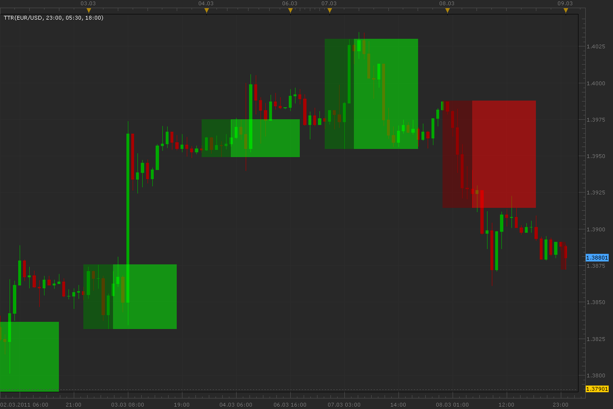

# Time trading range indicator

> Source: https://fxcodebase.com/code/viewtopic.php?f=17&t=3623  
> Forum: 17 · Topic 3623 · 5 post(s)

---

## Time trading range indicator

**Alexander.Gettinger** · Wed Mar 09, 2011 4:29 am

Indicator show range box from [BeginTime] to [EndTime] and continues this to [BoxEndTime]. Color of box depends on price direction between [BeginTime] and [EndTime].
Indicator can be useful for people who trading in different trade sessions.

 

Download:

 [TTR.lua](files/8707/TTR.lua)

The indicator was revised and updated

---

## Re: Time trading range indicator

**Alexander.Gettinger** · Thu Mar 10, 2011 2:33 am

Indicator updated, fixed 1 bug.

---

## Re: Time trading range indicator

**hherryjohn** · Sun Jan 11, 2015 8:41 am

Other version of OHLC volume.
Oscillator show difference between UP and DN volume form previous indicator.

---

## Re: Time trading range indicator

**Apprentice** · Tue Jan 13, 2015 9:23 am

Can you clarify your post.

---

## Re: Time trading range indicator

**Apprentice** · Tue Jul 18, 2017 7:48 am

The indicator was revised and updated.
