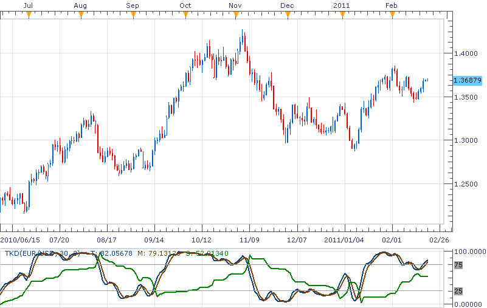

# TKD Indicator

> Source: https://fxcodebase.com/code/viewtopic.php?f=17&t=3477  
> Forum: 17 · Topic 3477 · 11 post(s)

---

## TKD Indicator

**richardtao** · Sun Feb 20, 2011 11:03 pm

The TKD indicator version 1 is applying to Trading Station II.
This Indicator is the moderate predictor which is Adapted Stochastic KD with Trailing Signal. It represents that predict of coincident timing.
The TKD is one of the predictors developed by Richard Tao.

The first parameter is "N: Periods for %K " which defines original Stochastic periods.
The second parameter is "M: Periods for Smooth" which defines ma periods.
The third parameter is "D: Distance percentage " which defines gauging level of 25/75 oversold/bought in percentage. Example: Setting 120 is changing level to 20/80.
The fourth parameter is "C: Coefficient percentage " which defines the multiplier of change coefficient in percentage. It could be fine-tuned to control the sensitivity.
Personal advice is that N better not to small and the applying timeframe D1 may use:20,5,100,100; H4:30,5,100,100; H1:50,7,100,100.

The TKD applying rules:
When T crosses up S, signal to buy.
When T crosses down S, signal to sell.

The excellence trader needs to have the ability to forecast trend. To enlarge profit, a trader had better to take position before market move rather than just following.
The general indicator is hard to catch the starting and fading away of the trend in performance. That’s the reason why I built a serial of simple and effective predictors for private use. To use those predictors, a trader needs to a)find the average time span, b)trace it, c)believe it. Hope this would help.

 [TKD_Old.lua](files/8284/TKD_Old.lua)

---

## Re: TKD Indicator

**richardtao** · Mon Apr 25, 2011 11:48 pm

v1.1 Enhance to distinguish between fast and slow signal.

 [TKD.lua](files/10030/TKD.lua)

 [TKD with Alert.lua](files/10030/TKD%20with%20Alert.lua)

---

## Re: TKD Indicator

**BabyDragonFX** · Mon Apr 06, 2015 9:28 pm

This is a very good indicator, could you please give us the option to regulate the thickness of the lines? Right now the default is 1, I would like to adjust their thickness.

---

## Re: TKD Indicator

**Apprentice** · Wed Apr 08, 2015 7:02 am

Style Option Added.

---

## Re: TKD Indicator

**BabyDragonFX** · Thu Apr 16, 2015 4:40 am

Thank You Apprentice!

---

## Re: TKD Indicator

**mulligan** · Mon Mar 21, 2016 10:16 am

My request is for TKD v1.1. An alert for T and S cross to define up and down. An additional alert with different color and sound options for T and F cross. This would further define up in up, down in up, down in down and up in down. Your consideration is appreciated.

---

## Re: TKD Indicator

**Apprentice** · Tue Mar 22, 2016 10:06 am

TKD with Alert.lua Added.

---

## Re: TKD Indicator

**Silver23** · Tue Apr 12, 2016 4:00 pm

Hi!

Can we have a strategy just based on the T ans S cross? A trade would be taken when the arrow signals up or down cross? An optional entry exit could be provided by the smoothed RSI. If it is not possible or too labor intensive then a strategy based just on T ans S cross would be great in the traders arsenal.

---

## Re: TKD Indicator

**Apprentice** · Wed Apr 13, 2016 3:01 am

Try this version.
[viewtopic.php?f=31&t=63370](https://fxcodebase.com/code/viewtopic.php?f=31&t=63370)

---

## Re: TKD Indicator

**Silver23** · Thu Apr 14, 2016 6:58 am

You are truly special, thank you very much. Please ignore my last request regarding a strategy which included the smoothed RSI, Trendstop and LSR. If it is done, I will gladly accept it, however I'm covered.

---

## Re: TKD Indicator

**Apprentice** · Mon Sep 03, 2018 8:09 am

The indicator was revised and updated.
