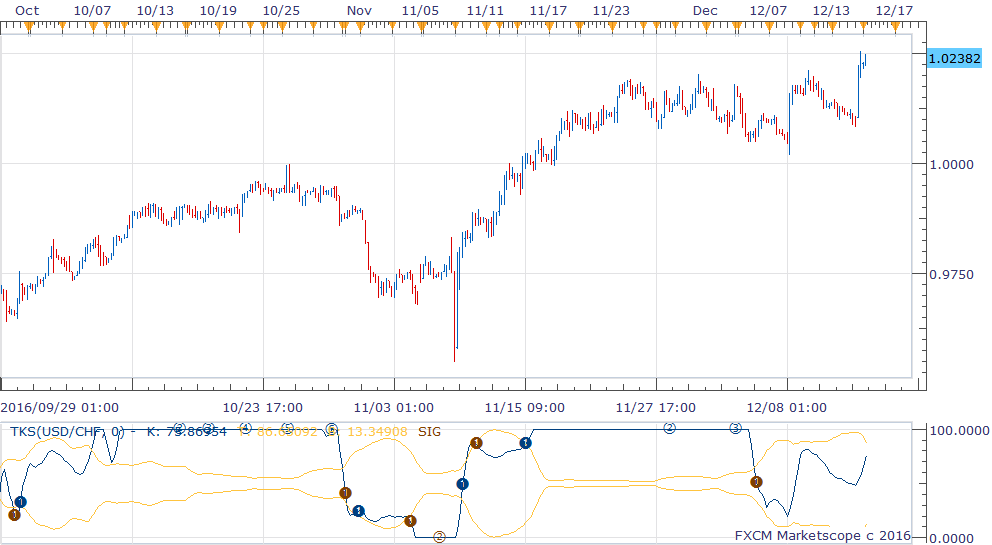

# TKS indicator

> Source: https://fxcodebase.com/code/viewtopic.php?f=17&t=64212  
> Forum: 17 · Topic 64212 · 1 post(s)

---

## TKS indicator

**richardtao** · Thu Dec 15, 2016 3:59 am

The TKS indicator is applying to Trading Station II.
The algorithmic rules of this indicator are:
a) adapted K Stochastic by smoothing.
b) defined the fluctuation band.
c) mark breakout as an entry trigger.

The first parameter is "K: Periods for %K" which defines the look back periods of K, default 0 means by automatic setting.
The second parameter is "M: Number of Multiple" which defines the maximum consecutive triggers in the same direction.
The end of year 2016’s release. Hope this could help.

 [TKS.bin](files/109941/TKS.bin)

 

