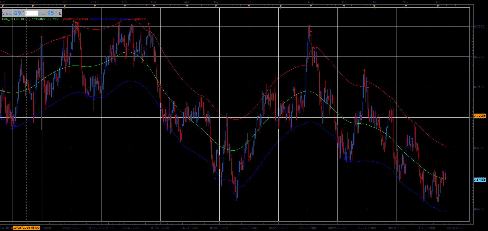

# TMA+CG indicator

> Source: https://fxcodebase.com/code/viewtopic.php?f=17&t=65446  
> Forum: 17 · Topic 65446 · 9 post(s)

---

## TMA+CG indicator

**Alexander.Gettinger** · Fri Dec 08, 2017 4:04 pm

Based on request: [viewtopic.php?f=27&t=65417](https://fxcodebase.com/code/viewtopic.php?f=27&t=65417)

 

Download:

 [TMA_CG.lua](files/116429/TMA_CG.lua)

 [TMA_CG with Alert.lua](files/116429/TMA_CG%20with%20Alert.lua)

---

## Re: TMA+CG indicator

**High&Low** · Sat Dec 09, 2017 9:08 pm

Hi,

 Thank you for your time and effort.

 Best regards,

---

## Re: TMA+CG indicator

**chai88888** · Tue Dec 12, 2017 7:26 pm

please can you put alert sound when new dot appear cheeers thanks

---

## Re: TMA+CG indicator

**Apprentice** · Fri Dec 15, 2017 7:44 am

TMA_CG with Alert.lua added.

---

## Re: TMA+CG indicator

**chai88888** · Sun Dec 17, 2017 12:27 am

many thanks

---

## Re: TMA+CG indicator

**bruno2017** · Thu Apr 19, 2018 12:58 pm

hello
 i have red or blue dots that appear and disappear
is repainted indicator

---

## Re: TMA+CG indicator

**AlexanderS** · Sat Nov 08, 2025 4:04 pm

HI
can you make a strategy PLEAS
THANKS

---

## Re: TMA+CG indicator

**Apprentice** · Sun Nov 09, 2025 8:01 am

We have added your request to the development list.
Development reference 708

---

## Re: TMA+CG indicator

**Apprentice** · Tue Dec 16, 2025 8:49 am

Indicator based strategy.
[https://fxcodebase.com/code/viewtopic.p ... 11#p161411](https://fxcodebase.com/code/viewtopic.php?f=31&t=76482&p=161411#p161411)
