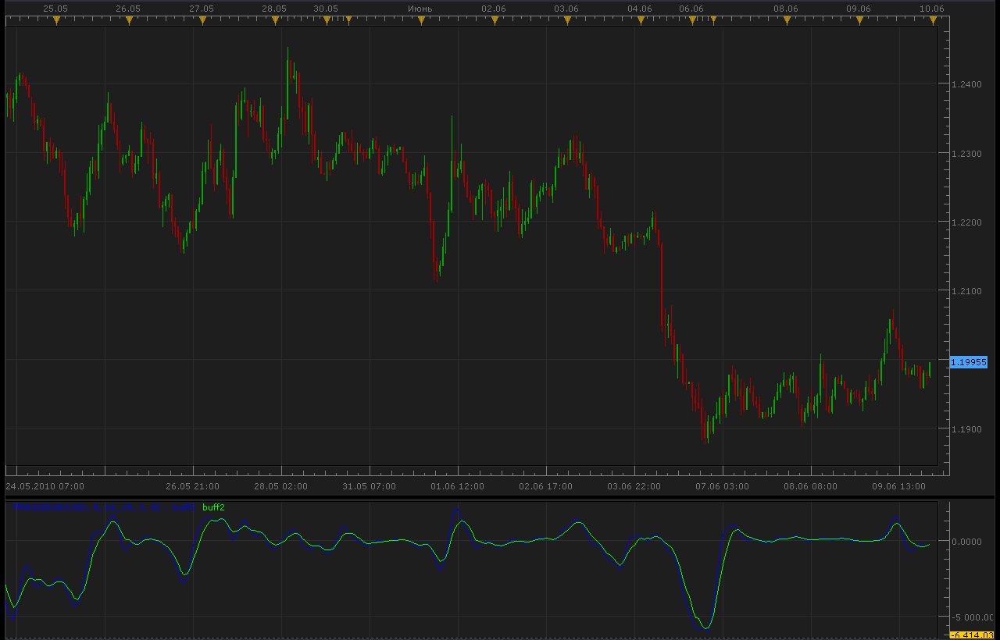

# TMAGi indicator

> Source: https://fxcodebase.com/code/viewtopic.php?f=17&t=1297  
> Forum: 17 · Topic 1297 · 2 post(s)

---

## TMAGi indicator

**Alexander.Gettinger** · Wed Jun 09, 2010 10:35 pm

TMAGi is an oscillator based on 3 Moving Averages.

TMAGi formula is:
Buff[i]=Abs(MVA_Slow-MVA_Middle)+Abs(MVA_Slow-MVA_Fast)+Abs(MVA_Fast-MVA_Middle);
TMAGi1[i]=MVA(Buff) for last SlowingSMA periods before i
TMAGi2[i]=LWMA(Buff) for SlowingLWMA periods before i.

 

 [TMAGi.lua](files/2479/TMAGi.lua)

The indicator was revised and updated

---

## Re: TMAGi indicator

**Apprentice** · Thu Jan 12, 2017 8:49 am

Indicator was revised and updated.
