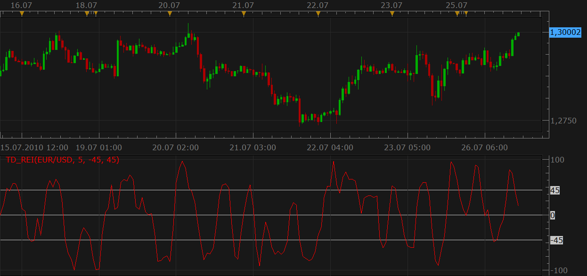

# Tom Demark Range Expansion Index (TD-REI)

> Source: https://fxcodebase.com/code/viewtopic.php?f=17&t=1585  
> Forum: 17 · Topic 1585 · 13 post(s)

---

## Tom Demark Range Expansion Index (TD-REI)

**Nikolay.Gekht** · Mon Jul 26, 2010 12:32 pm

The Tome Demark Range Expansion Index was described in, "DeMark on Day Trading Options" by T.R. DeMark and T.R. DeMark, Jr.

The indicator is a market-timing oscillator that attempts to overcome problems with exponentially calculated oscillators, such as the MACD, by being arithmetically calculated.

The indicator usually produces values in range of -100/+100. A value +45 or higher indicates overbought conditions and a value -45 or lower indicates oversold conditions. DeMark recommends trading in extreme overbought or oversold conditions indicated by six or more bars above/below the OB/OS level.

Note: As for many other indicators the Internet is filled by dozen variations of the indicator formula. I chosen the VTTrader's implementation of the indicator as a basis for our indicator. The VTTrader formula is:

Code: [Select all](https://fxcodebase.com/code/)
`HighMom:= H - Ref(H,-2);
LowMom:= L - Ref(L,-2);
TD1:= (H>=Ref(L,-5) OR H>=Ref(L,-6));
TD2:= (Ref(H,-2)>=Ref(C,-7) OR Ref(H,-2)>=Ref(C,-8));
TD3:= (L<=Ref(H,-5) OR L<=Ref(H,-6));
TD4:= (Ref(L,-2)<=Ref(C,-7) OR Ref(L,-2)<=Ref(C,-8));
TD5:= (TD1 OR TD2) AND (TD3 OR TD4);
TD6:= If(TD5,HighMom + LowMom,0);
TD7:= Abs(HighMom) + Abs(LowMom);
TDREI:= 100 * Sum(TD6,Periods) / Sum(TD7,Periods);`

 

Download:

 [TD_REI.lua](files/3111/TD_REI.lua)

The indicator was revised and updated

---

## Re: Tom Demark Range Expansion Index (TD-REI)

**bammbamm** · Mon Jul 26, 2010 5:28 pm

Nice work.

Just the D-wave left then!

---

## Re: Tom Demark Range Expansion Index (TD-REI)

**Nikolay.Gekht** · Tue Jul 27, 2010 10:39 am

I'm looking for the description. The book I have ("The New Science of Technical Analysis") describes the D-wave method too vague. At the moment the best description I have found is here:
[http://short-termcapitalmanagement.blog ... ve_04.html](https://short-termcapitalmanagement.blogspot.com/2009/10/td-d-wave_04.html) and [http://www.mail-archive.com/amibroker@y ... 44063.html](http://www.mail-archive.com/amibroker@yahoogroups.com/msg44063.html) and the following thread, but, probably it's good enough to start.

---

## Re: Tom Demark Range Expansion Index (TD-REI)

**bammbamm** · Tue Jul 27, 2010 1:05 pm

If you have access to ninjatrader 6.5, you can obtain a version of it here (this version doesn't calculate up and down simultaneously so you have to load the indicator twice but select one to downwave and other to up):
[http://www.ninjatrader.com/support/foru ... 15&page=14](http://www.ninjatrader.com/support/forum/local_links.php?catid=1&sort=N&pp=15&page=14)

Otherwise, I could either post the code from it here (it's 2500 lines), send you a pm or post a detailed decription. Could be a big job!

Best wishes.

---

## Re: Tom Demark Range Expansion Index (TD-REI)

**Nikolay.Gekht** · Tue Jul 27, 2010 3:29 pm

Got it. Thank you for the link!

---

## Re: Tom Demark Range Expansion Index (TD-REI)

**bammbamm** · Tue Jul 27, 2010 4:09 pm

I meant to add earlier - Demark's books are quite difficult to read but Jason Perl's book Demark Indicators published by Bloomberg press is much easier.

---

## Re: Tom Demark Range Expansion Index (TD-REI)

**Nikolay.Gekht** · Fri Jul 30, 2010 8:35 am

I also found the book with a pretty good description of D-wave, so I plan to start experimenting on the next week.

---

## Re: Tom Demark Range Expansion Index (TD-REI)

**DS0167** · Wed Dec 29, 2010 5:27 pm

Hello guys,

After reading the Jason Perl's book and the part of TD-REI, could you please improve this indicator so that we can identify easier the "prospective reversal"...?

For that we need to add the following formula so the indicator point out (by changing color for instance) :

Weakness: TD ReI stays above +40 (or +45) for **fewer than six price bars**, and then falls back = **Expect near-term gains**.

Strength: TD ReI stays below -40 (or -45) **for fewer than six price bars**, and then recovers =
**Expect short-term recovery**.

Is it possible ?

Thanks in advance for your answer.
Kind regards.
Danielle

---

## Re: Tom Demark Range Expansion Index (TD-REI)

**Apprentice** · Thu Dec 30, 2010 1:43 am

Danielle,
It is possible, but I would wait for an official announcement of the new platform.
Currently you are one of the few users who can use all its capabilities.

Apprentice

---

## Re: Tom Demark Range Expansion Index (TD-REI)

**Jeffreyvnlk** · Mon Sep 15, 2014 12:02 am

It is a good one.However could you change the level of Overbought and oversold to **60** according to The new science of Technical Analysis by Demark

Btw I think his book not difficult to read, just reading slow. Otherwise the book by Jason harder to read

Thanks

---

## Re: Tom Demark Range Expansion Index (TD-REI)

**Jeffreyvnlk** · Mon Sep 15, 2014 12:04 am

Whoops, it got option to set 60.My bad again
Thank anyway, a great indicator
Have a good day

---

## Re: Tom Demark Range Expansion Index (TD-REI)

**Jeffreyvnlk** · Mon Sep 15, 2014 12:06 am

Hi me again,
I back with new idea. Could you just coloring the overbought/ oversold level of this indicator just like RSI coloring.Thanks

---

## Re: Tom Demark Range Expansion Index (TD-REI)

**Apprentice** · Thu Jun 29, 2017 5:34 am

The indicator was revised and updated.
