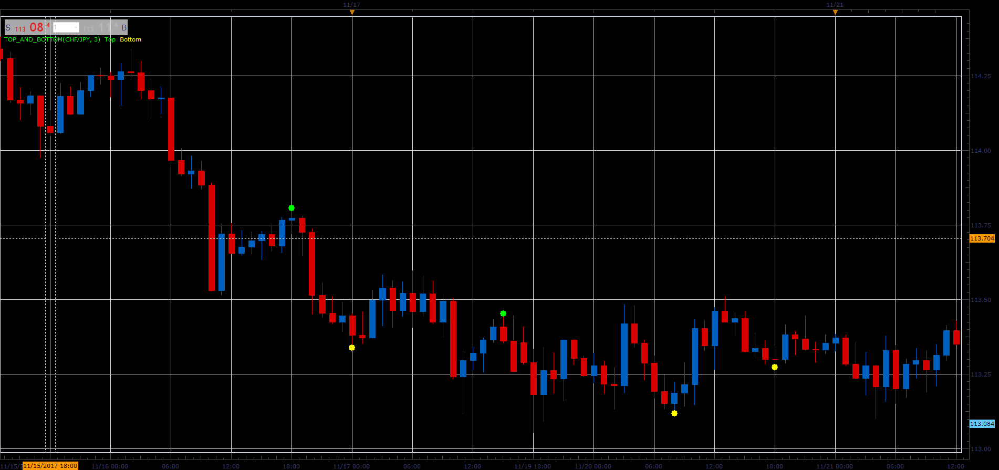

# Top and bottom

> Source: https://fxcodebase.com/code/viewtopic.php?f=17&t=65400  
> Forum: 17 · Topic 65400 · 7 post(s)

---

## Top and bottom

**Alexander.Gettinger** · Mon Nov 27, 2017 11:07 am

Based on request: [viewtopic.php?f=27&t=63111](https://fxcodebase.com/code/viewtopic.php?f=27&t=63111)

 

Download:

 [Top_And_Bottom.lua](files/116241/Top_And_Bottom.lua)

 [Top_And_Bottom with Alert.lua](files/116241/Top_And_Bottom%20with%20Alert.lua)

MT4/Mq4 version.
[viewtopic.php?f=38&t=65437&p=116383#p116383](https://fxcodebase.com/code/viewtopic.php?f=38&t=65437&p=116383#p116383)

---

## Re: Top and bottom

**mulligan** · Thu Nov 30, 2017 2:37 pm

Very nice indicator. Would be great to have 'top and bottom with alert' adding sound and dialog box.

Thanks

---

## Re: Top and bottom

**Apprentice** · Mon Dec 04, 2017 1:34 pm

Top_And_Bottom with Alert.lua added.

---

## Re: Top and bottom

**tucuxi** · Tue Dec 05, 2017 8:21 am

is possible code this indicator to mt4 platform please ?

thanks in advance, regards

---

## Re: Top and bottom

**Apprentice** · Wed Dec 06, 2017 6:20 am

Try this version.
[viewtopic.php?f=38&t=65437&p=116383#p116383](https://fxcodebase.com/code/viewtopic.php?f=38&t=65437&p=116383#p116383)

---

## Re: Top and bottom

**tucuxi** · Wed Dec 06, 2017 6:06 pm

> **Apprentice wrote:**
> Try this version.
> [viewtopic.php?f=38&t=65437&p=116383#p116383](https://fxcodebase.com/code/viewtopic.php?f=38&t=65437&p=116383#p116383)

Thank you for your time.
Regards,
Tucuxi

---

## Re: Top and bottom

**Apprentice** · Tue May 08, 2018 5:12 am

The Indicator was revised and updated.
