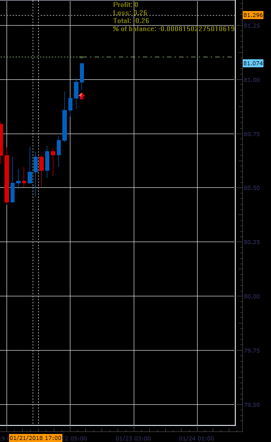

# Total Risk indicator

> Source: https://fxcodebase.com/code/viewtopic.php?f=17&t=65663  
> Forum: 17 · Topic 65663 · 2 post(s)

---

## Total Risk indicator

**Alexander.Gettinger** · Mon Jan 22, 2018 12:05 pm

Based on request: [viewtopic.php?f=27&t=63072](https://fxcodebase.com/code/viewtopic.php?f=27&t=63072)

 

Download:

 [Total_Risk.lua](files/117198/Total_Risk.lua)

The indicator was revised and updated

---

## Re: Total Risk indicator

**Alexander.Gettinger** · Mon Jan 22, 2018 12:07 pm

MQL4 version of the indicator: [viewtopic.php?f=38&t=65664](https://fxcodebase.com/code/viewtopic.php?f=38&t=65664)
