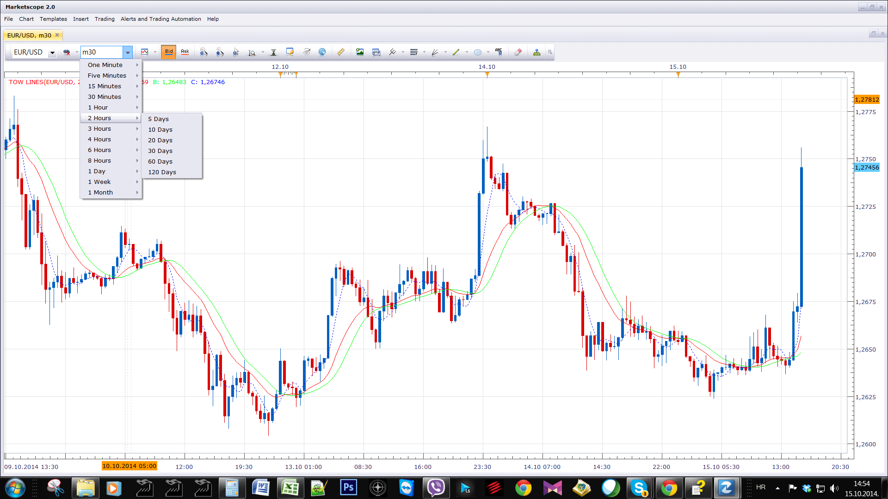
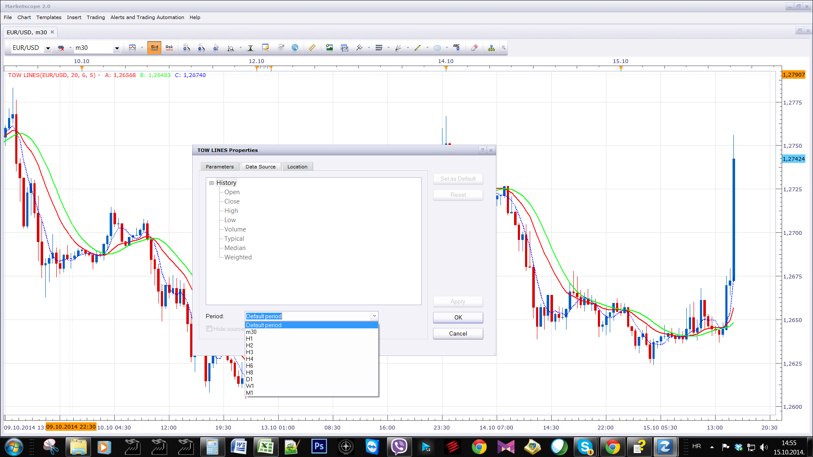

# Tow Lines

> Source: https://fxcodebase.com/code/viewtopic.php?f=17&t=61328  
> Forum: 17 · Topic 61328 · 12 post(s)

---

## Tow Lines

**Apprentice** · Wed Oct 15, 2014 3:59 am

Based on request.
[viewtopic.php?f=27&t=61324&p=96533#p96533](https://fxcodebase.com/code/viewtopic.php?f=27&t=61324&p=96533#p96533)

It was suggested to me that the Tow Lines is Chinese for trend lines.

Code: [Select all](https://fxcodebase.com/code/)
`MID:=(3*CLOSE+LOW+OPEN+HIGH)/6;
A:(20*MID+19*REF(MID,1)+18*REF(MID,2)+17*REF(MID,3)+16*REF(MID,4)+15*REF(MID,5)+14*REF(MID,6)+13*REF(MID,7)+12*REF(MID,8)+11*REF(MID,9)+10*REF(MID,10)+9*REF(MID,11)+8*REF(MID,12)+7*REF(MID,13)+6*REF(MID,14)+5*REF(MID,15)+4*REF(MID,16)+3*REF(MID,17)+2*REF(MID,18)+REF(MID,20))/210,COLORRED;
B:MA(A,6),COLORGREEN;
C:MA(CLOSE,5),POINTDOT,COLORLIBLUE;`

 [Tow Lines.lua](files/96535/Tow%20Lines.lua)

 

Arrow - A Line Slope.
Color- depends on the relationship between the two lines, see Calculation Mode

 [MTF MCP Tow Lines.lua](files/96535/MTF%20MCP%20Tow%20Lines.lua)

---

## Re: Tow Lines

**shengbo** · Wed Oct 15, 2014 6:39 am

could you make a "two lines strategy".

much much appreciated.

please.

---

## Re: Tow Lines

**baccicin** · Wed Oct 15, 2014 7:36 am

Hi Apprentice, if i may ask:
what is the TF for this indicator? Tha chart looks a TF daily, is it possible applying the indicator also to H1, M30, M15 and M5? and in case, do i have to change A-B-C-Line Period?
Last question if i am not abusing of your time: is it possible to add a signal such as an arrow, for example? for long and short entries?
Many thanks and sorry for my continuos asking...
have a nice day
Fabio

---

## Re: Tow Lines

**Apprentice** · Wed Oct 15, 2014 7:53 am

1.Change of Chart Time Frame

 

2.Change of Indicator Time Frame
(Only Higher Time Frames are applicable)

 

---

## Re: Tow Lines

**shengbo** · Wed Oct 15, 2014 8:10 am

hello,Apprentice

please make a strategy.

much appreciated

---

## Re: Tow Lines

**baccicin** · Wed Oct 15, 2014 11:50 am

Hello Apprentice, quick question: I asked for adding an arrow in case of short or long entry, is it possible? And i'd ask you another question:
is it possible create a list of currency pairs, index and others (gold, oil...) that, checking the Tow Lines entry or short signal, the system shows the entry in this list?
many thanks, ciao
Fabio

---

## Re: Tow Lines

**shengbo** · Thu Oct 16, 2014 1:59 am

> **Apprentice wrote:**
> 1.Change of Chart Time Frame
>
>
> 1.png
>
>
> 2.Change of Indicator Time Frame
> (Only Higher Time Frames are applicable)
>
>
> 2.png

i'm begging you.the "strategy".please.

---

## Re: Tow Lines

**Apprentice** · Thu Oct 16, 2014 2:01 am

Requested strategy can be found here.
[viewtopic.php?f=31&t=61332](https://fxcodebase.com/code/viewtopic.php?f=31&t=61332)

---

## Re: Tow Lines

**Apprentice** · Thu Oct 16, 2014 5:25 am

MTF MCP Tow Lines Added.

---

## Re: Tow Lines

**baccicin** · Fri Dec 12, 2014 10:58 am

Hi Mario, could you please add, if possible, a pop-up? This pop-up should appear also when the window or tab is being used in the background or window bar and i am using another window or program on the screen.
Conditions:
C line crosses B and A line
A line crosses B line but not C line
both for up and down
many thanks, ciao
Fabio

---

## Re: Tow Lines

**poriyavt** · Mon Dec 15, 2014 10:48 am

Hi

 Sir Can U Make A OVERLAY On Candle But In Another Format Like Below

Mode C

Color Green
C CrossOver A & B Line
Color Red
C CrossUnder A & B Line

Regards

---

## Re: Tow Lines

**Apprentice** · Sat May 05, 2018 6:38 am

The indicator was revised and updated.
