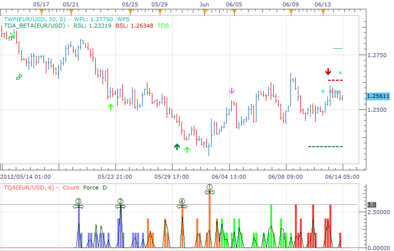
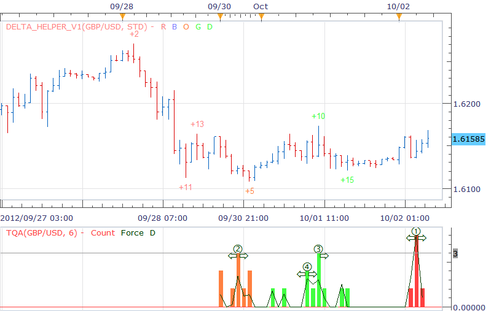

# TQA

> Source: https://fxcodebase.com/code/viewtopic.php?f=17&t=20191  
> Forum: 17 · Topic 20191 · 12 post(s)

---

## TQA

**richardtao** · Thu Jun 14, 2012 5:13 am

The TQA indicator version 1 is applying to Trading Station II.
The indicator nominate as Richard Tao Quadruple Accumulate, ideal from detla phenomenon identify helper.
This is Richard Tao Predictor serials number 4

The first parameter is "Wave Minimum " which defines minimum periods to setup a new wave.
The second parameter is "Select " which defines the accumulate mode either by count the turning points or by force of the price moving distance.
The most possible four turning points display as the circle number just above the color bars. The appearance may early or delay one period of bar which displayed as extension arrows by both side.

The Delta Phenomenon reference textbook please check:
[https://www.deltasociety.com/content/de ... ll-markets](https://www.deltasociety.com/content/delta-phenomenon-or-hidden-order-all-markets)

 [TQA.bin](files/35500/TQA.bin)

---

## Re: TQA

**transformer** · Fri Jun 15, 2012 4:23 am

dear developers ,

can you create alert on 4 serial numbers?

---

## Re: TQA

**richardtao** · Thu Aug 30, 2012 1:19 am

hello,
this is very interesting indicator from my opinion.
the revise version for adding alert function.

 [TQA.bin](files/39375/TQA.bin)

in order to enable alert please download another lua by excellent developer.
[download/file.php?id=6628](https://fxcodebase.com/code/download/file.php?id=6628)

---

## Re: TQA

**nsaale** · Fri Aug 31, 2012 10:24 am

Exactly what do those OFG colors mean?

---

## Re: TQA

**richardtao** · Mon Sep 03, 2012 2:51 am

hello,
RColor is Red color.
BColor is Blue color.
OColor is Orange color.
GColor is Green color.
these four color are distiguish quadruple accumulate reverse of delta phenomenon.
which was displayed in counting numbers.
FColor is color of distiguished quadruple accumulate moving of delta phenomenon.
which was displayed in percentage of max counting numbers.
for your reference.

---

## Re: TQA

**nsaale** · Sun Sep 30, 2012 2:58 pm

Does this indicator repaint?

---

## Re: TQA

**richardtao** · Tue Oct 02, 2012 5:21 am

hello nsaale,
The base is on Delta Phenomenon.
The theory of Delta Phenomenon reference textbook please check:
[https://www.deltasociety.com/content/de](https://www.deltasociety.com/content/de) ... ll-markets

however, the finding turning point of serial numbers of Delta is quite subjective.
therefore i build the indicator to accumlate the turning points by divided four term delta.
the most accumulated point mark from 1.
it might be easy to be read i think.
the both side arrows show the expended area which the peak would appeared.
please see the sample of screenshot for your reference.
do you think this kind of display could be repainted? the advise is to try it.
regards, richard.

 

---

## Re: TQA

**nsaale** · Wed Oct 10, 2012 5:20 pm

Hello Richard,

On TQA indicatorr which is the best or strongest turning point?

---

## Re: TQA

**richardtao** · Fri Oct 12, 2012 3:07 am

hi nsaale,

the indicator speculated the truning points when you select "ByCount".
the placing number 1-4 (high to low) express the candidate only.
do not underestimate the number 3 or 4.
when the lower placing became real truning point the placing number might be escalated.

to guess the major truning point it might be help by selecting "ByForce".
the higher placing number might be the higher possibility of strong truning point.

regards, richard.

---

## Re: TQA

**nsaale** · Fri Oct 12, 2012 12:14 pm

Thank you very much.

---

## Re: TQA

**xylary** · Tue Feb 12, 2013 7:22 pm

> **richardtao wrote:**
>
>
> TQA.png
>
>
> The TQA indicator version 1 is applying to Trading Station II.
> The indicator nominate as Richard Tao Quadruple Accumulate, ideal from detla phenomenon identify helper.
> This is Richard Tao Predictor serials number 4
>
> The first parameter is "Wave Minimum " which defines minimum periods to setup a new wave.
> The second parameter is "Select " which defines the accumulate mode either by count the turning points or by force of the price moving distance.
> The most possible four turning points display as the circle number just above the color bars. The appearance may early or delay one period of bar which displayed as extension arrows by both side.
>
> The Delta Phenomenon reference textbook please check:
> [https://www.deltasociety.com/content/de ... ll-markets](https://www.deltasociety.com/content/delta-phenomenon-or-hidden-order-all-markets)
>
>
> TQA.bin

Hi Richard,

Very impressive indicator! I am wondering if it is possible for you to share me the lua file of your TQA indicator. I am also a fan of the Delta Phenomenon, but I am just a beginner of programming. So I want to learn how you realize the ideas of Delta by programming.

Many thanks!

Best
Nan

---

## Re: TQA

**Apprentice** · Mon May 01, 2017 5:38 am

Bump up.
