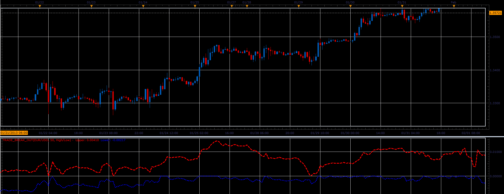

# TradeBreakOut oscillator

> Source: https://fxcodebase.com/code/viewtopic.php?f=17&t=34070  
> Forum: 17 · Topic 34070 · 5 post(s)

---

## TradeBreakOut oscillator

**Alexander.Gettinger** · Wed Apr 03, 2013 3:34 pm

This indicator is a ported MQL5 indicators from [http://www.mql5.com/en/code/1600](http://www.mql5.com/en/code/1600)

Formulas:
Upper[i] = ((Low[i] or Close[i]) - L)/L,
Lower[i] = ((High[i] or Close[i]) - H)/H, where
H, L - maximum and minimum values of price at range from (i-Period+1) to i.

 

Download:

 [Trade_Break_Out.lua](files/57910/Trade_Break_Out.lua)

---

## Re: TradeBreakOut oscillator

**Alexander.Gettinger** · Wed Apr 10, 2013 4:19 pm

MQL4 version of this oscillator: [viewtopic.php?f=38&t=34366](https://fxcodebase.com/code/viewtopic.php?f=38&t=34366)

---

## Re: TradeBreakOut oscillator

**Cactus** · Thu Jul 28, 2016 7:11 pm

Can you make these bands fit around price somehow?

---

## Re: TradeBreakOut oscillator

**Apprentice** · Fri Jul 29, 2016 7:31 am

I'm not sure how to create formula for this task.
Ideas?

---

## Re: TradeBreakOut oscillator

**Apprentice** · Mon Sep 24, 2018 10:15 am

The indicator was revised and updated.
