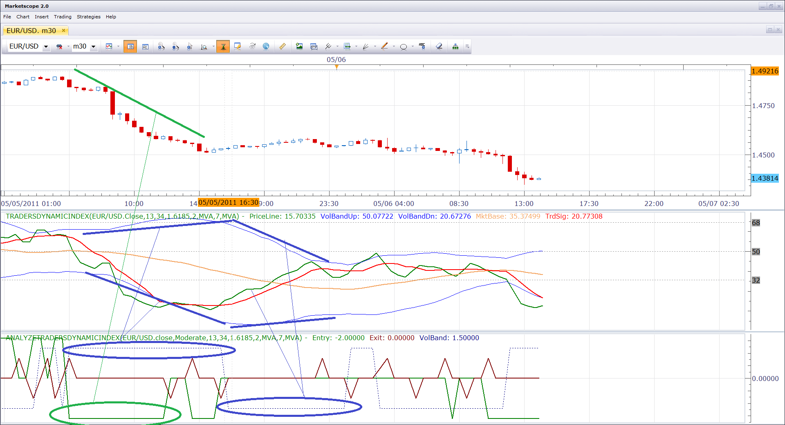

# Traders dynamic index interpreter

> Source: https://fxcodebase.com/code/viewtopic.php?f=17&t=4133  
> Forum: 17 · Topic 4133 · 10 post(s)

---

## Traders dynamic index interpreter

**Nikolay.Gekht** · Fri May 06, 2011 1:24 pm

The indicator interprets values of the Traders dynamic index indicator and shows the lines of trend, exit signals and convergence/divergence of the volatility band.

Please refer to the [Traders dynamic index indicator](https://fxcodebase.com/code/viewtopic.php?f=17&t=2069) for the description of the interpretation rules.

The trend/entry signal is a green line. When the line turns to positive, the long entry signal appears. When the line is positive, there is up trend. When the line turns negative, the short entry signal appears. When the is negative, there is down trend.

The exit signal is a red line. When the line is positive, the long exit signal appears. When the line is negative, the short exit signal appear.

The volatility band line is a blue dotted line. When the line is positive, the volatility bands diverges. When the line is negative, the volatility bands converges.

(Click on the image to enlarge it):

 

Download indicator:

 [AnalyzeTradersDynamicIndex.lua](files/10376/AnalyzeTradersDynamicIndex.lua)

Please download and install the **new** version of the [Traders dynamic index indicator](https://fxcodebase.com/code/viewtopic.php?f=17&t=2069). Follow the link below to find the indicator url=http://fxcodebase.com/code/viewtopic.php?f=17&t=2069

---

## Re: Traders dynamic index interpreter

**Checkz** · Sat May 14, 2011 12:31 am

Is there any way this could be turned into a indicator that allows us to monitor different currency pairs at the same time on the same chart when the Green and red lines on the TDI interpreter cross. For example if we set it on scalping mode where the red and green line cross. Can it show us all the currency pairs that the red line and green line crossed on say a 4hr chart?

---

## Re: Traders dynamic index interpreter

**Apprentice** · Sat May 14, 2011 5:53 am

Your request has been added to developmental cue.

---

## Re: Traders dynamic index interpreter

**hhbraz** · Wed Nov 30, 2011 10:12 am

Any estimate on the completion of a monitor to display TDI red/green (and yellow) crosses for multiple currency pairs ?

Also can you develop a signal for a TDI red/green cross-over for specific currency pairs at user-defined time frames ?
Thanks

---

## Re: Traders dynamic index interpreter

**Apprentice** · Thu Dec 01, 2011 9:32 am

Your request is added to the developmental cue.

Unfortunately, no.
I have a lot of work.
I'll try to include more developers.
To expedite the process.

---

## Re: Traders dynamic index interpreter

**hhbraz** · Fri Mar 09, 2012 5:10 pm

Any estimate on the completion of a monitor to display TDI red/green (and yellow) crosses for multiple currency pairs ?

Also can you develop a signal for a TDI red/green cross-over for specific currency pairs at user-defined time frames ?
Thanks

---

## Re: Traders dynamic index interpreter

**Apprentice** · Mon Mar 27, 2017 3:52 pm

Indicator was revised and updated.

---

## Re: Traders dynamic index interpreter

**Cowensen** · Wed Jan 24, 2018 4:13 am

> **Apprentice wrote:**
> Indicator was revised and updated.

I like this indi, thanks Apprentice. It could also be used as a divergence indicator too.

---

## Re: Traders dynamic index interpreter

**Apprentice** · Wed Jan 24, 2018 5:22 am

Your request is added to the development list under Id Number 4021

---

## Re: Traders dynamic index interpreter

**Apprentice** · Wed Feb 21, 2018 5:48 am

[AnalyzeTradersDynamicIndex_Divergence.lua](files/117835/AnalyzeTradersDynamicIndex_Divergence.lua)

Try this version.
