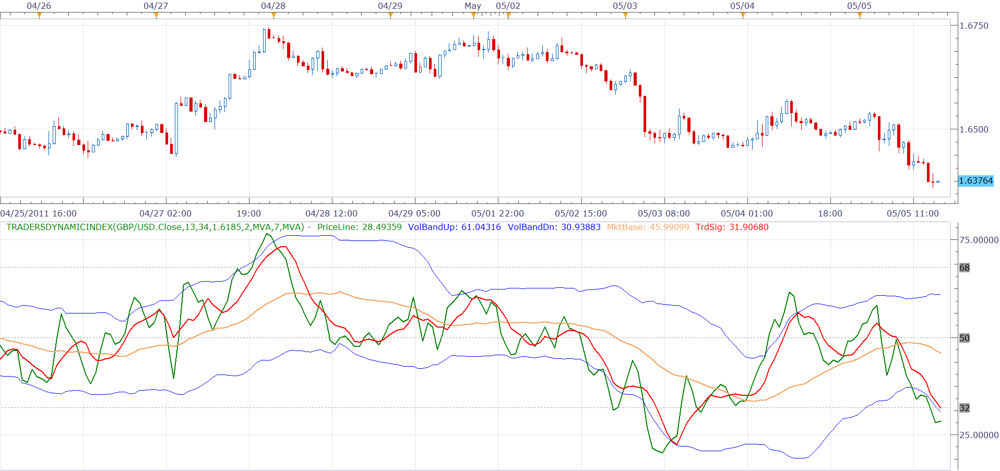

# Traders dynamic index [NG: upd, May, 05]

> Source: https://fxcodebase.com/code/viewtopic.php?f=17&t=2069  
> Forum: 17 · Topic 2069 · 33 post(s)

---

## Traders dynamic index [NG: upd, May, 05]

**Alexander.Gettinger** · Sun Sep 05, 2010 10:34 pm

The indicator has been updated May, 05 2011. See [viewtopic.php?f=17&t=2069&p=10346#p10346](https://fxcodebase.com/code/viewtopic.php?f=17&t=2069&p=10346#p10346) for details.

The indicator has been developed for MT4 by Dean Malone in 2006

 

Here is the original description of the indicator:

> **Dean Malone wrote:**
> **Traders Dynamic Index**
>
> This hybrid indicator is developed to assist traders in their ability to decipher and monitor market conditions related to trend direction, market strength, and market volatility.
>
> Even though comprehensive, the T.D.I. is easy to read and use.
>
> Green line = RSI Price line
> Red line = Trade Signal line
> Blue lines = Volatility Band
> Yellow line = Market Base Line
>
> Trend Direction - Immediate and Overall
>
> Immediate = Green over Red...price action is moving up. Red over Green...price action is moving down.
>
> Overall = Yellow line trends up and down generally between the lines 32 & 68. Watch for Yellow line to bounces off these lines for market reversal. Trade long when price is above the Yellow line, and trade short when price is below.
>
> Market Strength & Volatility - Immediate and Overall
> Immediate:
>
> Green Line is Strong = Steep slope up or down.
> Green Line is Weak = Moderate to Flat slope.
>
> Overall:
>
> Blue Lines - When expanding, market is strong and trending. When constricting, market is weak and in a range. When the Blue lines are extremely tight in a narrow range, expect an economic announcement or other market condition to spike the market.
>
> Entry conditions
>
> Scalping:
> Long = Green over Red, Short = Red over Green
> Active:
> Long = Green over Red & Yellow lines
> Short = Red over Green & Yellow lines
>
> Moderate:
> Long = Green over Red, Yellow, & 50 lines
> Short = Red over Green, Green below Yellow & 50 line
>
> Exit conditions*
> Long = Green crosses below Red
> Short = Green crosses above Red
>
> * If Green crosses either Blue lines, consider exiting when the Green line crosses back over the Blue line.
>
> IMPORTANT: The default settings are well tested and proven. But, you can change the settings to fit your trading style.

Note: Please read the post about the strategy based on that index. The default settings has been tested there, so you can decide whether they are good enough for you:
See [viewtopic.php?f=31&t=4134](https://fxcodebase.com/code/viewtopic.php?f=31&t=4134)

Download:

 [TradersDynamicIndex.lua](files/4235/TradersDynamicIndex.lua)

see [viewtopic.php?f=17&t=2069&p=10346#p10346](https://fxcodebase.com/code/viewtopic.php?f=17&t=2069&p=10346#p10346) for details about the update.

 [TradersDynamicIndex With Alert.lua](files/4235/TradersDynamicIndex%20With%20Alert.lua)

Compatibility issue Fix. _Alert helper is not longer needed.

See also: [Traders dynamic index interpreter indicator](https://fxcodebase.com/code/viewtopic.php?f=17&t=4133), [Traders dynamic index demo strategy](https://fxcodebase.com/code/viewtopic.php?f=31&t=4134)

Code: [Select all](https://fxcodebase.com/code/)
`-- original indicator:
-- Traders Dynamic Index.mq4
-- Copyright © 2006, Dean Malone
-- www.compassfx.com

function Init()
    indicator:name("Traders Dynamic Index Indicator");
    indicator:description("This hybrid indicator is developed to assist traders in their ability to decipher and monitor market conditions related to trend direction, market strength, and market volatility.");
    indicator:requiredSource(core.Tick);
    indicator:type(core.Oscillator);

    indicator.parameters:addGroup("Calculation");

    indicator.parameters:addInteger("RSI_N", "RSI Periods", "Recommended values are in 8-25 range", 13, 2, 1000);
    indicator.parameters:addInteger("VB_N", "Volatility Band", "Number of periods to find volatility band. Recommended value is 20-40", 34, 2, 1000);
    indicator.parameters:addDouble("VB_W", "Volatility Band Width", "", 1.6185, 0, 100);

    indicator.parameters:addInteger("RSI_P_N", "RSI Price Line Periods", "", 2, 1, 1000);
    indicator.parameters:addString("RSI_P_M", "RSI Price Line Smoothing Method", "", "MVA");
    indicator.parameters:addStringAlternative("RSI_P_M", "MVA(SMA)", "", "MVA");
    indicator.parameters:addStringAlternative("RSI_P_M", "EMA", "", "EMA");
    indicator.parameters:addStringAlternative("RSI_P_M", "LWMA", "", "LWMA");
    indicator.parameters:addStringAlternative("RSI_P_M", "LSMA(Regression)", "", "REGRESSION");
    indicator.parameters:addStringAlternative("RSI_P_M", "SMMA", "", "SMMA");
    indicator.parameters:addStringAlternative("RSI_P_M", "WMA(Wilders)", "", "WMA");
    indicator.parameters:addStringAlternative("RSI_P_M", "KAMA(Kaufman)", "", "KAMA");

    indicator.parameters:addInteger("TS_N", "Trade Signal Line Periods", "", 7, 1, 1000);
    indicator.parameters:addString("TS_M", "Trade Signal Line Smoothing Method", "", "MVA");
    indicator.parameters:addStringAlternative("TS_M", "MVA(SMA)", "", "MVA");
    indicator.parameters:addStringAlternative("TS_M", "EMA", "", "EMA");
    indicator.parameters:addStringAlternative("TS_M", "LWMA", "", "LWMA");
    indicator.parameters:addStringAlternative("TS_M", "LSMA(Regression)", "", "REGRESSION");
    indicator.parameters:addStringAlternative("TS_M", "SMMA", "", "SMMA");
    indicator.parameters:addStringAlternative("TS_M", "WMA(Wilders)", "", "WMA");
    indicator.parameters:addStringAlternative("TS_M", "KAMA(Kaufman)", "", "KAMA");

    local colors = core.colors();

    indicator.parameters:addGroup("Line Style");
    indicator.parameters:addColor("RSI_P_C", "RSI Price Line Color", "", colors.Green);
    indicator.parameters:addInteger("RSI_P_W", "RSI Price Line Width", "", 2, 1, 5);
    indicator.parameters:addInteger("RSI_P_S", "RSI Price Line Style", "", core.LINE_SOLID);
    indicator.parameters:setFlag("RSI_P_S", core.FLAG_LEVEL_STYLE);

    indicator.parameters:addColor("TS_C", "Trade Signal Line Color", "", colors.Red);
    indicator.parameters:addInteger("TS_W", "Trade Signal Line Width", "", 2, 1, 5);
    indicator.parameters:addInteger("TS_S", "Trade Signal Line Style", "", core.LINE_SOLID);
    indicator.parameters:setFlag("TS_S", core.FLAG_LEVEL_STYLE);

    indicator.parameters:addColor("VB_C", "Volatility Band Line Color", "", colors.Blue);
    indicator.parameters:addInteger("VB_W", "Volatility Band Line Width", "", 1, 1, 5);
    indicator.parameters:addInteger("VB_S", "Volatility Band Line Style", "", core.LINE_SOLID);
    indicator.parameters:setFlag("VB_S", core.FLAG_LEVEL_STYLE);

    indicator.parameters:addColor("MB_C", "Market Base Line Color", "", colors.SandyBrown);
    indicator.parameters:addInteger("MB_W", "Market Base Line Width", "", 2, 1, 5);
    indicator.parameters:addInteger("MB_S", "Market Base Line Style", "", core.LINE_SOLID);
    indicator.parameters:setFlag("MB_S", core.FLAG_LEVEL_STYLE);

    indicator.parameters:addGroup("Levels");
    indicator.parameters:addInteger("L1", "Low Level", "", 32, 0, 100);
    indicator.parameters:addInteger("L2", "Middle Level", "", 50, 0, 100);
    indicator.parameters:addInteger("L3", "High Level", "", 68, 0, 100);
    indicator.parameters:addColor("L_C", "Level Line Color", "", core.COLOR_CUSTOMLEVEL);
    indicator.parameters:addInteger("L_W", "Market Base Line Width", "", 1, 1, 5);
    indicator.parameters:addInteger("L_S", "Market Base Line Style", "", core.LINE_DOT);
    indicator.parameters:setFlag("L_S", core.FLAG_LEVEL_STYLE);
end

local iRSI, iPMA, iTSMA;
local P, VBU, VBD, TS, MB;

local VB_N, VB_W, L1, L2, L3;
local fP, fVB, fTS;

function Prepare(onlyName)
    local name = profile:id() .. "(" .. instance.source:name() .. "," ..
                                        instance.parameters.RSI_N .. "," ..
                                        instance.parameters.VB_N .. "," .. instance.parameters.VB_W .. "," ..
                                        instance.parameters.RSI_P_N .. "," .. instance.parameters.RSI_P_M .. "," ..
                                        instance.parameters.TS_N .. "," .. instance.parameters.TS_M .. ")";
    instance:name(name);
    if onlyName then
        return ;
    end

    VB_N = instance.parameters.VB_N;
    VB_W = instance.parameters.VB_W;
    L1 = instance.parameters.L1;
    L2 = instance.parameters.L2;
    L3 = instance.parameters.L3;

    iRSI = core.indicators:create("RSI", instance.source, instance.parameters.RSI_N);
    iPMA = core.indicators:create(instance.parameters.RSI_P_M, iRSI.DATA, instance.parameters.RSI_P_N);
    fP = iPMA.DATA:first();
    iTSMA = core.indicators:create(instance.parameters.TS_M, iRSI.DATA, instance.parameters.TS_N);
    fTS = iTSMA.DATA:first();

    fVB = iRSI.DATA:first() + instance.parameters.VB_N - 1;

    P = instance:addStream("RSI_P", core.Line, name .. ".RSI_P", "PriceLine", instance.parameters.RSI_P_C, fP);
    P:setWidth(instance.parameters.RSI_P_W);
    P:setStyle(instance.parameters.RSI_P_S);

    P:addLevel(L1, instance.parameters.L_S, instance.parameters.L_W, instance.parameters.L_C);
    P:addLevel(L2, instance.parameters.L_S, instance.parameters.L_W, instance.parameters.L_C);
    P:addLevel(L3, instance.parameters.L_S, instance.parameters.L_W, instance.parameters.L_C);

    VBU = instance:addStream("VBU", core.Line, name .. ".VBU", "VolBandUp", instance.parameters.VB_C, fVB);
    VBU:setWidth(instance.parameters.VB_W);
    VBU:setStyle(instance.parameters.VB_S);

    VBD = instance:addStream("VBD", core.Line, name .. ".VBD", "VolBandDn", instance.parameters.VB_C, fVB);
    VBD:setWidth(instance.parameters.VB_W);
    VBD:setStyle(instance.parameters.VB_S);

    MB = instance:addStream("MB", core.Line, name .. ".MB", "MktBase", instance.parameters.MB_C, fVB);
    MB:setWidth(instance.parameters.MB_W);
    MB:setStyle(instance.parameters.MB_S);

    TS = instance:addStream("TS", core.Line, name .. ".TS", "TrdSig", instance.parameters.TS_C, fTS);
    TS:setWidth(instance.parameters.TS_W);
    TS:setStyle(instance.parameters.TS_S);
end

function Update(period, mode)
    iRSI:update(mode);
    iPMA:update(mode);
    iTSMA:update(mode);

    if period >= fP then
        P[period] = iPMA.DATA[period];
    end

    if period >= fTS then
        TS[period] = iTSMA.DATA[period];
    end

    if period >= fVB then
        local stdev, ma;
        stdev = core.stdev(iRSI.DATA, period - VB_N + 1, period);
        ma = core.avg(iRSI.DATA, period - VB_N + 1, period);
        VBU[period] = ma + VB_W * stdev;
        VBD[period] = ma - VB_W * stdev;
        MB[period] = ma;
    end
end`

 [Non-standard Time Frame TradersDynamicIndex.lua](files/4235/Non-standard%20Time%20Frame%20TradersDynamicIndex.lua)

 [Other Time Frame TradersDynamicIndex.lua](files/4235/Other%20Time%20Frame%20TradersDynamicIndex.lua)

 [Non-standard Time Frame TradersDynamicIndex with Alert.lua](files/4235/Non-standard%20Time%20Frame%20TradersDynamicIndex%20with%20Alert.lua)

 [Other Time Frame TradersDynamicIndex with Alert.lua](files/4235/Other%20Time%20Frame%20TradersDynamicIndex%20with%20Alert.lua)

---

## Re: Traders dynamic index - from mq4 new functions

**forexjim** · Mon Oct 04, 2010 11:17 am

Hello,

Is it possible to get this version of the Traders Dynamic Index converted to Marketcope?

---

## Re: Traders dynamic index

**forexjim** · Mon Oct 04, 2010 1:09 pm

This may be easier.... there is an expanded version of the Traders Dynamic Index on the mql4 code base site that adds trade direction arrows and text prompts.

Can it be converted to LUA based programming for use with Marketscope?

Thanks,

Jim S.

---

## Re: Traders dynamic index

**Nikolay.Gekht** · Thu May 05, 2011 3:16 pm

May, 05 2011 update:

1) Calculation has been optimized
2) Lines are properly named and line width/style parameters has been added
3) All options, including the smoothing methods parameters has been added.
4) The original description of the indicator has been added.

Please see the top post ([viewtopic.php?f=17&t=2069#p4235](https://fxcodebase.com/code/viewtopic.php?f=17&t=2069#p4235)) for details.

---

## Re: Traders dynamic index [NG: upd, May, 05]

**Blackcat2** · Thu May 05, 2011 7:42 pm

Cool, backtesting looks good. If we can get arrow on the chart for buy, sell, and exit signal it'll be even better

Thanks...
BC

---

## Re: Traders dynamic index [NG: upd, May, 05]

**Nikolay.Gekht** · Fri May 06, 2011 10:19 am

I'm going to publish the interpreting indicator (as requested above) and a strategy soon.

---

## Re: Traders dynamic index [NG: upd, May, 05]

**Nikolay.Gekht** · Fri May 06, 2011 2:12 pm

See also: [Traders dynamic index interpreter indicator](https://fxcodebase.com/code/viewtopic.php?f=17&t=4133), [Traders dynamic index demo strategy](https://fxcodebase.com/code/viewtopic.php?f=31&t=4134)

---

## Re: Traders dynamic index [NG: upd, May, 05]

**Blackcat2** · Tue May 10, 2011 12:43 am

System that uses this indicator
[http://www.forexfactory.com/showthread.php?t=291622](http://www.forexfactory.com/showthread.php?t=291622)

I'm currently testing this system..

Cheers..
BC

---

## Re: Traders dynamic index [NG: upd, May, 05]

**BabyDragonFX** · Sun Apr 05, 2015 2:40 pm

Very good indicator! One of the best I have seen yet! Thank you for this!

---

## Re: Traders dynamic index [NG: upd, May, 05]

**hhbraz** · Sun Nov 15, 2015 7:29 pm

Hello,
The current TDI indicator in non-functional with the last TS (ver 1.14)
Importing indicator will not load and results in the following error messages.
Error: parameter with the specified id already exists
Error: attempt to index global 'indicator' (a nil value)
Please advise if the code can be updated.
Thanks

---

## Re: Traders dynamic index [NG: upd, May, 05]

**Apprentice** · Mon Nov 16, 2015 4:49 am

Thank you for the information.
Will investigate this.

---

## Re: Traders dynamic index [NG: upd, May, 05]

**Apprentice** · Mon Nov 16, 2015 5:10 am

Fixed.

---

## Re: Traders dynamic index [NG: upd, May, 05]

**hhbraz** · Thu Nov 19, 2015 6:44 am

TDI loads and executes okay with new Marketscope build.
Thanks for the quick fix

---

## Re: Traders dynamic index [NG: upd, May, 05]

**Coondawg71** · Tue Dec 29, 2015 10:49 am

Can we please request an amendment to Traders Dynamic Index with Alert indicator.

I would like to ask that we have Alert function added to the breach of user input levels, aka Overbought, Oversold.

Thanks!

sjc

---

## Re: Traders dynamic index [NG: upd, May, 05]

**Apprentice** · Mon Jan 04, 2016 5:17 am

Compatibility issue Fix. _Alert helper is not longer needed.
Additional alert levels added.

---

## Re: Traders dynamic index [NG: upd, May, 05]

**jaricarr** · Wed Nov 16, 2016 9:36 pm

Hi Apprentice,

Can you please add the "Vidya MA" to the RSI Price Line Smoothing Method options of this indicator.

This way it will be possible to match the parameters with the strategy .

---

## Re: Traders dynamic index [NG: upd, May, 05]

**jaricarr** · Sun Dec 11, 2016 7:14 pm

can you reply please

---

## Re: Traders dynamic index [NG: upd, May, 05]

**Apprentice** · Fri Dec 16, 2016 4:50 am

Additional options added.

---

## Re: Traders dynamic index [NG: upd, May, 05]

**crakeshm** · Tue Jan 03, 2017 12:05 am

Hi, I am trying to generate the TDI indicator on trading station web, My understanding of the lines are given below:
Green - 2 period Moving average of RSI (C,13)
Red - 7 period moving average of green line
Yellow - 34 period moving average of RSI - Is this correct?
Volatility band: how do I draw this on web. Is it 34 period bollinger bands?

Appreciate your reply.

Thanks

---

## Re: Traders dynamic index [NG: upd, May, 05]

**Apprentice** · Sat Jan 07, 2017 9:05 am

> Is this correct?

Yes

> Is it 34 period bollinger bands?

Yes, BB of RSI with 1.6185 deviation

---

## Re: Traders dynamic index [NG: upd, May, 05]

**xpertizetrading** · Mon Jan 16, 2017 3:24 am

Hello Apprentice,

This indicator performed very well for traders on forexfactory and babypips who used crossovers. Will appreciate if there is a simple arrow for green crossing red line, up and down.

Thanks and Regards,
XpertizeTrading

---

## Re: Traders dynamic index [NG: upd, May, 05]

**Apprentice** · Tue Jan 17, 2017 4:22 am

Did you try TradersDynamicIndex With Alert.lua ?
Or is your goal some specific presentation.

---

## Re: Traders dynamic index [NG: upd, May, 05]

**xpertizetrading** · Tue Jan 17, 2017 5:28 am

Thanks Apprentice. Didnt notice TDI with Alert. The Alert works very good.
Regards,

---

## Re: Traders dynamic index [NG: upd, May, 05]

**nchatzoglou** · Fri Oct 06, 2017 10:16 am

I recently updated Trading station and I cannot load-insert Traders dynamic index. Does anyone have the same problem?
What can I do to load the indicator properly?

---

## Re: Traders dynamic index [NG: upd, May, 05]

**Apprentice** · Fri Oct 06, 2017 11:01 am

No problem with TradersDynamicIndex.lua
Can you please try deinstall, make a clean install?

---

## Re: Traders dynamic index [NG: upd, May, 05]

**nchatzoglou** · Fri Oct 06, 2017 12:13 pm

You mean to uninstall the trading station and reinstall it?

---

## Re: Traders dynamic index [NG: upd, May, 05]

**Apprentice** · Fri Oct 06, 2017 12:21 pm

Yes.

---

## Re: Traders dynamic index [NG: upd, May, 05]

**nchatzoglou** · Fri Oct 06, 2017 1:00 pm

I ve just reinstalled it but nothing changed so far. I cannot install Traders dynamic index...
Can anyone help me on this?

---

## Re: Traders dynamic index [NG: upd, May, 05]

**nchatzoglou** · Fri Oct 06, 2017 1:18 pm

I just installed it succesfully this time... it seems I had an old version of the indicator. I downloaded and installed the new one.
Thank you

---

## Re: Traders dynamic index [NG: upd, May, 05]

**Apprentice** · Fri Jun 08, 2018 7:50 am

The Indicator was revised and updated.

---

## Re: Traders dynamic index [NG: upd, May, 05]

**Apprentice** · Wed Jun 13, 2018 7:13 am

Non-standard Time Frame TradersDynamicIndex and Other Time Frame TradersDynamicIndex added.

---

## Re: Traders dynamic index [NG: upd, May, 05]

**mulligan** · Wed Jun 13, 2018 10:47 am

Adding the alert function (same as the one on standard TDI with alert) to the new non standard time frame TDI would be much appreciated.

---

## Re: Traders dynamic index [NG: upd, May, 05]

**Apprentice** · Mon Jun 18, 2018 7:14 am

Non-standard Time Frame TradersDynamicIndex with Alert.lua added.
