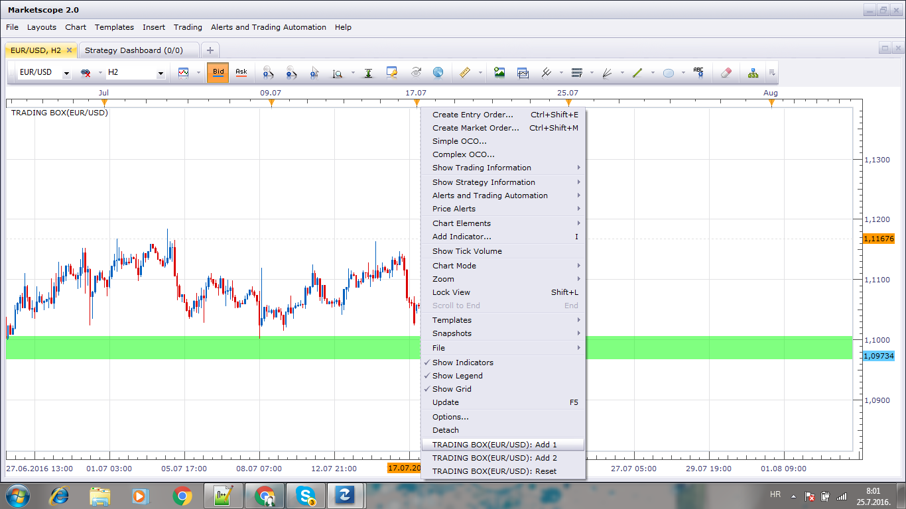

# Trading Box

> Source: https://fxcodebase.com/code/viewtopic.php?f=17&t=63703  
> Forum: 17 · Topic 63703 · 8 post(s)

---

## Trading Box

**Apprentice** · Sun Jul 24, 2016 10:21 am

 

Based on request.
[viewtopic.php?f=27&t=63696#p107267](https://fxcodebase.com/code/viewtopic.php?f=27&t=63696#p107267)

 [Trading Box.lua](files/107301/Trading%20Box.lua)

 [Manual-entry Trading Box.lua](files/107301/Manual-entry%20Trading%20Box.lua)

---

## Re: Trading Box

**Hailkayy** · Sun Jul 24, 2016 10:31 am

Hello,

Thanks.

I can't set line 1 and line 2 values, they do not appear in the menu.

Can you do it and add :
line 3 and 4
line 5 and 6
line 7 and 8
with the same options for every pair of lines ?

---

## Re: Trading Box

**Apprentice** · Mon Jul 25, 2016 1:35 am

Use the MENU option to define the line.

---

## Re: Trading Box

**Hailkayy** · Mon Jul 25, 2016 5:44 am

> **Apprentice wrote:**
>
>
> Untitled.png
>
>
> Use the MENU option to define the line.

surprisingly this is not working for me, I see the menu but aftee setting the lines the colored area does not appear.

I understand the tab idea but I have several other indicators in there (like ttc trans line that has 10 lines to scroll) meaning I have to scroll down and pass through 2 or 3 other indicators, taking me about 5-10 seconds just for placing line 1 out of 2, and I trade with lots of charts having the same setup.

That way, like for gridd, can you release a version where I can go in the indicator menu, type the name and set up values ? Would be much faster for me.

Thanks a lot.

---

## Re: Trading Box

**Hailkayy** · Mon Jul 25, 2016 12:04 pm

It was a problem on my end.
I had it working.

please just :
1. release a manual-entry based version, for gridd too, (more straightforward for my trading, and also currently if one trading box (or gridd) is set on one chart, I cannot add an other trading box on other, or the same chart as the first box will be deleted) and

2. add 1 more zone to this indicator with same parameters (color etc.)

Thanks for your work.

---

## Re: Trading Box

**Apprentice** · Wed Jul 27, 2016 6:34 am

Manual-entry Trading Box.lua added.

---

## Re: Trading Box

**Hailkayy** · Wed Jul 27, 2016 1:01 pm

Piece of art, thanks.

---

## Re: Trading Box

**Apprentice** · Mon Aug 27, 2018 4:57 am

The indicator was revised and updated.
