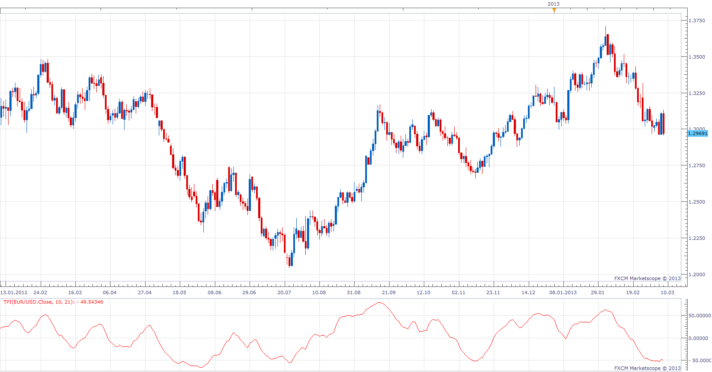

# Trading Channel Index

> Source: https://fxcodebase.com/code/viewtopic.php?f=17&t=32945  
> Forum: 17 · Topic 32945 · 3 post(s)

---

## Trading Channel Index

**Apprentice** · Fri Mar 08, 2013 2:05 pm

The Trading Channel Index measures the location of average daily price relative to a smoothed average of average daily price.

 [TPI.lua](files/56027/TPI.lua)

The indicator was revised and updated

---

## Re: Trading Channel Index

**Alexander.Gettinger** · Mon Sep 15, 2014 12:32 pm

MQL4 version of Trading Channel Index: [viewtopic.php?f=38&t=61155](https://fxcodebase.com/code/viewtopic.php?f=38&t=61155).

---

## Re: Trading Channel Index

**Apprentice** · Sat Jun 24, 2017 4:58 am

The indicator was revised and updated.
