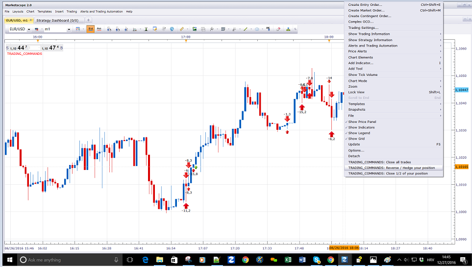

# Trading_commands

> Source: https://fxcodebase.com/code/viewtopic.php?f=17&t=64251  
> Forum: 17 · Topic 64251 · 72 post(s)

---

## Trading_commands

**Apprentice** · Tue Dec 27, 2016 9:23 am

Will Add a custom command "Close all trades","Reverse / Hedge your position","Close 1/2 of your position" to your right mouse menu.
It is limited to chart instrument.
Will affect all accounts.

If we use "Close 1/2" and we have an odd number of positions, unbalanced number will be used.
Example.
If we have 5 positions, 2 will be closed.
If we have 3 positions, 1 will be closed.
If we have 1 positions, 1 will be closed.

 [Trading_commands.lua](files/110294/Trading_commands.lua)

 [Trading_commands_all.lua](files/110294/Trading_commands_all.lua)

While Trading_commands.lua is chart instrument only.
Trading_commands_all will work for all instrument, will close/hedge/reverse all position regardless of the instrument.

---

## Re: Trading_commands

**albertparis** · Tue Dec 27, 2016 10:51 am

Code: [Select all](https://fxcodebase.com/code/)
`Hello
Can be added the hedge function

If 2 positions are open for purchase then if hedge 2 positions for sale will be open

Thank you in advance for your work`

---

## Re: Trading_commands

**amazon1a** · Wed Dec 28, 2016 8:47 am

Hi Apprentice,

Thanks for this,

Is it possible to select a different fraction to Close?

For example 1/3 or 1/4 etc.

I can see this to be an extremely helpful feature.

Best, AG

---

## Re: Trading_commands

**Apprentice** · Wed Dec 28, 2016 12:24 pm

Hedge function added.

---

## Re: Trading_commands

**Cactus** · Wed Dec 28, 2016 6:41 pm

Can you add a "set limit for all position on this symbol" button?
Which would update the limit profit level based on where you right click, on all positions opened of the symbol of the chart

---

## Re: Trading_commands

**Apprentice** · Fri Dec 30, 2016 5:12 am

Your request is added to the development list, Under Id Number 3705
 If someone is interested to do this task, please contact me.

---

## Re: Trading_commands

**albertparis** · Sun May 28, 2017 6:26 am

Hello
Can we add the function: Brekeven price so that the Stop Loss = 0 E

Thank you for your future work

---

## Re: Trading_commands

**Apprentice** · Mon May 29, 2017 5:10 am

Breakeven have 1 pip minimum.

---

## Re: Trading_commands

**albertparis** · Mon May 29, 2017 6:53 am

If you can add this function: Breakeven have 1 pip minimum

perfect for me .

 Thank you for your future work

---

## Re: Trading_commands

**7000306337** · Mon Jul 17, 2017 4:45 pm

Thanks a million Apprentice.
You are amazing.

Never ever ever thought trading can be done from an INDICATOR.
That is how you do it.

Txs again.

---

## Re: Trading_commands

**7000306337** · Mon Jul 17, 2017 7:20 pm

Can`t thank you enough. Awesome!

Would it be too much to ask of you to add a new command to use OpenMarket() to open a new position if CURRENTLY NO TRADES EXIST ?

---

## Re: Trading_commands

**7000306337** · Mon Jul 17, 2017 7:59 pm

Apologize.

I did NOT mean to say a new "addCcommand".

I actually meant to say ONLY MODIFY OpenMarket() to open a new position if no positions already exist.

---

## Re: Trading_commands

**7000306337** · Tue Jul 18, 2017 12:11 am

I do NOT want to abuse your generosity.

Please disregard, my last request (to modify OpenMarket()).
I should try to do it myself.
I will ask for help, if I get stuck.

---

## Re: Trading_commands

**7000306337** · Tue Jul 18, 2017 11:13 am

APPRENTICE ...... YOU ARE AMAZING !!!!!!! AWESOME !!!!!

YES ... trading can be done from INDICATORS.
For proof of concept, ... I just hard coded OpenMarket() and it DID OpenMarket("B") on crossingAbove and OpenMarket("S") on crossingBelow the trend line.

INCREDIBLE ... HARD TO BELIEVE.

Why for so many years INDICORE SDK got me confused under the impression that "STRATEGIES/ALERTS" and "INDICATORS" are 2 different separate animals (you can NOT do in one what is done in the other)?????

Why did INDICORE SDK create the distinction, .... if I can do everything I want in an INDICATOR?????

---

## Re: Trading_commands

**Apprentice** · Tue Jul 18, 2017 12:08 pm

That was true once.
Trade from within indicator was introduced later.
Strategies still have some advantages, like, trade simulation.

---

## Re: Trading_commands

**7000306337** · Sat Jul 22, 2017 11:52 am

Hi Greatest Apprentice:

Very much appreciate if can give me a link to a complete documentation of core.valuemap.

In the SDK, I couldn`t find any meaningful complete description of all attributes of valuemap, and ENUMERATED lists of their respective values

local valuemap = core.valuemap();
 valuemap.Command = "CreateOrder", ?????
 valuemap.OrderType = "OM", "CM", ?????
 valuemap.OfferID = offer_id;
 valuemap.AcctID = account_id;
 valuemap.Quantity = amount;
 valuemap.BuySell = "B", "S", ??????
 valuemap.NetQtyFlag = "y", ??????
 valuemap.?????? = ???????
 ????????

txs,

---

## Re: Trading_commands

**Apprentice** · Mon Jul 24, 2017 8:24 am

You will add different values, depending on the trading command that you will use.
[http://www.fxcodebase.com/documents/Ind ... mands.html](http://www.fxcodebase.com/documents/IndicoreSDK/TradingCommands.html)

---

## Re: Trading_commands

**7000306337** · Mon Jul 24, 2017 8:47 am

Greater Than Life Apprentice:

Exactly what I was looking for.

Thank you very much,

---

## Re: Trading_commands

**Paul W** · Mon Jul 24, 2017 2:31 pm

Handy function

been testing, found some errors
- Close all trades - OK
- Hedge your Position - not working
- Reverse your Position - will close existing trade, does not open new reverse position
- Close 1/2 of your Position - not working

amount size tested = 10
am using TSII - current Version 01.15.090518

if you could have a look - would be very much appreciated\

---

## Re: Trading_commands

**Apprentice** · Tue Jul 25, 2017 8:55 am

Works perfectly on my non FIFO account.
Do you use FIFO?

---

## Re: Trading_commands

**7000306337** · Wed Jul 26, 2017 7:29 pm

Hello Again:
Thanks a million for your precious time and mentor.

A totally different question:
From within a LUA INDICATOR, ... is it possible to periodically login into a web page to scrap two columns of a table there?

Much Gratitude,

---

## Re: Trading_commands

**Apprentice** · Thu Jul 27, 2017 8:59 am

Not that I know.

---

## Re: Trading_commands

**Paul W** · Thu Jul 27, 2017 12:56 pm

non-FIFO

from this link - [http://download.fxcorporate.com/FXCM/FXTS2Install.EXE](http://download.fxcorporate.com/FXCM/FXTS2Install.EXE)

removed all other indicators on chart, and was able to duplicate error ?

---

## Re: Trading_commands

**Apprentice** · Sun Aug 06, 2017 4:10 am

Do you use Demo or Real?
Which version of TS you use.

---

## Re: Trading_commands

**Paul W** · Mon Aug 07, 2017 10:36 am

have only used "Close all trades" on Live account - works fine

tested (only) on Demo other options
- Hedge
- Reverse
- Close half (am interested in this feature)

am a little reluctant to test (any) indicator on live account - especially if it has latency consequences

when scalping

---

## Re: Trading_commands

**Mountaintrader** · Wed Sep 13, 2017 5:56 pm

Hi Apprentice,

Is it possible to add a "close all trades at a predetermined $$ or pip value" to trading commands ?

Thanks

Mountain Bear

---

## Re: Trading_commands

**Apprentice** · Fri Sep 15, 2017 3:09 pm

Your request is added to the development list, Under Id Number 3896
 If someone is interested to do this task, please contact me.

---

## Re: Trading_commands

**Apprentice** · Thu Sep 21, 2017 4:06 am

$/Pip close added.

---

## Re: Trading_commands

**7000306337** · Mon Oct 16, 2017 10:09 am

This worked fine

 if BuySell == "B" then
 valuemap.PegPriceOffsetPipsStop = -instance.parameters.Stop;
 else
 valuemap.PegPriceOffsetPipsStop = instance.parameters.Stop;
 end

---

## Re: Trading_commands

**Alexander.Gettinger** · Fri Oct 20, 2017 10:02 am

> **Cactus wrote:**
> Can you add a "set limit for all position on this symbol" button?
> Which would update the limit profit level based on where you right click, on all positions opened of the symbol of the chart

Please, try this version of the indicator:

 [Trading_commands2.lua](files/115519/Trading_commands2.lua)

---

## Re: Trading_commands

**7000306337** · Mon Oct 23, 2017 7:11 pm

Thank you very much in advance for your awesome mentor,

In STRATEGIES
local tk, H0
function ExtUpdate(id, source, period)
 if id==tickSourceID then tk = source[period] end
 if id==barSourceID then H0 = source.high[period] end

-- now every tick we can compare tick price with bar.high price.
end

Is there an equivalent way In INDICATORS to compare tick price with bar prices ?

---

## Re: Trading_commands

**Apprentice** · Tue Oct 24, 2017 4:02 am

Sure, if you use core.host:execute("getSyncHistory" do get your price data.
This is the case with most MTF MCP indicators.

---

## Re: Trading_commands

**7000306337** · Tue Nov 21, 2017 10:42 am

Thank you very much in advance for your awesome mentor.

Is it possible to have a STRATEGY or an INDICATOR applied to MULTIPLE instruments?
(To eliminate having multiple instances of the same STRATEGY or INDICATOR applied to each instrument)

Much appreciated,

---

## Re: Trading_commands

**Apprentice** · Wed Nov 22, 2017 5:14 am

Sure. Strategy can trade on different currency pairs.

---

## Re: Trading_commands

**SirOrigami** · Thu Nov 30, 2017 6:53 pm

Yeah, Move stop to breakeven +x pips would be awesome

---

## Re: Trading_commands

**Apprentice** · Sat Dec 02, 2017 5:51 am

Your request is added to the development list under Id Number 3967

---

## Re: Trading_commands

**Apprentice** · Wed Dec 13, 2017 10:28 am

Try this version.

 [Trading_commands.lua](files/116457/Trading_commands.lua)

---

## Re: Trading_commands

**7000306337** · Thu Jan 11, 2018 10:19 am

Thank you very much in advance for your awesome mentor.

Follow up to my previous enquiry to have one single STRATEGY or INDICATOR applied to MULTIPLE instruments? (To eliminate having multiple instances of the same STRATEGY or INDICATOR applied to each instrument)

For example I can implement a STRATEGY or an INDICATOR to EXIT positions of a specific instrument when its RSI indicator reaches a certain level.

But don`t know how to apply it to ALL instruments without having multiple instances of the same (one for each instrument)

Much appreciated,

---

## Re: Trading_commands

**Apprentice** · Fri Jan 12, 2018 6:46 am

> But don`t know how to apply it to ALL instruments without having multiple instances of the same (one for each instrument)

Give me an example.
Will write this for you.

---

## Re: Trading_commands

**7000306337** · Fri Jan 12, 2018 10:24 am

-- Appling this indicator to to EUR/USD chart will exit EUR/USD long pos if EUR/USD avg[period] crosses below threshold
-- and will exit EUR/USD short pos if EUR/USD avg[period] crosses above threshold.
-- I wish to modify it to work also on an additional another instument say USD/JPY.
-- I mean (I could) but do not want to have another instance applied it to a separate USD/JPY chart.
-- Wish to have ONLY ONE instance to exit both EUR/USD and USD/JPY.

Code: [Select all](https://fxcodebase.com/code/)
`function Init()
    indicator:name("avg");
    indicator:description("Khairy N");
--    indicator:requiredSource(core.Tick);
    indicator:requiredSource(core.Bar);
    indicator:type(core.Oscillator);
--    indicator:type(core.Indicator);
--    indicator:setTag("group", "Classic Oscillators");
    indicator:setTag("group", "Moving Averages");

    indicator.parameters:addGroup("Calculation");
    indicator.parameters:addInteger("nn", "nn", "nn", 22, 1, 1000000);
    indicator.parameters:addInteger("pos", "pos", "pos", 1, -1, 1);
    indicator.parameters:addDouble("thrsh", "thrsh", "thrsh", 1.23, 0.1, 1000);

    indicator.parameters:addGroup("Style");
    indicator.parameters:addColor("clravg", "clravg", "clravg", core.rgb(255, 0, 255));
    indicator.parameters:addInteger("widthavg", "widthavg", "widthavg", 1, 1, 5);
    indicator.parameters:addInteger("styleavg", "styleavg", "styleavg", core.LINE_SOLID);
    indicator.parameters:setFlag("styleavg", core.FLAG_LINE_STYLE);
    indicator.parameters:addString("Account", "Account2Trade", "", "");
    indicator.parameters:setFlag("Account", core.FLAG_ACCOUNT);
end

local nn, Account, Offer, thrsh, pos

local first;
local source = nil;

local avg = nil;
local ColorMode, UPclr, DNclr;
local psz;
local fst=false

function Prepare()
    pos = 0                              -- position  =1 long     =-1 short    =0 flat
    fst=true
    nn = instance.parameters.nn;
    pos = instance.parameters.pos;
    thrsh  = instance.parameters.thrsh  -- thrshold to exit long above or short below
    source = instance.source;
    first = source:first()
    UPclr = core.rgb(255, 0, 0);
    DNclr = core.rgb(255, 255, 255);
    psz = source:pipSize();
   Account = instance.parameters.Account;
   Offer = core.host:findTable("offers"):find("Instrument", instance.source:instrument()).OfferID;

    local name = profile:id() .. "(" .. source:name() .. ", " .. nn .. ", " .. thrsh .. ")";
    instance:name(name);
    avg = instance:addStream("avg", core.Line, name, "avg", instance.parameters.clravg, first)
    avg:setWidth(instance.parameters.widthavg);
    avg:setStyle(instance.parameters.styleavg);
end

function Update(period)
   if period>first+nn  then   
      avg[period] = mathex.avg( source.close, period-nn, period)
      if avg[period]<thrsh and pos==1  then exit("B") end
      if avg[period]>thrsh and pos==-1 then exit("S") end
   end
end

function AsyncOperationFinished(cookie, success, message)
end

function exit(BuySell)
    local valuemap, success, msg;
    if haveTrades(BuySell) then
        valuemap = core.valuemap();
        if BuySell == "B" then
            BuySell = "S";
        else
            BuySell = "B";
        end
        valuemap.OrderType = "CM";
        valuemap.OfferID = Offer;
        valuemap.AcctID = Account;
        valuemap.NetQtyFlag = "Y";
        valuemap.BuySell = BuySell;
        success, msg = terminal:execute(101, valuemap);

        if not(success) then
            terminal:alertMessage(instance.bid:instrument(), instance.bid[instance.bid:size() - 1], "alert_OpenOrderFailed" .. msg, instance.bid:date(instance.bid:size() - 1));
        end
    end
end

function haveTrades(BuySell)
    local enum, row;
    local found = false;
    enum = core.host:findTable("trades"):enumerator();
    row = enum:next();
    while (not found) and (row ~= nil) do
        if row.AccountID == Account and
           row.OfferID == Offer and
           (row.BS == BuySell or BuySell == nil) then
           found = true;
        end
        row = enum:next();
    end
    return found
end`

---

## Re: Trading_commands

**7000306337** · Fri Jan 12, 2018 10:32 am

The reason being :
If I apply this indicator to each chart of say 20 instruments it becomes a big mess.
Especially every time I modify it.

---

## Re: Trading_commands

**7000306337** · Fri Jan 12, 2018 5:16 pm

Forgot to mention that the avg INDICATOR is required to be displayed, .... to choose the threshold avg that will trigger the exit.

---

## Re: Trading_commands

**Apprentice** · Sat Jan 13, 2018 7:14 am

in Prepare() You have to call the source on different instruments
See Two Instrument Strategy Template.lua
[viewtopic.php?f=28&t=2712](https://fxcodebase.com/code/viewtopic.php?f=28&t=2712)
You will have to replace Offer in
valuemap.OfferID = Offer;
with the appropriate instrument name.

But first U will have to create array will all available instruments,
and do this checks for all of them.

---

## Re: Trading_commands

**7000306337** · Mon Jan 15, 2018 12:05 am

Thank you very much for your precious time.
Generous as ever.
Always much appreciated.

---

## Re: Trading_commands

**chai88888** · Fri Jan 19, 2018 12:23 am

can you add a command where you only close all sell and all buy. thanks

---

## Re: Trading_commands

**Apprentice** · Sat Jan 20, 2018 4:14 pm

Your request is added to the development list under Id Number 4015

---

## Re: Trading_commands

**Apprentice** · Sat Jan 20, 2018 4:26 pm

Long / Short option added.

---

## Re: Trading_commands

**chai88888** · Sun Jan 21, 2018 12:03 pm

thank you very much

---

## Re: Trading_commands

**Apprentice** · Mon Feb 05, 2018 6:49 am

The Strategy was revised and updated.

---

## Re: Trading_commands

**7000306337** · Sat Feb 10, 2018 8:27 am

I can not thank you enough for your valuable coaching and mentor.

Is there a way to find out the time a STOP or a LIMIT was executed? (or any other way to same effect)

The reason being: Once a STOP or LIMIT is executed, I want to wait for the rest of the candle to complete and close before I enter() a new position. To prevent an endless ping-pong enter()-exit() for the rest of the candle.

For example if I`m on an H1 time frame and:
an enter() was executed at 11:xx o`clock
and exit() was executed at 12:xx o`clock
I do NOT want to enter() any new positions till the 13:00 o`clock candle starts.
Otherwise I`ll have the ping-pong situation since both the enter() and exit() conditions do exist simultaneously till the end of the 12:00 o`clock candle.

Sincerest Gratitude,

---

## Re: Trading_commands

**Apprentice** · Sun Feb 11, 2018 5:19 am

Unfortunately Closed Trades table it does not provide information about the order type.
Close time is provided, so we can use this as a reference point.
With which indicator/strategy this will be used.

---

## Re: Trading_commands

**7000306337** · Sun Feb 11, 2018 9:34 pm

Cordial thanks for your valuable time and reply. Much appreciated.

I`m not using any STANDARD INDICATOR or STRATEGY.

I`m struggling with a STRATEGY that I`m trying to create.
I got it working to enter() correctly and exit() correctly on a PegPriceOffsetPipsStop STOP or a PegPriceOffsetPipsLimit LIMIT.

The only problem left now is how to prevent entering() again till end of current candle.
Because for the rest of the current candle both enter() and exit() conditions are still simultaneously valid till end of current candle which results in thousands of enter() and exactly the same number of thousands of exit().

Wish there was a way (or a work around) to limit number of enter() per candle to ONLY ONE(1) trade.

---

## Re: Trading_commands

**7000306337** · Sun Feb 11, 2018 10:05 pm

Thank you thank you ....

That is it ...
I will set a flag=true if enter() is executed once, to prevent entering() again.
And reset flag=false on each new candle.
That should work.
I`ll try it.

---

## Re: Trading_commands

**7000306337** · Mon Feb 12, 2018 7:20 am

Sincerest Gratitude ... can`t thank you enough for your valuable time and mentor.

Just wanted to mention that the flag on ................................... enter() .... worked just fine.
I was trying to solve the wrong problem by trying to set a flag on ....... exit().
(there are many exits() and the STOP and LIMIT exits() are hard to track)

As always much much appreciated,
Thanks again.

---

## Re: Trading_commands

**7000306337** · Mon Feb 12, 2018 2:24 pm

Hi:
Me again.

Just a quick question;
Can extSignale() be used in INDICATORS (any example)? or it is only for STRATEGIES.

If not is there a way to mimic it in INDICATORS?

txs,

---

## Re: Trading_commands

**Apprentice** · Fri Feb 16, 2018 7:32 am

Only for STRATEGIES.

---

## Re: Trading_commands

**alerander81** · Fri Jul 27, 2018 9:31 am

Hi Apprentice,

Thanks you very much for this indicator !

But in order to have more results, Is it possible to add these functions :

- We open a position, short or long, manually (example, a Buy position with 20 lots)

- Then the price reach first take profit (for example 6 pips, definied in indicator parameters), the indicator close 1/2 of this position automatically (10 lots so), and in the same time, the indicator move automactically the fixed stop to breakeaven + 1 pips.

- Then the price reach the second take profit (for example 12 pips, definied in indicator parameters), the indicator close again automatically 1/2 of the position (5 lots so), and again in the same time automatically change the fixed stop to trailing stop.

By this behaviour we secure trades with an automatic way with the breakeaven, as the same time as we have closed 75% of the position, with 25% is running if we have a market acceleration.

Thanks you in advance.

---

## Re: Trading_commands

**Apprentice** · Mon Jul 30, 2018 9:57 am

Your request is added to the development list under Id Number 4202

---

## Re: Trading_commands

**Apprentice** · Mon Jul 30, 2018 12:29 pm

There is a strategy which does almost exactly that. I modified it a little bit to fit exactly to the requirements.

 [Trailing_stop_limit_2.lua](files/120230/Trailing_stop_limit_2.lua)

 [Trailing_stop_limit_all trades.lua](files/120230/Trailing_stop_limit_all%20trades.lua)

---

## Re: Trading_commands

**alerander81** · Tue Jul 31, 2018 8:22 am

Hi,

I can't use the strategy when no trades are present on open positions.

Is it possible to activate the strategy (in stand-by mode) when no trades are open?
Then when we open a position the strategy detect this?

Thanks !

---

## Re: Trading_commands

**Godspeed108** · Thu Aug 02, 2018 4:43 am

> **Apprentice wrote:**
> There is a strategy which does almost exactly that. I modified it a little bit to fit exactly to the requirements.
>
>
> Trailing_stop_limit_2.lua

Hello Apprentice,

I am new here and first off, let me express my appreciation for the work you do. Thanks so much.

I see that you created this EA Trailing stop limit. It is exactly what I am looking for. My question to you is, can I disable the function to turn the stop into a trailing stop? I do not want my stop to trail.

Essentially, all I want are TWO options to:

Set SL at 'X1' when market reaches 'Y1'
Close 'X1 amount of lots' when market reaches 'Y1'

and

Set SL at 'X2' when market reaches 'Y2'
Close 'X2 amount of lots' when market reaches 'Y2'.

That's it. This is for the Trading Station II on FXCM

Cheers!

---

## Re: Trading_commands

**Godspeed108** · Thu Aug 02, 2018 4:57 am

Bump

---

## Re: Trading_commands

**Godspeed108** · Thu Aug 02, 2018 6:07 pm

> **Apprentice wrote:**
>
>
>
> Trailing_stop_limit_2.lua

Does anyone have any experience using this strategy in terms of inputs, values, etc? If so, I have some basic questions and would appreciate some feedback.

Thanks in advance.

---

## Re: Trading_commands

**Apprentice** · Fri Aug 03, 2018 3:44 am

> My question to you is, can I disable the function to turn the stop into a trailing stop?

Set Trailing stop order to No

---

## Re: Trading_commands

**Apprentice** · Fri Aug 03, 2018 4:05 am

Trailing_stop_limit_all trades.lua added.

---

## Re: Trading_commands

**Godspeed108** · Mon Aug 20, 2018 4:35 am

> **Apprentice wrote:**
> Trailing_stop_limit_all trades.lua added.

What does this new strategy do that is different from the previous one?

Thanks in advance!

---

## Re: Trading_commands

**Apprentice** · Tue Aug 21, 2018 6:56 am

This strategy has "Monitor all new trades" parameter. When is set to true the strategy will work on all trades instead of the chosen in the " Choose Trade" parameter.

---

## Re: Trading_commands

**PivotDayTrader** · Fri Mar 01, 2019 9:58 am

Since the last update of the TS2 seems to not work properly (at least in demo account).

Can I have a confirmation ?

The issues ;

When I try to hedge position it does not work.
When I try to close half of the positions (100 on EURUSD) it close all.
Most of the times it does nothing.

Kind Regards,

---

## Re: Trading_commands

**Apprentice** · Mon Mar 04, 2019 6:13 am

Your request is added to the development list under Id Number 4510

Can you please provide more information.
Are you using Real or Demo account, are we talking about FIFO or not-FIFO account.

---

## Re: Trading_commands

**Apprentice** · Wed Mar 06, 2019 5:31 am

Topmost/First post of the topic was updated.

---

## Re: Trading_commands

**MadMan** · Fri Jul 24, 2020 2:31 am

Hello .. can we have all the commands in one indicator instead of having multiple indicators installed with duplicated commands?

---

## Re: Trading_commands

**Apprentice** · Fri Jul 24, 2020 7:27 am

We have both versions, users can choose which will be used.
