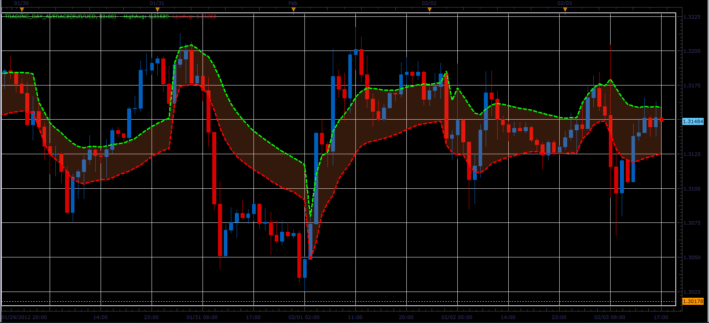

# Trading day average indicator

> Source: https://fxcodebase.com/code/viewtopic.php?f=17&t=12840  
> Forum: 17 · Topic 12840 · 6 post(s)

---

## Trading day average indicator

**Alexander.Gettinger** · Sat Feb 04, 2012 9:21 pm

The indicator calculates the values ​​of the average High and Low prices during the trading day.
The beginning of the trading day is defined as a parameter.

For example:
Timeframe: H1,
BeginTime: 02:00
For "02:00" candle: HighAvg("02:00")=High("02:00"), LowAvg("02:00")=Low("02:00"),
for "03:00" candle: HighAvg("03:00")=(High("03:00")+High("02:00"))/2, LowAvg("03:00")=(Low("03:00")+Low("02:00"))/2, etc.

 

Download:

 [Trading_Day_Average.lua](files/25185/Trading_Day_Average.lua)

The indicator was revised and updated

---

## Re: Trading day average indicator

**LordTwig** · Fri Feb 17, 2012 11:14 pm

Great Job.
Thank you for this indicator.

**Can you also make a strategy as well?**
Buy if price goes above High Average
Sell if price goes below Low Average

With all the usual strategy options....Stops...Limits ...ect including these options:
1) Option to close all opened trades at end of trading day.
2) Option to choose how many trades to open per day.

Btw.... Is it at all possible to restart(break) the (highAve/LowAve) line at start of new day/time?
Rather than continual line joining days together.? For better clarity.....

Cheers
Lordtwig

---

## Re: Trading day average indicator

**Apprentice** · Sat Feb 18, 2012 4:17 am

Your request is added to the development list.

---

## Re: Trading day average indicator

**Alexander.Gettinger** · Thu Feb 23, 2012 10:31 am

Strategy you may find here: [http://www.fxcodebase.com/code/viewtopi ... 31&t=13893](http://www.fxcodebase.com/code/viewtopic.php?f=31&t=13893)

---

## Re: Trading day average indicator

**Alexander.Gettinger** · Tue May 08, 2012 5:23 pm

MQL4 version of indicator: [viewtopic.php?f=38&t=17983](https://fxcodebase.com/code/viewtopic.php?f=38&t=17983)

---

## Re: Trading day average indicator

**Apprentice** · Tue Apr 04, 2017 5:37 am

Indicator was revised and updated.
