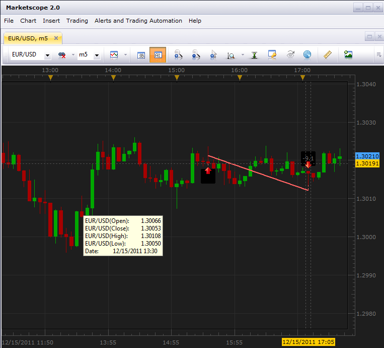
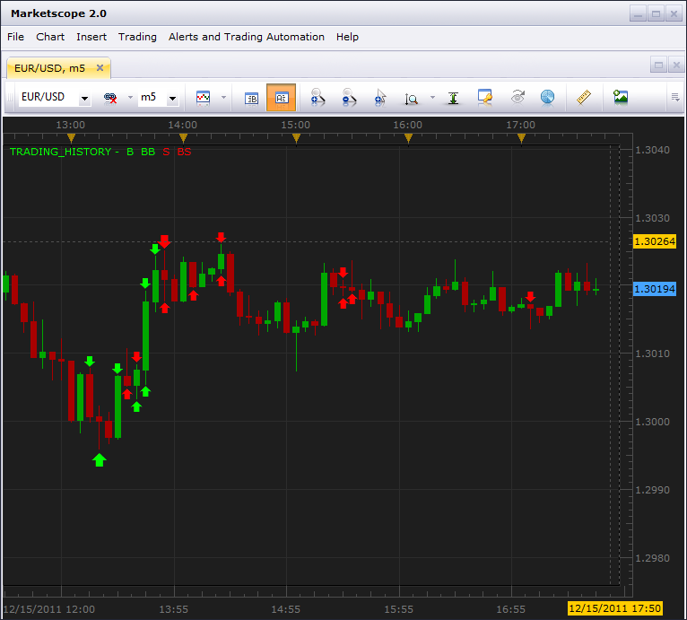
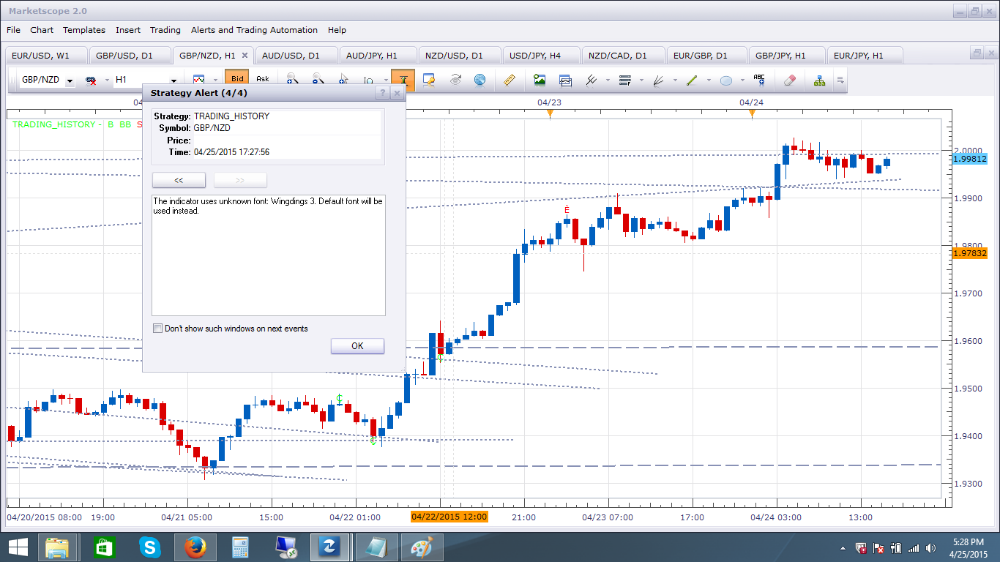
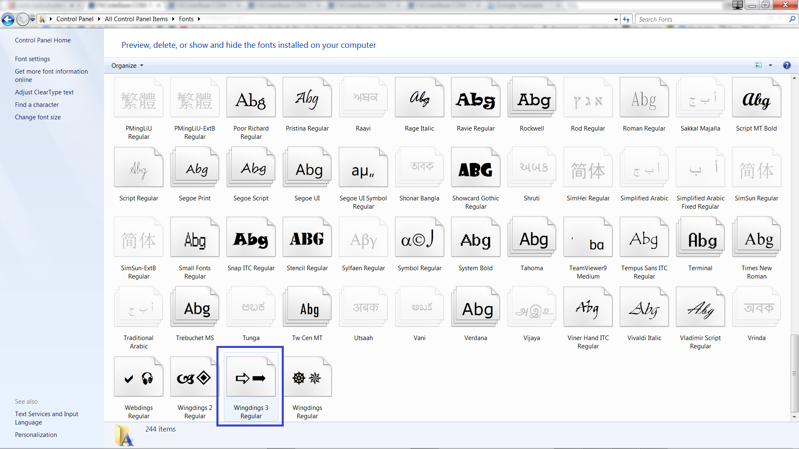

# Trading History

> Source: https://fxcodebase.com/code/viewtopic.php?f=17&t=9754  
> Forum: 17 · Topic 9754 · 25 post(s)

---

## Trading History

**vstrelnikov** · Thu Dec 15, 2011 5:58 pm

Indicator displays arrows at the bars when positions was opened/close on the given account/currency pair.
Beside standard function "Show Trading History", which displays only positions from "Closed Trades" table, TRADING_HISTORY indicator retrieves information with help of report api library.
Using of report api library allows to retrive information about any amount of closed positions (up to account creation time).

Compare, standard function:

 

And "Trading History" indicator:

 

Indicator requires [LuaLib](https://fxcodebase.com/code/viewtopic.php?f=28&t=9753) libraries to be installed.

 [TRADING_HISTORY.lua](files/20772/TRADING_HISTORY.lua)

---

## Re: Trading History

**7510109079** · Wed Dec 21, 2011 12:02 pm

NIce.

Is there a simple way to:

- add the pips P/L to the arrows
- specify the arrow size

thx
L

---

## Re: Trading History

**Jigit Jigit** · Sun Feb 05, 2012 1:52 am

Hi guys,
could you please let me know how to make it work.

When I try to apply this indi a message pops up saying:

Thanks

---

## Re: Trading History

**Apprentice** · Sun Feb 05, 2012 3:13 am

Have you install LuaLib libraries.
They are necessary for the proper operation of this indicator.

---

## Re: Trading History

**Jigit Jigit** · Sun Feb 05, 2012 5:17 am

Thank you Apprentice.
Now it's working like a charm.

---

## Re: Trading History

**Hailkayy** · Sun Feb 05, 2012 9:44 am

Yup Nice. Thanks.

---

## Re: Trading History

**tatianavas** · Tue Jun 05, 2012 9:53 am

hi I downloaded trading history indicator but it doesn't show arrows it has some symbols how can I change it?

---

## Re: Trading History

**tatianavas** · Tue Jun 05, 2012 9:58 am

my charts have symols and not arrows in trading history can i change it?

---

## Re: Trading History

**evgeniyn** · Mon May 20, 2013 12:38 pm

Hi, After installation of LuaLib and attempt load the indicator I get error, see attached

---

## Re: Trading History

**sunshine** · Mon Jun 03, 2013 5:06 am

> **evgeniyn wrote:**
> Hi, After installation of LuaLib and attempt load the indicator I get error, see attached

Please re-install Trading Station, and then, install a new version of LuaLibs (LuaLib-20130603.exe):
[viewtopic.php?f=28&t=9753&p=20771#p20771](https://fxcodebase.com/code/viewtopic.php?f=28&t=9753&p=20771#p20771)

---

## Re: Trading History

**speakinmymind** · Sun Aug 11, 2013 11:06 am

I get the following error when attempting to install the lualib.exe.

Attachments are disabled on that forum so I'm putting it here.

---

## Re: Trading History

**sunshine** · Mon Aug 12, 2013 11:52 pm

Hi speakinmymind,

I couldn't reproduce the issue. It appears that the reason of the issue is denied write access to a directory to which you are trying to install the .exe file.

---

## Re: Trading History

**Silverthorn** · Mon Dec 30, 2013 1:20 am

Is it possible to load history that has been downloaded from a Mirror Trader Strategy's history using this indicator?

I'd like to be able to load the historic trades downloaded from the Mirror Trader Platform over the chart to enable me to assess historically under what trading situations a strategy does well and when it performs poorly.

---

## Re: Trading History

**Valeria** · Mon Jan 06, 2014 4:50 am

Hi Silverthorn,

I'm not sure that you will manage to do that without the code changes of the indicator.

---

## Re: Trading History

**johnnolte** · Sat Apr 25, 2015 7:16 pm

I'm getting a alert when I first add the indicator to the chart that says: "The indicator uses unknown font: Wingdings 3. Default font will be used instead."

I'm also getting symbols instead of arrows, maybe the alert has something to do with it?

 

---

## Re: Trading History

**Apprentice** · Mon Apr 27, 2015 2:36 am

Can you check is it Wingdings 3 available on your workstation.
Go to Control Panel / Fonts

 [WINGDNG3.TTF](files/100052/WINGDNG3.TTF)

---

## Re: Trading History

**johnnolte** · Tue Apr 28, 2015 4:24 pm

That was the problem, I installed the Wingdings 3 font and it fixed the problem, thanks.

---

## Re: Trading History

**amazon1a** · Wed Apr 29, 2015 7:27 am

Hi Apprentice,

Works fine, but is it possible to 1) change Font size and 2) add function to display Pip Value directly on the screen?

Many Thanks, AG

---

## Re: Trading History

**7510109079** · Fri May 01, 2015 4:45 am

Hi Apprentice
scrutinising the indicator's buy/sell markers, I find that it plots trades from other currency pairs too

This is quite easy to spot if you turn on the MS recent trading history. Every marker that doesnt have a recent system history marker represents a trade from another currency pair. e.g. EURUSD, USDJPY

This is GBPUSD. Magenta circles represent EURUSD & USDJPY trades

---

## Re: Trading History

**7510109079** · Fri May 01, 2015 7:06 am

Strange. If i refresh the view the indicator corrects itself and only the correct currency pair is shown, so ignore my last post

---

## Re: Trading History

**7510109079** · Fri May 01, 2015 8:01 am

for some reason the phantom markers keep returning. A refresh sorts it out temporarily but they soon come back again

---

## Re: Trading History

**mechanicjon** · Mon Feb 22, 2016 12:06 am

Will this work on the latest TS version? Any updates on the phantom markers?

thx

---

## Re: Trading History

**10daiFX** · Fri Dec 29, 2017 4:14 am

> **speakinmymind wrote:**
> I get the following error when attempting to install the lualib.exe.
>
> Attachments are disabled on that forum so I'm putting it here.

I had this issue as well. The easy way is to create a new folder on C:\Lualib and run the "lualib.exe." that will install and extract the files

---

## Re: Trading History

**10daiFX** · Fri Dec 29, 2017 5:00 am

> **Jigit Jigit wrote:**
> Hi guys,
> could you please let me know how to make it work.
>
> When I try to apply this indi a message pops up saying:
>
>
> Thanks

Hi Also had the same problem but fixed through this post:

[viewtopic.php?f=17&t=3514&hilit=trading+history&start=20#p111146](https://fxcodebase.com/code/viewtopic.php?f=17&t=3514&hilit=trading+history&start=20#p111146)

then download the latest version here:
[viewtopic.php?f=17&t=3514&hilit=trading+history&start=30#p115422](https://fxcodebase.com/code/viewtopic.php?f=17&t=3514&hilit=trading+history&start=30#p115422)

Happy Trading

---

## Re: Trading History

**Apprentice** · Wed Jun 20, 2018 6:01 am

Bump up.
