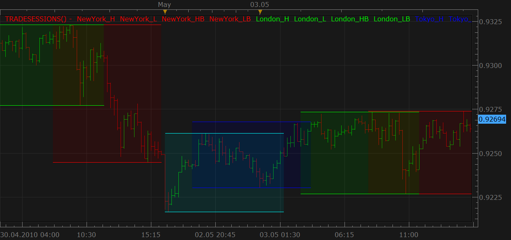
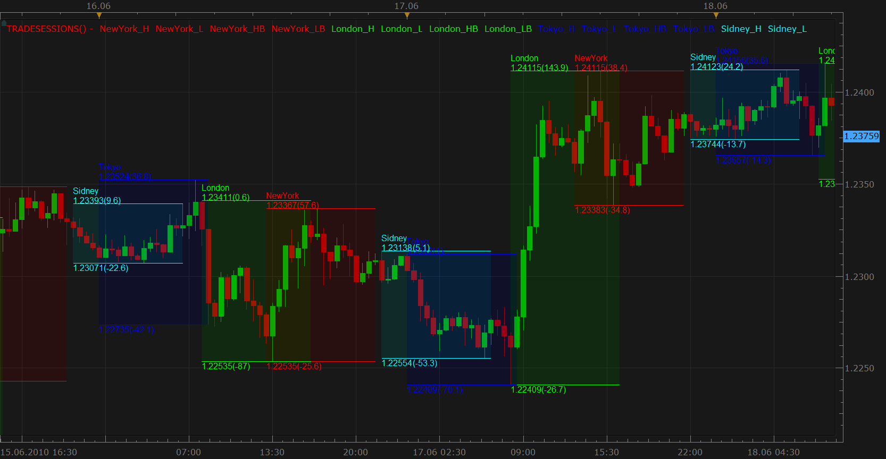
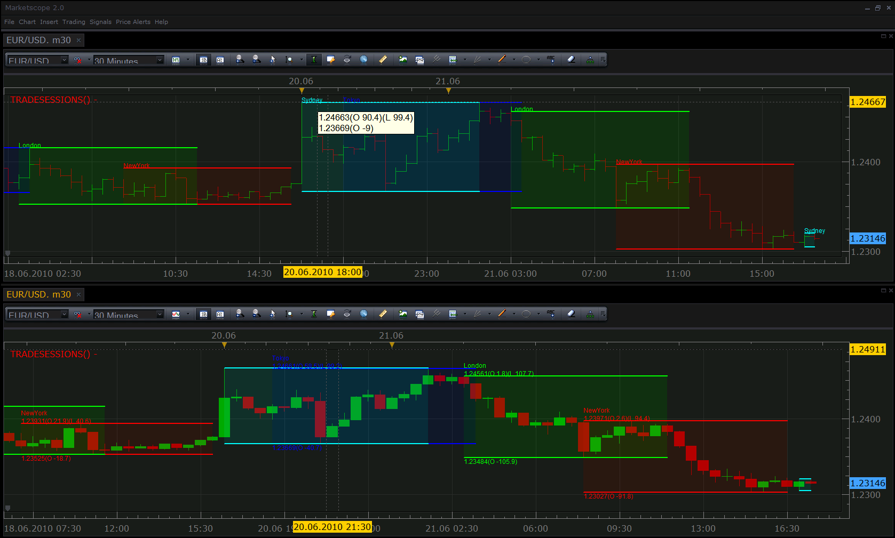
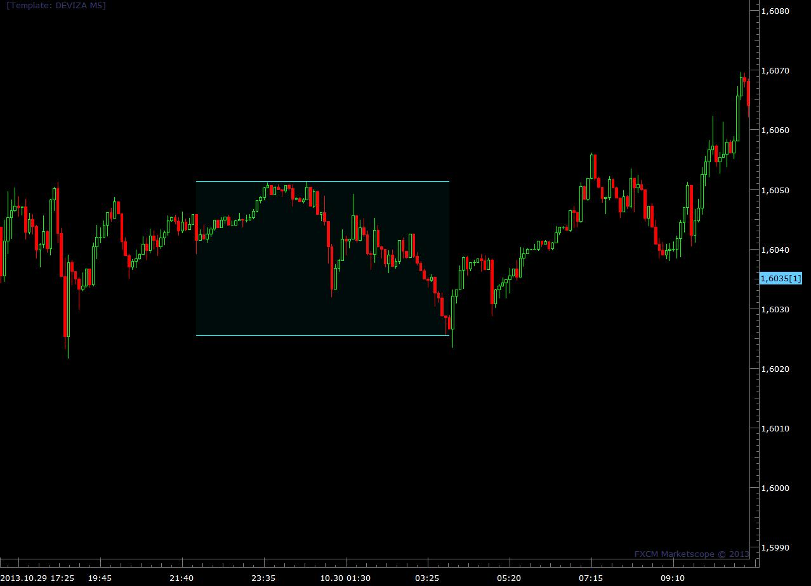

# Trading Session Hours Highlight (closed)

> Source: https://fxcodebase.com/code/viewtopic.php?f=17&t=940  
> Forum: 17 · Topic 940 · 59 post(s)

---

## Trading Session Hours Highlight (closed)

**Nikolay.Gekht** · Mon May 03, 2010 5:35 pm

**The post is closed. Please read the post about new version of the indicator for August, 27 2010 trading station release: [viewtopic.php?f=17&t=1974](https://fxcodebase.com/code/viewtopic.php?f=17&t=1974)**.

The indicator highlights the trading sessions for the New York, London and Tokyo

Sidney Trading Session: 5:00 PM - 2:00 AM (EDT/EST)
Tokyo Trading Session: 7:00 PM - 4:00 AM (EDT/EST)
London Trading Session: 3:00 AM - 12:00 PM (EDT/EST)
New York Trading Session: 8:00 AM - 5:00 PM (EDT/EST)

See more about the trading session here: [http://www.fxwords.com/f/fx-market-hours.html](http://www.fxwords.com/f/fx-market-hours.html) and here: [http://www.forexmarkethours.com/](http://www.forexmarkethours.com/)

You can choose any combination of these three sessions to show. The session also highlights the highest and the lowest price during the session.

Because N-hours candles are always aligned against the FXCM's trading day (17:00EDT/EST), the indicator cannot highlight the trading sessions on the time frames higher than 1 hour.

 

Download the indicator:

 [TRADESESSIONS.lua](files/1713/TRADESESSIONS.lua)

Code: [Select all](https://fxcodebase.com/code/)
`-- Indicator profile initialization routine
-- Defines indicator profile properties and indicator parameters
function Init()
    indicator:name("The indicator highlights trade sessions");
    indicator:description("The indicator can be applied on 1-minute to 1-hour charts");
    indicator:requiredSource(core.Bar);
    indicator:type(core.Indicator);

    indicator.parameters:addBoolean("NY_S", "Show New York session (8:00 am - 5:00 pm EST/EDT)", "", true);
    indicator.parameters:addColor("NY_C", "New York session color", "", core.rgb(255, 0, 0));
    indicator.parameters:addBoolean("LO_S", "Show London session (3:00 am - 12:00 pm EST/EDT)", "", true);
    indicator.parameters:addColor("LO_C", "New York session color", "", core.rgb(0, 255, 0));
    indicator.parameters:addBoolean("TO_S", "Show Tokyo session (7:00 pm - 4:00 am EST/EDT)", "", true);
    indicator.parameters:addColor("TO_C", "Tokyo session color", "", core.rgb(0, 0, 255));
    indicator.parameters:addBoolean("SI_S", "Show Sidney session (5:00 pm - 2:00 am EST/EDT)", "", true);
    indicator.parameters:addColor("SI_C", "Sidney session color", "", core.rgb(0, 255, 255));
    indicator.parameters:addInteger("HL", "Highlight transparency (%)", "", 90, 0, 100);
end

-- Indicator instance initialization routine
-- Processes indicator parameters and creates output streams
-- Parameters block
local first;
local source = nil;
local host;
local new_york = nil;
local london = nil;
local tokyo = nil;
local sidney = nil;
local dummy = nil;
local day_offset, week_offset;

-- Routine
function Prepare()
    source = instance.source;
    first = source:first();
    host = core.host;
    day_offset = host:execute("getTradingDayOffset");
    week_offset = host:execute("getTradingWeekOffset");

    local s, e;
    s, e = core.getcandle(source:barSize(), 0, 0, 0);
    s = math.floor(s * 86400 + 0.5);  -- >>in seconds
    e = math.floor(e * 86400 + 0.5);  -- >>in seconds
    assert((e - s) < 3600, "The source time frame must not be bigger than 1 hour");

    local name = profile:id() .. "()";
    instance:name(name);
    if instance.parameters.NY_S then
        -- 8 am to 5 pm
        new_york = CreateSession(8, 9, instance.parameters.NY_C, "NewYork", name);
    end
    if instance.parameters.LO_S then
        -- 3 am to 12 pm
        london = CreateSession(3, 9, instance.parameters.LO_C, "London", name);
    end
    if instance.parameters.TO_S then
        -- 7 pm of yesterday to 4 am of today
        tokyo = CreateSession(-5, 9, instance.parameters.TO_C, "Tokyo", name);
    end
    if instance.parameters.SI_S then
        -- 5 pm of yesterday to 2 am of today
        sidney = CreateSession(-7, 9, instance.parameters.SI_C, "Sidney", name);
    end

    dummy = instance:addInternalStream(0, 0);   -- the stream for bookmarking
end

local ref = nil;    -- the reference 1-hour source

-- Indicator calculation routine
function Update(period)
    if period >= first then
        if ref == nil then
            ref = registerStream(0, "H1", 24);  -- open 1-hour stream which returns 24 bars BEFORE the start of the source collection.
        end
    end

    Process(new_york, period);
    Process(london, period);
    Process(tokyo, period);
    Process(sidney, period);
end

-- Process the specified session
function Process(session, period)
    if session == nil then
        return ;
    end
    -- find the start of the session
    local date = source:date(period);       -- bar date;
    local sfrom, sto;

    -- 1) calculate the session to which the specified date belongs
    local t;
    t = math.floor(date * 86400 + 0.5);     -- date/time in seconds

    -- shift the date so it is in the virtual time zone in which 0:00 is the begin of the session
    t = t - session.from * 3600;
    -- truncate to the day only.
    t = math.floor(t / 86400 + 0.5) * 86400;
    -- and shift it back to est time zone
    t = t + session.from * 3600;

    sfrom = t;                          -- begin of the session
    sto = sfrom + session.len * 3600;   -- end of the session

    sfrom = sfrom / 86400;
    sto = sto / 86400;

    -- process only if the date/time is inside the session
    if date >= sfrom and date < sto then
        -- find the hour bar of the beginning of the day
        local ref_period, loading;
        ref_period, loading = getDate(0, sfrom, false, period);
        if ref_period == -1 then
            -- the first bar is not found at all
            -- or the date is being loaded
            return ;
        end
        local hi = 0;
        local lo = 100000000000000;
        while true do
            local t = ref:date(ref_period);
            if t >= sfrom then
                if t >= sto then
                    break;
                end
                if ref.high[ref_period] > hi then
                    hi = ref.high[ref_period];
                end
                if ref.low[ref_period] < lo then
                    lo = ref.low[ref_period];
                end
            end
            ref_period = ref_period + 1;
            if ref_period >= ref:size() then
                break;
            end
        end
        if hi ~= 0 then
            session.begin[period] = sfrom;
            session.high[period] = hi;
            session.highband[period] = hi;
            session.low[period] = lo;
            session.lowband[period] = lo;
            while period > 1 and session.begin[period] == session.begin[period - 1] do
                if session.high[period] ~= hi or
                   session.low[period] ~= low then
                    session.high[period - 1] = hi;
                    session.highband[period - 1] = hi;
                    session.low[period - 1] = lo;
                    session.lowband[period - 1] = lo;
                    period = period - 1;
                else
                    break;
                end   
            end
        end
    else
        session.begin[period] = 0;
    end
end

-- Create the session description
-- from - the offset in hours again 0:00 of the EST canlendar day
-- len - length of the session in hours
-- color - color for lines and fill area
-- name - of the session
-- iname - the name of the indicator
function CreateSession(from, len, color, name, iname)
    local session = {};
    local n;
    session.name = name;
    session.from = from;
    session.len = len;
    n = name .. "_H";
    session.high = instance:addStream(n, core.Line, iname .. "." .. n, n, color, first);
    n = name .. "_L";
    session.low = instance:addStream(n, core.Line, iname .. "." .. n, n, color, first);
    n = name .. "_HB";
    session.highband = instance:addStream(n, core.Line, iname .. "." .. n, n, color, first);
    n = name .. "_LB";
    session.lowband = instance:addStream(n, core.Line, iname .. "." .. n, n, color, first);
    session.begin = instance:addInternalStream(0, 0);
    instance:createChannelGroup(name, name, session.highband, session.lowband, color, 100 - instance.parameters.HL);
    return session;
end

local streams = {}

-- register stream
-- @param barSize       Stream's bar size
-- @param extent        The size of the required extent (number of periods to look the back)
-- @return the stream reference
function registerStream(id, barSize, extent)
    local stream = {};
    local s1, e1, length;
    local from, to;

    s1, e1 = core.getcandle(barSize, 0, 0, 0);
    length = math.floor((e1 - s1) * 86400 + 0.5);

    stream.data = nil;
    stream.barSize = barSize;
    stream.length = length;
    stream.loading = false;
    stream.extent = extent;
    local from, dataFrom
    from, dataFrom = getFrom(barSize, length, extent);
    if (source:isAlive()) then
        to = 0;
    else
        t, to = core.getcandle(barSize, source:date(source:size() - 1), day_offset, week_offset);
    end
    stream.loading = true;
    stream.loadingFrom = from;
    stream.dataFrom = from;
    stream.data = host:execute("getHistory", id, source:instrument(), barSize, from, to, source:isBid());
    setBookmark(0);

    streams[id] = stream;
    return stream.data;
end

function getDate(id, candle, precise, period)
    local stream = streams[id];
    assert(stream ~= nil, "Stream is not registered");
    local from, dataFrom, to;
    if candle < stream.dataFrom then
        setBookmark(period);
        if stream.loading then
            return -1, true;
        end
        from, dataFrom = getFrom(stream.barSize, stream.length, stream.extent);
        stream.loading = true;
        stream.loadingFrom = from;
        stream.dataFrom = from;
        host:execute("extendHistory", id, stream.data, from, stream.data:date(0));
        return -1, true;
    end

    if (not(source:isAlive()) and candle > stream.data:date(stream.data:size() - 1)) then
        setBookmark(period);
        if stream.loading then
            return -1, true;
        end
        stream.loading = true;
        from = bf_data:date(bf_data:size() - 1);
        to = candle;
        host:execute("extendHistory", id, stream.data, from, to);
    end

    local p;
    p = findDateFast(stream.data, candle, precise);
    return p, stream.loading;
end

function setBookmark(period)
    local bm;
    bm = dummy:getBookmark(1);
    if bm < 0 then
        bm = period;
    else
        bm = math.min(period, bm);
    end
    dummy:setBookmark(1, bm);
end

-- get the from date for the stream using bar size and extent and taking the non-trading periods
-- into account
function getFrom(barSize, length, extent)
    local from, loadFrom;
    local nontrading, nontradingend;

    from = core.getcandle(barSize, source:date(source:first()), day_offset, week_offset);
    loadFrom = math.floor(from * 86400 - length * extent + 0.5) / 86400;
    nontrading, nontradingend = core.isnontrading(from, day_offset);
    if nontrading then
        -- if it is non-trading, shift for two days to skip the non-trading periods
        loadFrom = math.floor((loadFrom - 2) * 86400 - length * extent + 0.5) / 86400;
    end
    return loadFrom, from;
end

-- the function is called when the async operation is finished
function AsyncOperationFinished(cookie)
    local period;
    local stream = streams[cookie];
    if stream == nil then
        return ;
    end
    stream.loading = false;
    period = dummy:getBookmark(1);
    if (period < 0) then
        period = 0;
    end
    loading = false;
    instance:updateFrom(period);
end

-- find the date in the stream using binary search algo.
function findDateFast(stream, date, precise)
    local datesec = nil;
    local periodsec = nil;
    local min, max, mid;

    datesec = math.floor(date * 86400 + 0.5)

    min = 0;
    max = stream:size() - 1;

    if max < 1 then
        return -1;
    end

    while true do
        mid = math.floor((min + max) / 2);
        periodsec = math.floor(stream:date(mid) * 86400 + 0.5);
        if datesec == periodsec then
            return mid;
        elseif datesec > periodsec then
            min = mid + 1;
        else
            max = mid - 1;
        end
        if min > max then
            if precise then
                return -1;
            else
                return min - 1;
            end
        end
    end
end`

---

## Re: Trading Session Hours Highlight

**a135711** · Mon May 03, 2010 6:24 pm

Outstanding!

---

## Re: Trading Session Hours Highlight

**a135711** · Mon May 03, 2010 6:38 pm

can it be extended to highlight an oscillator window in the exact same way?

---

## Re: Trading Session Hours Highlight

**cayantgee** · Wed May 05, 2010 7:18 am

Hi this looks like a useful tool. WHen I load it has the following error
"4:attempt to index global indicator (a nil value)"

Any idea why this is so ?

Thanks

---

## Re: Trading Session Hours Highlight

**Nikolay.Gekht** · Wed May 05, 2010 10:07 am

> **cayantgee wrote:**
> Any idea why this is so ?

Just use the Chart->Manage Custom Indicators.
The step-by-step instruction on how to install the indicator is here:
[viewtopic.php?f=17&t=17](https://fxcodebase.com/code/viewtopic.php?f=17&t=17)

Do not be confused with signals:
[viewtopic.php?f=29&t=602](https://fxcodebase.com/code/viewtopic.php?f=29&t=602)

---

## Re: Trading Session Hours Highlight

**cayantgee** · Thu May 06, 2010 7:36 am

Thanks for the tip Nikolay. It worked.

---

## Re: Trading Session Hours Highlight

**a135711** · Fri Jun 11, 2010 1:40 pm

hello, i need the following functionality on the tradesessions indicator

first, i need the session period divided into 5 time periods based with a line that is drawn from the session high to the session low from the session start to the session end.

second, i need the session range to be divided according to fibo, that is 38,50,62 lines and the extensions 1.38 , 1.5, 1.62. the extensions should be both above and below the range. there is no need for numbers or percents to be visible, just the lines.
thanks

---

## Re: Trading Session Hours Highlight

**Nikolay.Gekht** · Tue Jun 15, 2010 9:59 am

> **a135711 wrote:**
> hello, i need the following functionality on the tradesessions indicator

As far as I can see, in that case, the session high/low will change during the session life time, especially during the start period, so these lines will also move and will get their final state when the session is finished. Shouldn't it be something like Breakout indicator?

---

## Re: Trading Session Hours Highlight

**a135711** · Tue Jun 15, 2010 3:10 pm

> As far as I can see, in that case, the session high/low will change during the session life time, especially during the start period, so these lines will also move and will get their final state when the session is finished. Shouldn't it be something like Breakout indicator?

the start period of the session should be the start of the session fibo calculations. the end of the session should be the end of the fibo calculations. the fibo calculations and the lines that are drawn from them, like the high low calculations, will indeed, change dynamically over the session period, but are limited to the session only. unlike the breakout indicator, this modification gives me the fibo lines, internal and extended, of the current session only. something i use to to compare session to session price movement,

essentially, i am asking for an autolevels indicator that starts at session start and ends at session end and draws fibo lines, internal and extended, for the session only.

---

## Re: Trading Session Hours Highlight

**Nikolay.Gekht** · Tue Jun 15, 2010 4:33 pm

Well. To more questions:
1) Do you want to see these lines for the chosen session only (e.g. NY or London only) or for all currently active sessions?
2) What to do with the lines when the session ends? Should line disappears until the next session begins?

---

## Re: Trading Session Hours Highlight

**a135711** · Tue Jun 15, 2010 5:14 pm

Well. To more questions:
1) Do you want to see these lines for the chosen session only (e.g. NY or London only) or for all currently active sessions?

at the minimum, i need the last session lines to be visible in oder to reference the current session's evolving price action.

lets establish the trading day as the point of change. when a new trading day begins, all lines from each of the previously day's active sessions are erased. at the trading day progresses through the various active sessions, the lines are drawn for each active session and shall remain visible until the end of the the current trading day.

2) What to do with the lines when the session ends? Should line disappears until the next session begins?
the lines should be left visible for each active session until the end of the trading day.

---

## Re: Trading Session Hours Highlight

**a135711** · Tue Jun 15, 2010 5:36 pm

in regard to the issue of crossover periods,ie the london NY crossover, the lines from the London session are what matter most since the current price action occurring in the London/NY crossover does so in reference to the price action that happened in London. if the line color are matched to the session color, then overlapping lines should be quite readable even when the NY session starts to change. also, the crossover, in my mind is a distinct period of trade. thus the crossovers of Sydney/Tokyo, Tokyo/London, London/NY are defined as unique periods. thus the periods are:

Sydney
Sydney/Tokyo
Tokyo
Tokyo/London
London/NY
NY

if each period has the lines drawn for that period, then the next period can be compared to it. it might be cleaner to write under this distinction.

---

## Re: Trading Session Hours Highlight

**LordTwig** · Fri Jun 18, 2010 11:28 am

Hi Nikolay,

Great Job with this, it has been well received in the downloads (over 600 times).
Love the crossovers and High Low points.

> the indicator cannot highlight the trading sessions on the time frames higher than 1 hour.

Mine does not work on the (1) hour chart though? I thought only above 1 hour does not work

Also, I reckon it needs the following
1) high & low points 'price' above/below them (text ie 1.4567 H... 1.4486 L) added.

2) Above the 'current' high and low it should have the pips total from Open(Session Open) to Low (ie -67pips) & Open to High (ie +126 pips) @ the high & low points(ie it will move position only if higher or lower values.

3) At end of Session it shows total pips from session low to session high or vice versa (ie SE+256pips)

4) User choice on each above.

5) User choice for Both Sessions & Overlaps or either or none on above.

6) Remove Info Heading Line sessions text and place text instead under each coloured session line the main session name ie London under the London session.

Well done so far.
Cheers
LordTwig

---

## Re: Trading Session Hours Highlight

**Apprentice** · Fri Jun 18, 2010 2:30 pm

I second that Suggestions by LordTwig, about 5 proposals still not have clear mind.

---

## Re: Trading Session Hours Highlight

**Nikolay.Gekht** · Sat Jun 19, 2010 3:29 pm

> **LordTwig wrote:**
> Mine does not work on the (1) hour chart though? I thought only above 1 hour does not work

It's mine mistake. Done.

> **LordTwig wrote:**
> 1) high & low points 'price' above/below them (text ie 1.4567 H... 1.4486 L) added.
>
> 2) Above the 'current' high and low it should have the pips total from Open(Session Open) to Low (ie -67pips) & Open to High (ie +126 pips) @ the high & low points(ie it will move position only if higher or lower values.
>
> 3) At end of Session it shows total pips from session low to session high or vice versa (ie SE+256pips)
>
> 4) User choice on each above.
>
> 5) User choice for Both Sessions & Overlaps or either or none on above.
>
> 6) Remove Info Heading Line sessions text and place text instead under each coloured session line the main session name ie London under the London session.

1) I cannot remove the labels from the headline, but can add the name of the session on the chart. Done.

2) I have also added an option to show the high, low and the distance from high and low to the open of the session.

The only problem I see is that the chart now have too much information. So, I need advice: is it ok or, probably, the user must choose the session which must be labeled, or, probably, we can show this information in the tooltip which is shown when cursor is over the session name.

 

To try this version download (it's beta!!!):

 [TRADESESSIONS.lua](files/2651/TRADESESSIONS.lua)

---

## Re: Trading Session Hours Highlight

**Apprentice** · Sat Jun 19, 2010 3:59 pm

Another possible option.
Absolute and percentage changes from the beginning of the session.

Replace
instance:addStream(n, core.Line, iname .. "." .. n, n, color, first);
with
instance:addStream(n, core.Line, iname, "", color, first);

---

## Re: Trading Session Hours Highlight

**a135711** · Sat Jun 19, 2010 4:47 pm

any numerical or textual information definitely in tool tips or the option to turn it off. i like the idea of having a absolute pip range per session since this could be compared session to session at a glance. having the session spelled and color coded seems to add unnecessary information. what is needed is a mid line per session, or the session channel divided into high to mid channel and a mid to low channel.

how goes the fibo enhancement for this indicator?

---

## Re: Trading Session Hours Highlight

**LordTwig** · Sun Jun 20, 2010 11:17 am

Do you know what......... I love it!!
It kinda looks like a flight controllers screen eh?

Yeah, flexibility to only show session(s) user wants would be a great addition.

I do agree it can look a bit busy on the hourly only....... but if you place each output under each other (stacked)it would be more more neater and takes up less horizontal room ie;
London
1.4885
-146
256 --(this one....is the total/sum of High & Low for session) if you could add that as well.

The optional text size is great too, as a font of size 7 on hour chart does wonders.(which could be automatically shown in size 7 when viewing hour chart)

BTW..... not getting picky.... but for future ref, Sydney is spelt with an Y not an i... it might be confusing for people with less english.

Cheers
LordTwig

---

## Re: Trading Session Hours Highlight

**LordTwig** · Mon Jun 21, 2010 8:38 am

> **a135711 wrote:**
> any numerical or textual information definitely in tool tips or the option to turn it off.

The thing I don't like about 'tooltip' is, it is not resposive enough, If it was instant dynamic scrolling display then good..... but it is as slow as a dead cow being eaten by one ant .

Cursur data is crap as well because it needs to be made smaller (text) and be able to only list the values that user wants, as opposed to showing every damn line & value of every indicator on the screen/chart. Curser data table is also fixed in the area that it is placed and gets in the way all the time.

Need something like the data box shown in screenshot but dynamic and fast(it imediately updates as you scroll)
These are the things in which Marketscope lets itself down. Here is the proof

> http://fxcodebase.com/code/viewtopic.php?f=17&t=903&p=1648&hilit=tooltip#p1648
> To see the full name ajust move the mouse cursor over the pattern label **and wait** until a tooltip with the full name appears

Say 'yeah' everybody.
Cheers
LordTwig

---

## Re: Trading Session Hours Highlight

**a135711** · Mon Jun 21, 2010 12:48 pm

> Cursur data is crap as well because it needs to be made smaller (text) and be able to only list the values that user wants, as opposed to showing every damn line & value of every indicator on the screen/chart. Curser data table is also fixed in the area that it is placed and gets in the way all the time.

i was able some months back to get only the data to print on a tool tip as well as real time dynamic text to print, the tooltip is specific to the bar itself. i only have to run the cursor over the top of the bar to get it. it only shows the information i programmed it to do so. any indicator or oscillator value can be printed in this way.
numerical text data(oscillator values) can also be printed real-time above the bar, below it. i used it to print above the current bar the value of the current RLW indicator. granted its precision was only 3 digits for the sake of clarity, but it did tell me that when the RLW hit 100 or 0 whilst the bar was in action

---

## Re: Trading Session Hours Highlight

**Nikolay.Gekht** · Mon Jun 21, 2010 3:20 pm

You're going so far, guys.

What can I say:

1) There is difference b/w the tooltip shown when the user clocks on the chart (this damned "yellow" box) and tooltip we show over the indicator's label. BTW, here is two moments:
a) You can easily turn the yellow box off via options.
b) The timeout to show the tooltip can be changed. By default, the Windows shows tooltip in 0,5 second, but you can tune this value via registry or one of thousands "tweak" and "trick" applications.
How to change the tooltip timeout:
[http://khsw.blogspot.com/2005/03/changi ... ps-or.html](https://khsw.blogspot.com/2005/03/changing-timeout-of-tooltips-or.html)

> - It don't like pets!
> - You just don't know how to cook them right!

2) Precision was a question until the last beta release. Now the indicators and oscillators can define their own precision on the streams.

Ok, anyway I'll prepare another version today, following to your ideas, so we can go forward step-by-step.

---

## Re: Trading Session Hours Highlight

**Nikolay.Gekht** · Mon Jun 21, 2010 4:40 pm

Ok. The next version:

a) You can choose the individually sessions for which the data will be shown
b) You can choose which data will be shown:
- name
- high
- low
- open->to->high distance in pips
- open->to->low distance in pips
- high-to-low distance in pips
c) You can show on how to show the data
- show all as labels
- show only the name, all other data is shown in tooltip which appears when you move
cursor to the label
d) Sydney spelling is fixed
e) The default font size is reduced from 8 to 6.

 

download:

 [TRADESESSIONS.lua](files/2692/TRADESESSIONS.lua)

Note: Beta!!! When the indicator is finished I'll update the topmost post!

---

## Re: Trading Session Hours Highlight

**a135711** · Tue Jun 22, 2010 1:53 pm

Nikolay,
well done so far

a user selected option for a session grid

when the user selects the grid as true, then the following is visible:
1. one midline of the price from session start to session end
2. one midline of the session time from high to low
the color of the lines is determined by the color of the session

user selected option for triangulation

3 a line drawn from session open to session high
4. a line drawn from session open to session low
5. a line drawn from session high to session low

all lines are the same color and the user selects the color

user selected option for session trend
6 a diagonal line from session start to session end

i do appreciate your time and effort

---

## Re: Trading Session Hours Highlight

**patick** · Tue Jun 22, 2010 11:35 pm

Just a small correction... I noticed in the Properties tab:

Line 14 should read: indicator.parameters:addColor("LO_C", "London session color", "", core.rgb(0, 255, 0));

(was: ...."New York session....",)

---

## Re: Trading Session Hours Highlight

**LordTwig** · Wed Jun 23, 2010 9:50 am

> b) You can choose which data will be shown:
> - name
> - high
> - low
> - open->to->high distance in pips
> - open->to->low distance in pips
> - high-to-low distance in pips

Can you please show these stacked under each other as Labels so as to less interfere with the other sessions data-labels. ie Just how you placed high under the session name stack the rest (except for Low keep that at the bottom of session. I had a go at it but can't seem to work it out.

I also abbreviated session names so they wouldn't run into each other as well NY, SYD,TYO,LON.

How can I make the session high/low line thinner (looked but cannot find it) as this will help as well?

I turned the transparency up to 96% and it is way better to view now also.
LordTwig

---

## Re: Trading Session Hours Highlight

**Nikolay.Gekht** · Wed Jun 23, 2010 7:17 pm

Another beta:

1) Problem with the london parameter name fixed
2) The short names of the session are shown
3) The parameters are split into three groups: sessions, data and style
4) Data is stacked
5) Default transparency is increased to the 95%

The next planned step (Friday or Monday, tomorrow I'm discussing the next Marketscope release, so, will be out of the office):
1) triangulation and diagonal lines.

I'm also ready to create grid lines, but cannot image how should it look. Could you please give me a sample.

Another beta:

 [TRADESESSIONS.lua](files/2739/TRADESESSIONS.lua)

---

## Re: Trading Session Hours Highlight

**a135711** · Wed Jun 23, 2010 8:54 pm

Nikolay

an example of the proposed reference grid
the horizontal line is = (High+low)/2
the vertical line is midpoint of the session

thank you

---

## Re: Trading Session Hours Highlight

**Nikolay.Gekht** · Fri Jun 25, 2010 3:12 pm

Hm... since a vertical line is always drawn at left side of the bar (at least in the current version) the grid, especially while the session has odd number of candles looks extremely ugly. So I removed it.

The triangulation and open to close line is added. How do you think, should user be able to choose the sessions to show lines at? For example to show them at NY session only.

Beta with triangulation and open-to-close lines:

 [TRADESESSIONS.lua](files/2754/TRADESESSIONS.lua)

---

## Re: Trading Session Hours Highlight

**a135711** · Sat Jun 26, 2010 2:29 am

Nikolay,

we need to revise the triangulation variables to the following:

A = session open at candle open to session high at session high candle
B = session open at candle open to session low at session low candle
C= session low at candle low candle to session high at candle high

an example should look like:

a mid line drawn from session start to session end that has the value of (session.high +session.low)/2
this should have the same color as the session color
thank you

---

## Re: Trading Session Hours Highlight

**Nikolay.Gekht** · Sat Jun 26, 2010 9:21 am

Midline is not a problem, the triangles as you described will require a bit modification of the code, but are possible as well. Will do it in the next beta.

---

## Re: Trading Session Hours Highlight

**Nikolay.Gekht** · Mon Jun 28, 2010 4:12 pm

Changed triangulation as it was requested. One note: on 1-minute chart triangulation this works very slow, because it requires to finding the exact position of the low and high. Starting 15+ minutes it works pretty well. I'll look on what can I do for the 1-minute frame later.

 [TRADESESSIONS.lua](files/2780/TRADESESSIONS.lua)

---

## Re: Trading Session Hours Highlight

**a135711** · Mon Jun 28, 2010 4:38 pm

> Changed triangulation as it was requested. One note: on 1-minute chart triangulation this works very slow, because it requires to finding the exact position of the low and high. Starting 15+ minutes it works pretty well. I'll look on what can I do for the 1-minute frame later.

looks good, provides a wealth of reference data at a glance. i will analyze it effectiveness and get back with you in a week.

---

## Re: Trading Session Hours Highlight

**a135711** · Tue Jun 29, 2010 4:52 pm

The modifications of this indicator

standard session
Sydney
Tokyo
London
NY

enhanced session options(server times)
Sydney 17:00-19:00
Sydney-Tokyo cross 19:00 to 01:00
Tokyo 01:00 to 03:00
Tokyo-London cross 03:00 to 04:00
London 04:00 to 08:00
London-NY cross 08:00 to 12:00
NY 12:00 to 17:00

note: use can select either standard session highlight, or enhanced session highlight
note: user can select visibility of any or all of the enhanced sessions

data to display:
no mods here except data displays shows enhanced session data if enhanced session is selected.

grid lines
 horizontals
 show high-line
 show low -line
 show mid-line(done)
 show upper quarter line(mid-line+high-line/2)
 show lower quarter line( mid-line +low-line/2)
 show session open line
 show session close line
extend horizontal session lines by n-sessions(enhanced session or standard session)
all horizontal lines are drawn during session
all horizontal extensions are drawn at the open of the following session and are drawn n-sessions.
example :all diagonal lines that are drawn in the NY session are drawn at the open of Sydney. enhanced sessions function the same way
note: color of all lines are the same as session color, all line extensions are the same color as the session color.

 diagonals
show session open at candle open to session close at candle close
show session open at candle open to session low at candle low
show session open at candle open to session high at candle high
show session high at candle high to session close at candle close
show session low at candle low to session close at candle close

extend diagonal lines n-sessions(default 1 session forward)

all diagonal lines and all diagonal line extensions for a particular session are drawn at the open of the following session. example: all diagonal lines that are drawn in the NY session are drawn at the open of Sydney. enhanced sessions function the same way
diagonals and extensions are a user selected color different than the session color. default is (255,255,255,)

---

## Re: Trading Session Hours Highlight

**Nikolay.Gekht** · Wed Jun 30, 2010 1:13 pm

BTW, I don't see triangulation here. Should it be removed?

---

## Re: Trading Session Hours Highlight

**a135711** · Wed Jun 30, 2010 2:56 pm

apologies for the lack of clarity, i grouped all lines that were not horizontal under a diagonal group heading. here is a clearer wording(i think)

session open/session close line(already works great)

triangulation lines proper:

current lines drawn
session open/session high at candle high(part of triangulation)
session open/session low at candle low(part of triangulation)
session high at candle high/session low at candle low(part of triangulation)

additional lines needed
session low at candle low/session close at candle close(needed)
session high at candle high/session close at candle close(needed)

---

## Re: Trading Session Hours Highlight

**Nikolay.Gekht** · Wed Jun 30, 2010 3:51 pm

I got it. I'll try to do it asap, but... do not expect it earlier than by the end next week.

---

## Re: Trading Session Hours Highlight (closed)

**Matteo Zucchini** · Wed May 16, 2012 9:01 am

It's very usefull indicator.
I use it in my trading every day.

---

## Re: Trading Session Hours Highlight (closed)

**philipphilip** · Sat Jun 16, 2012 5:21 am

Hello,

Would it be possible to be able to customise the time zones. Everything is great as it is except to define the trading session hours. would that be possible?

Looking forward to your reply,

Regards

---

## Re: Trading Session Hours Highlight (closed)

**Apprentice** · Sun Jun 17, 2012 3:24 am

Your request is added to the development list.

---

## Re: Trading Session Hours Highlight (closed)

**Apprentice** · Fri Jun 22, 2012 4:39 am

Try this Version

 [TRADESESSIONS.lua](files/35893/TRADESESSIONS.lua)

---

## Re: Trading Session Hours Highlight (closed)

**philipphilip** · Fri Jun 29, 2012 6:49 am

Hi Apprentice,

Thanks, it works well.

How can it be modified to work on difffernt time frame charts. i.e. 30min and 15min time frames not just 1 Hour time frames? so on a 15min chart, the trading time zones can start at 6:15 am or 9:30 am?

Perhaps including decimals or selecting a preferable timeframe in the properties would work best?

Looking forard to your reply,

Regards

---

## Re: Trading Session Hours Highlight (closed)

**sedraude** · Fri Jun 29, 2012 10:02 am

Hi Apprentice,

Thank you for the indi. Can you make tradestations.lua to show horizontal line at open price only when the market session is start-finish, not range high-low.

Thanks in advance

---

## Re: Trading Session Hours Highlight (closed)

**philipphilip** · Tue Jul 03, 2012 8:12 am

Hi Apprentice,

Just wondering if the below has been seen. Looking forward to the additions.

How can it be modified to work on difffernt time frame charts. i.e. 30min and 15min time frames not just 1 Hour time frames? so on a 15min chart, the trading time zones can start at 6:15 am or 9:30 am?

Perhaps including decimals or selecting a preferable timeframe in the properties would work best?

Looking forard to your reply,

Regards

Joined: Fri Jun 15, 2012 2:09 pm
Private messageE-mail

---

## Re: Trading Session Hours Highlight (closed)

**philipphilip** · Mon Jul 23, 2012 9:31 am

Hello,

Can anyone help with the following and can be seen in previous posts?

How can it be modified to work on difffernt time frame charts. i.e. 30min and 15min time frames not just 1 Hour time frames? so on a 15min chart, the trading time zones can start at 6:15 am or 9:30 am?

Perhaps including decimals or selecting a preferable timeframe in the properties would work best?

Looking forward to anyones help and response.

Regards

---

## Re: Trading Session Hours Highlight (closed)

**atwork** · Tue Oct 09, 2012 12:41 pm

Thank you very much for this wonderful tool. -)

But I have an issue - when the tool is active within a chart - zooming in and out is quite slow.
Is it a normal behavior for the tool or is it just my PC? Is it the server connection maybe?
If I "remove" the TRADESESSIONS - it is very fast to zoom in/out and scroll the charts.

Anyway - I think this is a very good tool and I am grateful it was built. THX.

---

## Re: Trading Session Hours Highlight (closed)

**Apprentice** · Wed Oct 10, 2012 4:04 am

Unfortunately yes, the next version, data retrieval is somewhat accelerated.

---

## Re: Trading Session Hours Highlight (closed)

**philipphilip** · Wed Jan 30, 2013 2:19 pm

Hi,

quick question,

Would it be possible to change when the beginning and end of the trading sessions strat and stop?
Can it work on a 15 minute chart and 5 minute chart too?

Regards,

---

## Re: Trading Session Hours Highlight (closed)

**Apprentice** · Thu Jan 31, 2013 5:48 am

In the current implementation, start / stop times of the session can only be changed from the code.
Will not work, if time frame is less than 1 hour.

I'll try to find time to make the necessary changes so u can have both.

---

## Re: Trading Session Hours Highlight (closed)

**Apprentice** · Mon Feb 04, 2013 10:33 am

philipphilip I believe that this version has everything you need.
[download/file.php?id=6874](https://fxcodebase.com/code/download/file.php?id=6874)
Posted on Fri Jun 22, 2012 11:39 am

---

## Re: Trading Session Hours Highlight (closed)

**speakinmymind** · Tue Apr 09, 2013 8:52 am

can you add the ability to set the clock usage to local as opposed to changing the hours for each session?

---

## Re: Trading Session Hours Highlight (closed)

**kumaresan** · Mon Sep 16, 2013 1:23 pm

Hi Apprentice,

Thanks for this Great tool. One more request from new traders like me,

Can you draw the Session hours lines till the end of the particular trading session as default, so that traders can come to know, still how long the market need to travel to come to the end of today's trading session. This will also help us to know the expected takeoff / new trading session from the next trading Start positions.

I don't know whether i have communicated completely. In over all would like to know, Still how many minutes there to close the present session and the start position of next session in well in advance.

Kindly check and confirm the feasibility. Thanks in advance

Rgds / Kumaresan.

---

## Re: Trading Session Hours Highlight (closed)

**Apprentice** · Tue Sep 17, 2013 3:26 am

Your request is added to the development list.

---

## Re: Trading Session Hours Highlight (closed)

**olasz11** · Mon Oct 21, 2013 5:24 am

Are there any other versions of this indicator, which can extend the lines during all day. For example: i would like to see the sudney session high and session low lines which are extended to right side of the chart (to current candle). Is it possible?

---

## Re: Trading Session Hours Highlight (closed)

**Apprentice** · Tue Oct 22, 2013 4:35 am

I believe that this version has this functionality.
[viewtopic.php?f=17&t=1974](https://fxcodebase.com/code/viewtopic.php?f=17&t=1974)

---

## Re: Trading Session Hours Highlight (closed)

**olasz11** · Thu Oct 24, 2013 11:17 am

Hi!
It also does not work. I want to see simple horizontal lines which has a length of the whole screen. For exapmle if i draw a simple horizontal line to the chart, the line length is "infinite", i can see it the whole screen.

---

## Re: Trading Session Hours Highlight (closed)

**olasz11** · Wed Oct 30, 2013 4:38 pm

I am uploadin two picture. On the second picture you can see extended h line on session high and session low which i was drawing as a simple h line. So is it possible to draw h line like this with this indicatos?

 

*Normal use os indicator, the line's length are only the session strat to end.*

 

*that is what i talking about: i want extended h line.(these lines was drawn as a simple h line, the indicator did not inculde these lines.)*

---

## Re: Trading Session Hours Highlight (closed)

**Apprentice** · Thu Oct 31, 2013 12:09 pm

Such a thing is possible
Your request is added to the development list.

---

## Re: Trading Session Hours Highlight (closed)

**Apprentice** · Sat Aug 19, 2017 4:19 pm

The indicator was revised and updated.

---

## Re: Trading Session Hours Highlight (closed)

**Apprentice** · Tue Oct 23, 2018 6:52 am

Bump up.
