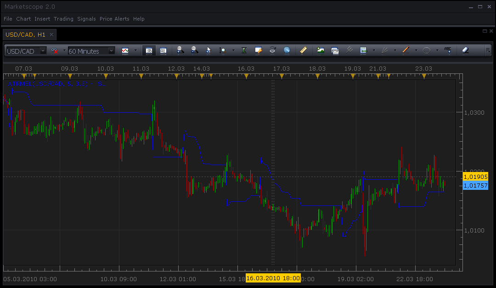

# Trailing Stop/Limit based on modified ATR (S&C 06/2009)

> Source: https://fxcodebase.com/code/viewtopic.php?f=17&t=514  
> Forum: 17 · Topic 514 · 6 post(s)

---

## Trailing Stop/Limit based on modified ATR (S&C 06/2009)

**Nikolay.Gekht** · Tue Mar 23, 2010 1:46 pm

This indicator is published in the Jun 2009 issue of the Stock & Commodities magazine. The indicator uses modified ATR algorithm to detect the market trend and calculate the stop and limit values.

 

Download the indicator

 [ATRMSL.lua](files/877/ATRMSL.lua)

 [ATRMSL with Alert.lua](files/877/ATRMSL%20with%20Alert.lua)

Compatibility issue Fixed. _Alert helper is not longer needed.

---

## Re: Trailing Stop/Limit based on modified ATR (S&C 06/2009)

**Apprentice** · Thu Jan 31, 2013 7:28 am

Style Update

---

## Re: Trailing Stop/Limit based on modified ATR (S&C 06/2009)

**Coondawg71** · Fri Mar 20, 2015 3:25 pm

Please omit my last request regarding Williams Trailing Stop indicator.

This is the indicator I wish to have Alert function added.

Alert is trigged upon "touch" or "cross" of indicator.

Thanks,

sjc

---

## Re: Trailing Stop/Limit based on modified ATR (S&C 06/2009)

**Apprentice** · Sun Mar 22, 2015 2:23 pm

Alert Functionality added.
Note it is NOT tested on live data.

---

## Re: Trailing Stop/Limit based on modified ATR (S&C 06/2009)

**Apprentice** · Mon Dec 14, 2015 4:22 am

Compatibility issue Fixed. _Alert helper is not longer needed.

If you want to use updated version of this indicator,
please make sure to use TS Version 01.14.101415. or higher.

---

## Re: Trailing Stop/Limit based on modified ATR (S&C 06/2009)

**Apprentice** · Sat May 05, 2018 6:20 am

The indicator was revised and updated.
