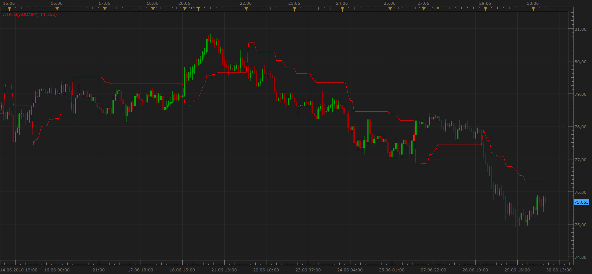
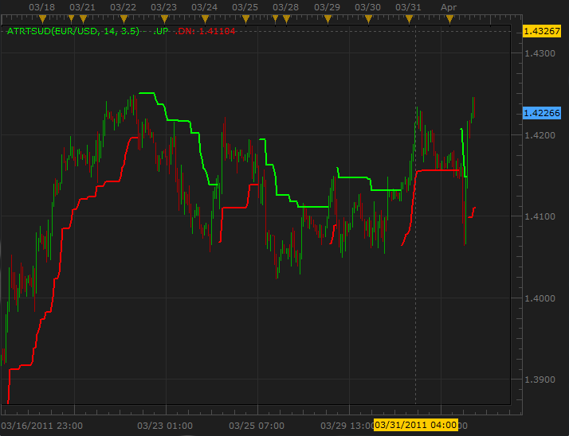

# Trailing Stop

> Source: https://fxcodebase.com/code/viewtopic.php?f=17&t=1434  
> Forum: 17 · Topic 1434 · 15 post(s)

---

## Trailing Stop

**Apprentice** · Wed Jun 30, 2010 5:57 am

*Trailing Stop*

I made two versions of this trend indicators.
Percent and the ATR-based.

 [ATRTS.lua](files/2807/ATRTS.lua)

 [PTS.lua](files/2807/PTS.lua)

 [TS.lua](files/2807/TS.lua)

 [TickTS.lua](files/2807/TickTS.lua)

---

## Re: Trailing Stop

**gcardo** · Fri Jul 23, 2010 1:48 pm

Is there any signal code for this indicator?

Thank you

---

## Re: Trailing Stop

**Apprentice** · Fri Jul 23, 2010 5:36 pm

Added to developmental cue.

---

## Re: Trailing Stop

**gcardo** · Sat Jul 24, 2010 8:17 pm

Thanks. Really appreciate

---

## Re: Trailing Stop

**Apprentice** · Tue Jul 27, 2010 12:05 pm

I brought together these two indicators in order to make a common signal.

---

## Re: Trailing Stop

**Apprentice** · Tue Jul 27, 2010 12:55 pm

Signal is available here.
[http://fxcodebase.com/code/viewtopic.php?f=29&t=1598&p=3151#p3151](https://fxcodebase.com/code/viewtopic.php?f=29&t=1598&p=3151#p3151)

---

## Re: Trailing Stop

**gcardo** · Tue Jul 27, 2010 1:39 pm

Thanks again

---

## Re: Trailing Stop

**Apprentice** · Mon Jan 03, 2011 10:14 am

I added a third option, which allows you to define a distance for trailing stop in pips.

 [TS.lua](files/7169/TS.lua)

Tick version has the possibility of defining the TS distance only in the PIPS.

 [TickTS.lua](files/7169/TickTS.lua)

---

## Re: Trailing Stop

**BlueBloodedTrader** · Fri Feb 18, 2011 5:56 am

on the ATRTS indicator, there is a PERCENTAGE input which doesn't seem to make any difference to the indicator when changed from anything from 0% to 100%. Is this input redundant in this indicator or does it serve some kind of purpose? If so, would you kindly explain the purpose?

---

## Re: Trailing Stop

**Apprentice** · Fri Feb 18, 2011 7:30 am

You're right. Percentage have No purpose, do not affect the final results.
I have overlooked this line.

I have fix this.

---

## Re: Trailing Stop

**vstrelnikov** · Fri Apr 01, 2011 2:57 pm

Small modification of ATRTS, which shows only Up or Down line.

 

 [ATRTSUD.lua](files/9301/ATRTSUD.lua)

---

## Re: Trailing Stop

**vstrelnikov** · Thu Apr 07, 2011 10:13 am

Strategy based on ATRTS indicator posted [here](https://fxcodebase.com/code/viewtopic.php?f=31&t=3861).

---

## Re: Trailing Stop

**blessedtrader** · Tue Sep 25, 2012 9:38 pm

I want to set my stop much further away than 20 pips and when the trade goes in my favor, stop moves to break even and half my position is sold. Example: I go long gbp/usd at 1.55, set stop at 1.54 and take profit at 1.57. The trade moves in my favor 20 pips at 1.5520. My stop automatically moves to 1.55 and half my position is sold, leaving no risk on the table. Is there a way to program this? Thank you again for all your help!

---

## Re: Trailing Stop

**Apprentice** · Thu Sep 27, 2012 2:13 am

Your request is added to the development list.

---

## Re: Trailing Stop

**Apprentice** · Wed Feb 21, 2018 6:51 am

The Indicator was revised and updated.
