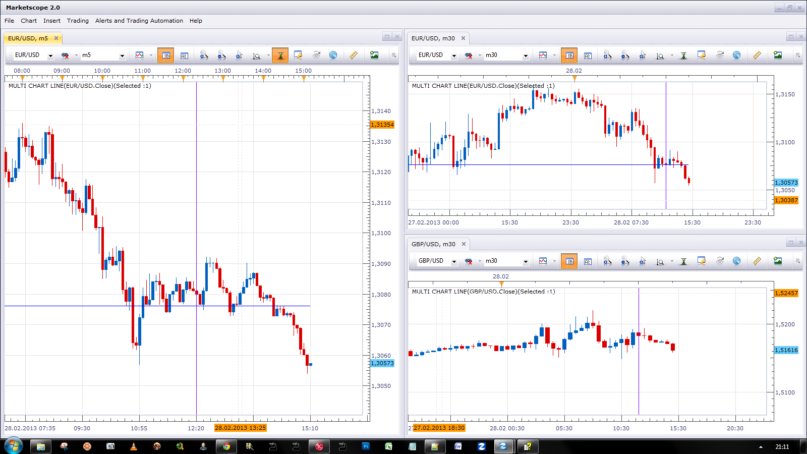
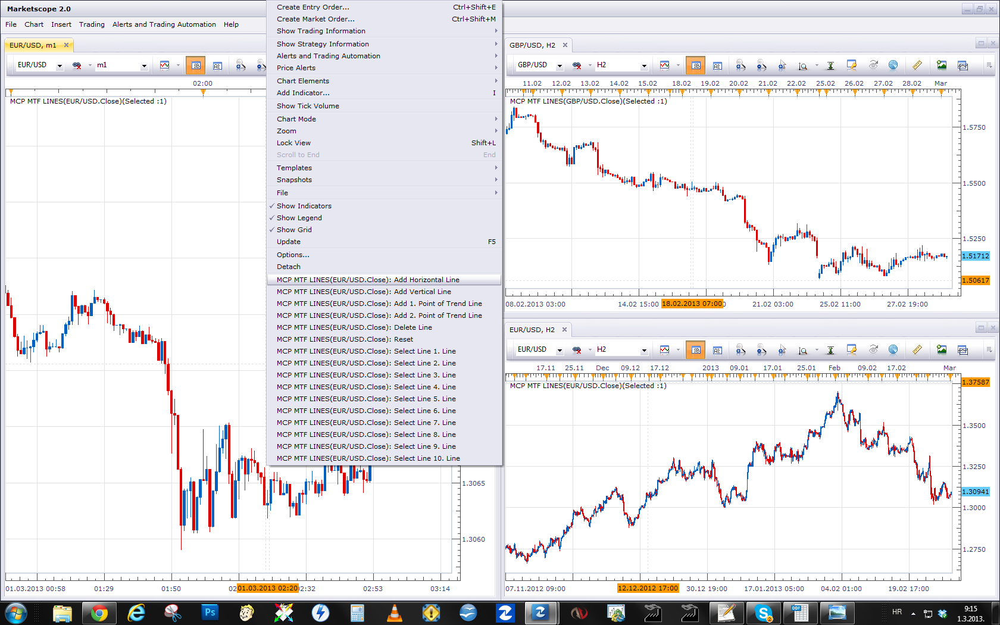

# Trans Currency Pair, Trans Time Frame Lines

> Source: https://fxcodebase.com/code/viewtopic.php?f=17&t=32568  
> Forum: 17 · Topic 32568 · 15 post(s)

---

## Trans Currency Pair, Trans Time Frame Lines

**Apprentice** · Fri Mar 01, 2013 4:21 am

This indicator allows to define three types of lines.
1) Vertical Lines.
2) Horizontal Lines
3) Trend Lines
4) Cross/Cursor

Horizontal and Trend lines are Trans Time Frame Lines
Added at one Time, will show on all other.

Vertical lines are Trans Currency Pair Lines.
Added on one currency pair, will show on all other.

Furthermore, the lines are persistent and will be remembered even if the original chart is removed.

 

To define them using the menu options.

Time allowing, in the coming weeks, I will introduce, a version that fully utilize functionality of the SDK 2.2.

 [TCP TTF Lines.lua](files/55475/TCP%20TTF%20Lines.lua)

 [TCP TTF Lines Old.lua](files/55475/TCP%20TTF%20Lines%20Old.lua)

The indicator was revised and updated

---

## Re: Trans Currency Pair, Trans Time Frame Lines

**speakinmymind** · Mon Mar 11, 2013 1:26 pm

Is this for the bet a version only? Does this put a vertical lines at specified times? Say 5 p.m. is always highlighted?

---

## Re: Trans Currency Pair, Trans Time Frame Lines

**Apprentice** · Tue Mar 12, 2013 5:24 am

Will work on regular, current version of TS.
U will have to define the line.
The line will be displayed only once.
I believe, You need something like this.
[viewtopic.php?f=17&t=11079&hilit=vertical](https://fxcodebase.com/code/viewtopic.php?f=17&t=11079&hilit=vertical)

---

## Re: Trans Currency Pair, Trans Time Frame Lines

**speakinmymind** · Tue Mar 12, 2013 9:29 am

Thanks, exactly what I was looking for!!

---

## Re: Trans Currency Pair, Trans Time Frame Lines

**Silverthorn** · Tue Dec 24, 2013 6:41 pm

Any chance of adding a text field across the bottom of the chart?

---

## Re: Trans Currency Pair, Trans Time Frame Lines

**Apprentice** · Wed Dec 25, 2013 2:52 pm

This is possible.
What information will be printed.

---

## Re: Trans Currency Pair, Trans Time Frame Lines

**Silverthorn** · Thu Dec 26, 2013 6:55 pm

Hi Apprentice,

Basically I'm still looking for a good method of displaying my Top Down analysis on my charts for M1, W1, D1 and H8. I currently use 4 instances of Watermark to do this and colour code red for Bear Black for Ranging and Blue for Bull along with a brief analysis displayed at the top and bottom of the chart. But as you can also see when you switch to another pair the watermark does not change so you are looking at the analysis for the wrong pair. If the text was specific to the pair and remained aligned to the bottom of the chart when zooming etc. it would be AWESOME even without the colour coding!!!!.

Cheers,
Mark

---

## Re: Trans Currency Pair, Trans Time Frame Lines

**Silverthorn** · Thu Dec 26, 2013 7:33 pm

Mate, cancel that.

I just saw your response to my comment on the Watermark thread and the awesome new indicator that does what I wanted. Thanks so much the repository indicator. It's GREAT!! Does the job beautifully.

---

## Re: Trans Currency Pair, Trans Time Frame Lines

**Apprentice** · Fri May 23, 2014 2:46 am

Bump Up.

---

## Re: Trans Currency Pair, Trans Time Frame Lines

**Apprentice** · Sun May 25, 2014 8:20 am

Updated version added.

It will now fully benefit from ownerDrawn functionality.
Cross / Cursor Added.

---

## Re: Trans Currency Pair, Trans Time Frame Lines

**tmdabc** · Fri Oct 23, 2015 2:29 pm

looks good，thanks

---

## Re: Trans Currency Pair, Trans Time Frame Lines

**Jaywalker** · Sun Feb 07, 2016 2:27 pm

Please can you explain in more detail how to use this indicator

Many thanks
Mike

---

## Re: Trans Currency Pair, Trans Time Frame Lines

**Apprentice** · Mon Feb 08, 2016 4:13 am

If you have a point of interest on one chart, date or value,
indicator will help you find the same date or value on second chart.
Note, indicator should be added on both charts.

---

## Re: Trans Currency Pair, Trans Time Frame Lines

**Apprentice** · Sun Jul 17, 2016 6:42 am

Minor Update.

---

## Re: Trans Currency Pair, Trans Time Frame Lines

**Apprentice** · Fri May 05, 2017 4:44 pm

Indicator was revised and updated.
