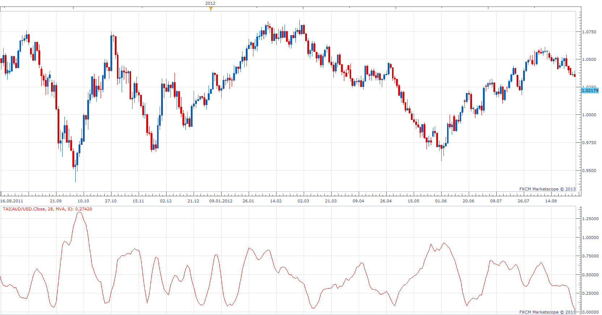

# Trend Analysis Index

> Source: https://fxcodebase.com/code/viewtopic.php?f=17&t=32941  
> Forum: 17 · Topic 32941 · 3 post(s)

---

## Trend Analysis Index

**Apprentice** · Fri Mar 08, 2013 1:12 pm

 Adam White published specification for TAI in August 1992 issue of S&C Magazine.
TAI is a simple trend indicator.

 [TAI.lua](files/56023/TAI.lua)

The indicator was revised and updated

---

## Re: Trend Analysis Index

**Alexander.Gettinger** · Mon Sep 15, 2014 12:37 pm

MQL4 version of Trend Analysis Index: [viewtopic.php?f=38&t=61156](https://fxcodebase.com/code/viewtopic.php?f=38&t=61156).

---

## Re: Trend Analysis Index

**Apprentice** · Sat Jun 24, 2017 5:00 am

The indicator was revised and updated.
