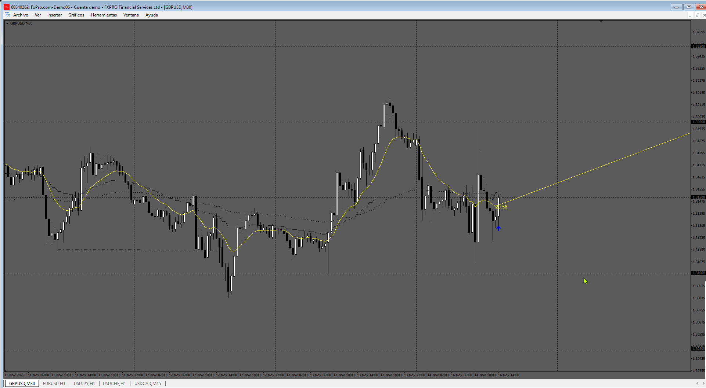

# Trend Angle

> Source: https://fxcodebase.com/code/viewtopic.php?f=17&t=60698  
> Forum: 17 · Topic 60698 · 17 post(s)

---

## Trend Angle

**Apprentice** · Thu May 15, 2014 12:02 pm

Developed by request.
[viewtopic.php?f=27&t=60680&p=93977#p93977](https://fxcodebase.com/code/viewtopic.php?f=27&t=60680&p=93977#p93977)

 [Trend Angle.lua](files/94033/Trend%20Angle.lua)

MT4 version.
[https://fxcodebase.com/code/viewtopic.php?f=38&t=60781](https://fxcodebase.com/code/viewtopic.php?f=38&t=60781)

---

## Re: Trend Angle

**kingos497** · Thu May 15, 2014 1:48 pm

thx apprentice

---

## Re: Trend Angle

**transformer** · Mon May 26, 2014 7:17 pm

hi,
it not working for higher time frame.

---

## Re: Trend Angle

**Apprentice** · Tue May 27, 2014 3:50 am

Higher time frames should not affect this indicator.
I have tested it on higher time frames.
It works without problems.
If u compressed Chart, too much, either on X of Y axis, problems can arise.

---

## Re: Trend Angle

**Alexander.Gettinger** · Thu Jun 05, 2014 9:59 am

MQL4 version of Trend Angle indicator: [viewtopic.php?f=38&t=60781](https://fxcodebase.com/code/viewtopic.php?f=38&t=60781).

---

## Re: Trend Angle

**Francis D** · Fri Nov 06, 2015 6:38 am

Hello,
It would be nice to be able to choose the text position in the chart, as it is possible to do for ATR pips indicator.

Thank you very much

---

## Re: Trend Angle

**Apprentice** · Mon Nov 09, 2015 6:16 am

Try it now.

---

## Re: Trend Angle

**mrlnb2016** · Sun Feb 07, 2016 11:48 pm

This indicator shows the current trend angle.

Is it possible to show the angle in degrees at any bar in the past?

Much appreciate for the help.

---

## Re: Trend Angle

**Apprentice** · Mon Feb 08, 2016 3:38 am

Shift parameter added.

---

## Re: Trend Angle

**Apprentice** · Sun Mar 18, 2018 12:00 pm

The indicator was revised and updated.

---

## Re: Trend Angle

**compoundtraders** · Fri Jan 20, 2023 7:01 pm

Can you apply this to any moving average method?

Where does it show you the actual degree of the moving average?

---

## Re: Trend Angle

**Apprentice** · Mon Jan 23, 2023 11:43 am

This will show on the chart moving average Angle.
If you pan, zoom in or zoom out your chart, the angle may change.

---

## Re: Trend Angle

**compoundtraders** · Sat Jan 28, 2023 2:35 am

Is it possible to get the angle calculated from the crossing point of two moving averages?

Especially if these moving averages are already used on the chart?

---

## Re: Trend Angle

**Apprentice** · Tue Jan 31, 2023 6:35 am

Sure.
We can do it for any line cross.

---

## Re: Trend Angle

**khanatd** · Tue Oct 21, 2025 10:04 pm

hi sir plz add mt4 non repaint arrows at close of current candle or reversals/continuations /breakouts etc

thanks
khan

---

## Re: Trend Angle

**Apprentice** · Wed Oct 29, 2025 6:00 am

We have added your request to the development list.
Development reference 706

---

## Re: Trend Angle

**Apprentice** · Sun Nov 16, 2025 2:47 pm

 [Trend_Angle_arrows.mq4](files/161227/Trend_Angle_arrows.mq4)
