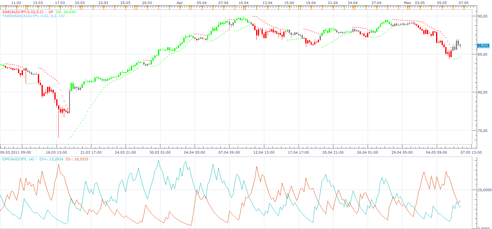
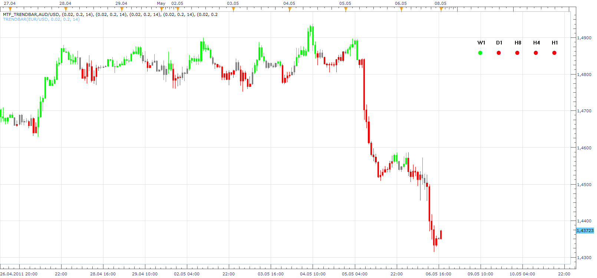

# Trend Bar

> Source: https://fxcodebase.com/code/viewtopic.php?f=17&t=4150  
> Forum: 17 · Topic 4150 · 4 post(s)

---

## Trend Bar

**Apprentice** · Sun May 08, 2011 9:15 am

Up Trend
 DIP > DIM and SAR < CLOSE then
Down Trend
DIP < DIM and SAR > CLOSE then
else
Neutral

 [TrendBar.lua](files/10421/TrendBar.lua)

MT4/MQ4 version.
[viewtopic.php?f=38&t=65760](https://fxcodebase.com/code/viewtopic.php?f=38&t=65760)

---

## Re: Trend Bar

**Apprentice** · Sun May 08, 2011 4:38 pm

MTF Version

 [MTF_TrendBar.lua](files/10427/MTF_TrendBar.lua)

---

## Re: Trend Bar

**Apprentice** · Thu Mar 02, 2017 6:19 am

Indicator was revised and updated.

---

## Re: Trend Bar

**Gentle** · Thu Mar 02, 2017 6:54 am

Hi Apprentice,

Thank you for your work and generosity!

One question: is it possible to add to this type of indicators a button on chart in order to show or hide the bar layout of indicator ? If the button is clicked once after installing the indi on chart, the colored layout dissappear, if clicked one more time, the layout appear, and so on ...

Or a setting in indicator parameters, if a button isn't possible ...

Keep it up!
