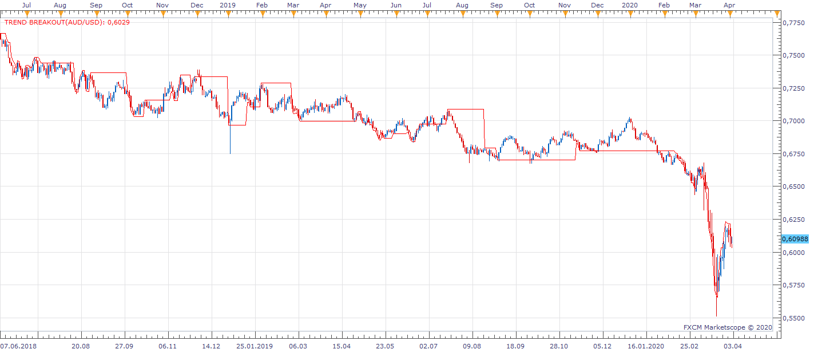

# Trend Breakout

> Source: https://fxcodebase.com/code/viewtopic.php?f=17&t=69610  
> Forum: 17 · Topic 69610 · 3 post(s)

---

## Trend Breakout

**Apprentice** · Thu Apr 02, 2020 6:50 am

 [Trend Breakout.lua](files/132513/Trend%20Breakout.lua)

Indicator based strategy.
[viewtopic.php?f=31&t=69611](https://fxcodebase.com/code/viewtopic.php?f=31&t=69611)

Based on code.
[https://www.prorealcode.com/prorealtime ... -breakout/](https://www.prorealcode.com/prorealtime-trading-strategies/trend-breakout/)

---

## Re: Trend Breakout

**kitefrog** · Fri Apr 10, 2020 4:03 pm

Hey,
Apprentice,

If I write some pseudo-code for you to make a much better break out signal - indicator, could you code it ?

I've been working on the logic of how to do this for a while. I could be motivated to finish it.

David.

---

## Re: Trend Breakout

**Apprentice** · Sun Apr 12, 2020 9:46 am

Sure.
Post your request here.
[viewforum.php?f=27](https://fxcodebase.com/code/viewforum.php?f=27)
