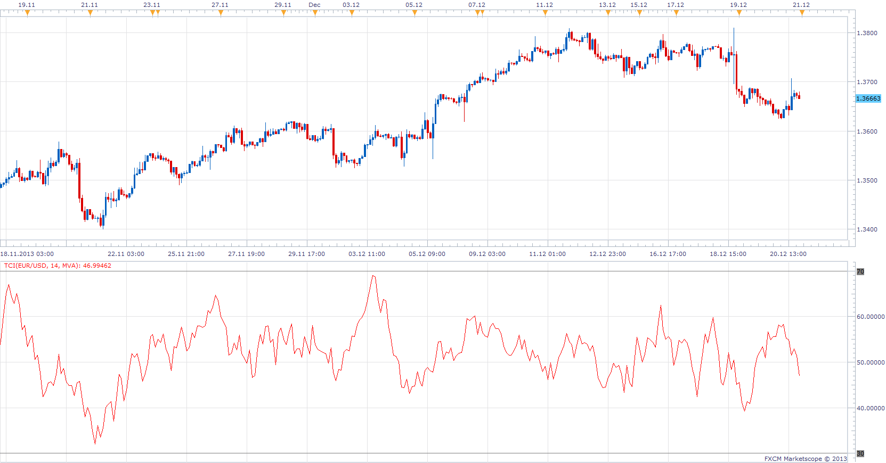

# Trend Confirmation Index

> Source: https://fxcodebase.com/code/viewtopic.php?f=17&t=60136  
> Forum: 17 · Topic 60136 · 3 post(s)

---

## Trend Confirmation Index

**Apprentice** · Sat Dec 21, 2013 9:50 am

As a presumption, the position of the closing price within the candles,
provides information whether the trend is strong or weak, gains or loses power.

TCI will calculate the average of last N position of the closing price within the candles.

Position of Close within the candles are calculated as (C-L) / ((H-L) / 100)

 [TCI.lua](files/91639/TCI.lua)

The indicator was revised and updated

---

## Re: Trend Confirmation Index

**Alexander.Gettinger** · Mon Aug 18, 2014 2:09 pm

MQL4 version of Trend Confirmation Index: [viewtopic.php?f=38&t=61051](https://fxcodebase.com/code/viewtopic.php?f=38&t=61051).

---

## Re: Trend Confirmation Index

**Apprentice** · Sun Jun 25, 2017 1:32 pm

The indicator was revised and updated.
