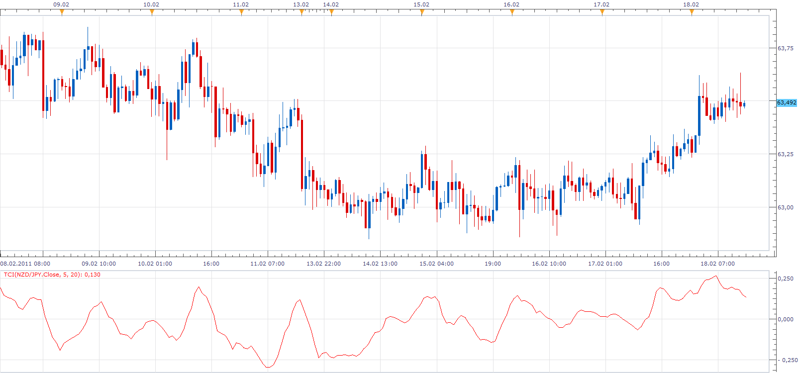

# Trend Confirmation Indicator (TCI)

> Source: https://fxcodebase.com/code/viewtopic.php?f=17&t=3447  
> Forum: 17 · Topic 3447 · 2 post(s)

---

## Trend Confirmation Indicator (TCI)

**Apprentice** · Fri Feb 18, 2011 2:23 pm

The TCI is defined as ratio of a short term SMA of the price and a long term SMA,
 TCI[period] = (ShortMVA[period] / LongMVA[period]-1) *100;

 [TCI.lua](files/8244/TCI.lua)

MT4/MQ4 version.
[viewtopic.php?f=38&t=65657&p=117174#p117174](https://fxcodebase.com/code/viewtopic.php?f=38&t=65657&p=117174#p117174)

The indicator was revised and updated

---

## Re: Trend Confirmation Indicator (TCI)

**Apprentice** · Mon Feb 13, 2017 12:51 pm

Indicator was revised and updated.
