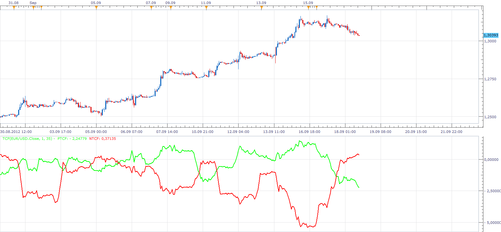

# Trend Continuation Factor

> Source: https://fxcodebase.com/code/viewtopic.php?f=17&t=23551  
> Forum: 17 · Topic 23551 · 3 post(s)

---

## Trend Continuation Factor

**Apprentice** · Tue Sep 18, 2012 12:36 pm

The Trend Continuation Factor (TCF) was introduced by M. H. Pee. in the article "Trend Continuation Factor". It was designed to help identify the market trend and direction.

 [TCF.lua](files/40526/TCF.lua)

Similar implementation
[https://fxcodebase.com/code/viewtopic.php?f=17&t=71880](https://fxcodebase.com/code/viewtopic.php?f=17&t=71880)

---

## Re: Trend Continuation Factor

**Alexander.Gettinger** · Mon Nov 17, 2014 4:47 pm

MQL4 version of Trend Continuation Factor oscillator: [viewtopic.php?f=38&t=61447](https://fxcodebase.com/code/viewtopic.php?f=38&t=61447).

---

## MTF MCP Trend Continuation Factor Heat Map

**Apprentice** · Thu Jan 05, 2023 9:16 am

 [MTF MCP Trend Continuation Factor Heat Map.lua](files/148906/MTF%20MCP%20Trend%20Continuation%20Factor%20Heat%20Map.lua)
