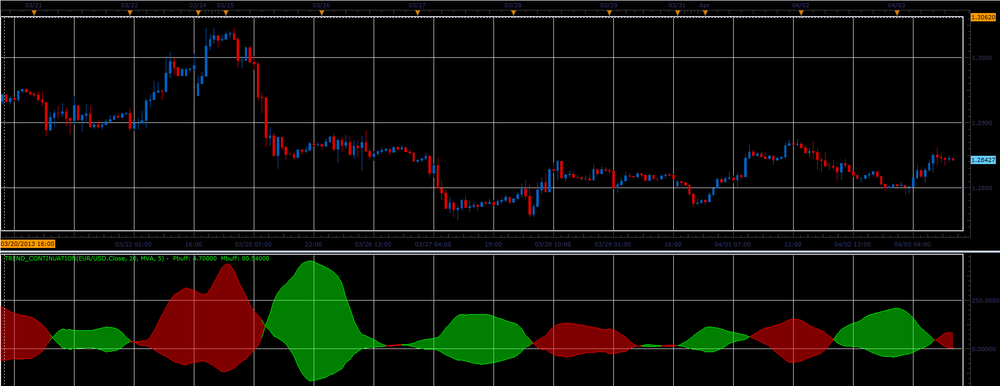

# Trend continuation oscillator

> Source: https://fxcodebase.com/code/viewtopic.php?f=17&t=34068  
> Forum: 17 · Topic 34068 · 2 post(s)

---

## Trend continuation oscillator

**Alexander.Gettinger** · Wed Apr 03, 2013 3:27 pm

This indicator is a ported MQL5 indicators from [http://www.mql5.com/en/code/1579](http://www.mql5.com/en/code/1579)

 

Download:

 [Trend_Continuation.lua](files/57908/Trend_Continuation.lua)

For this indicator must be installed Averages indicator ([viewtopic.php?f=17&t=2430](https://fxcodebase.com/code/viewtopic.php?f=17&t=2430)).

The indicator was revised and updated

---

## Re: Trend continuation oscillator

**Apprentice** · Tue May 09, 2017 6:06 am

Indicator was revised and updated.
