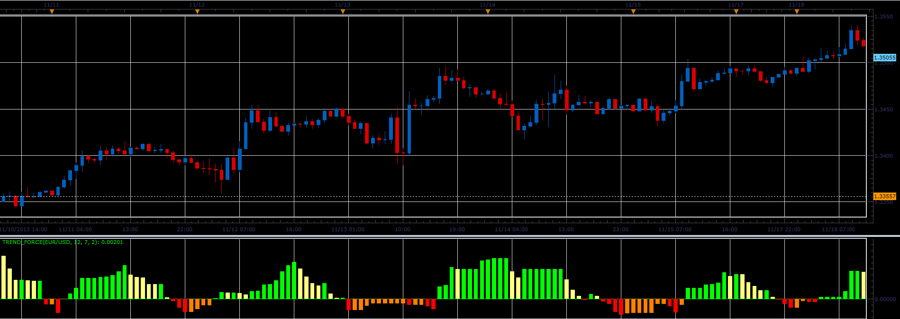

# Trend force oscillator

> Source: https://fxcodebase.com/code/viewtopic.php?f=17&t=59985  
> Forum: 17 · Topic 59985 · 3 post(s)

---

## Trend force oscillator

**Alexander.Gettinger** · Tue Nov 26, 2013 3:53 pm

Formulas:
Trend Force[i] = Up[i]-Dn[i], where
Up[i] = maximum (MaxPrice-ATR_Coeff*ATR) at range from (i-Period+1) to i,
Dn[i] = minimum (MinPrice+ATR_Coeff*ATR) at range from (i-Period+1) to i,
MaxPrice, MinPrice - maximum and minimum prices at range from (i-ATR_Period+1) to i,
ATR - Average True Range with ATR_Period.

 

Download:

 [Trend_Force.lua](files/91139/Trend_Force.lua)

The indicator was revised and updated

---

## Re: Trend force oscillator

**Alexander.Gettinger** · Tue Nov 26, 2013 3:55 pm

MQL4 version of Trend force oscillator: [viewtopic.php?f=38&t=59986](https://fxcodebase.com/code/viewtopic.php?f=38&t=59986).

---

## Re: Trend force oscillator

**Apprentice** · Sat Jun 17, 2017 4:35 am

The indicator was revised and updated.
