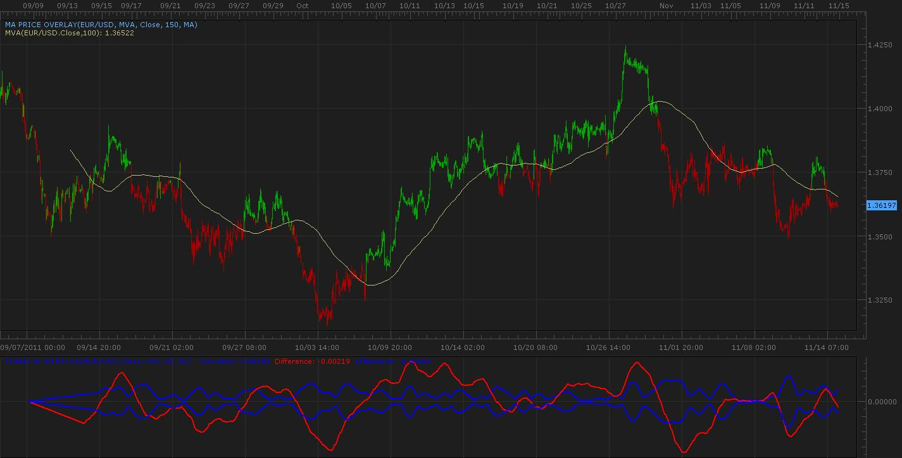

# Trend ID

> Source: https://fxcodebase.com/code/viewtopic.php?f=17&t=8114  
> Forum: 17 · Topic 8114 · 11 post(s)

---

## Trend ID

**Apprentice** · Tue Nov 15, 2011 12:44 pm

This indicator, as far as I know does not exist anywhere else.
Was developing in the last few days here on Fxcodebase.
By Aprentice and Zmender.

The main purpose of this indicator is to distinguish trending from non trending period.

 [TREND ID.lua](files/17926/TREND%20ID.lua)

---

## Re: Trend ID

**rhodia16** · Tue Nov 15, 2011 8:10 pm

Hi Apprentice,

Thank you for the interesting indicator!

Could you please enlighten us on the ways to distinguish trend periods from non-trend periods by using this indicator?

Thanks in advance.

Rhodia

---

## Re: Trend ID

**Apprentice** · Wed Nov 16, 2011 2:15 am

You tell me, I do not have much experience with it.

One possible way to use.
If Trend Id closes within Deviation lines. The trend has ended.
And Vice-versa.

---

## Re: Trend ID

**zmender** · Wed Nov 16, 2011 3:48 pm

Right now, I am using the indicator as a visual indicator of trend: difference > stdev, trend; vice versa.

I'm trying to make an oscillator out of this. The ratio oscillator Apprentice programmed tends to "explode", so I'm trying to figure out a way to "cap" it like an erf function.

---

## Re: Trend ID

**Alexander.Gettinger** · Thu Nov 20, 2014 10:26 am

MQL4 version of Trend ID oscillator: [viewtopic.php?f=38&t=61497](https://fxcodebase.com/code/viewtopic.php?f=38&t=61497).

---

## Re: Trend ID

**tmdabc** · Fri Oct 23, 2015 2:09 pm

looks good，thanks
wonder if change line color is better

---

## Re: Trend ID

**fxcyberman** · Mon Nov 02, 2015 3:14 am

It seems there are something wrong with the stream's name (label name).
Also, is it possible to know its logic ?

---

## Re: Trend ID

**Apprentice** · Tue Nov 03, 2015 5:41 am

Fixed.

---

## Re: Trend ID

**Apprentice** · Tue Nov 03, 2015 5:46 am

Raw = ( source - MVA of source) / (MVA of source /100 );
d = Stdev of MVA of Raw;
Deviation= MVA of Raw;
Negativ= -d*Multiplier;
Positiv = d*Multiplier;

---

## Re: Trend ID

**fxcyberman** · Tue Nov 03, 2015 10:49 am

Thank you for your prompt reply.

---

## Re: Trend ID

**Apprentice** · Thu Sep 27, 2018 5:06 am

The Indicator was revised and updated.
