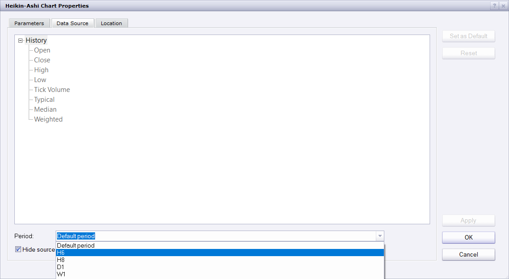

# Trend Indicator

> Source: https://fxcodebase.com/code/viewtopic.php?f=17&t=65461  
> Forum: 17 · Topic 65461 · 13 post(s)

---

## Trend Indicator

**Apprentice** · Sun Dec 17, 2017 1:08 pm

Based on the request.
[viewtopic.php?f=27&t=65455](https://fxcodebase.com/code/viewtopic.php?f=27&t=65455)

 [Trend Indicator.lua](files/116519/Trend%20Indicator.lua)

 [Trend Indicator with Alert.lua](files/116519/Trend%20Indicator%20with%20Alert.lua)

 

 [Trend Indicator Histogram.lua](files/116519/Trend%20Indicator%20Histogram.lua)

---

## Re: Trend Indicator

**bartwas1** · Mon Dec 18, 2017 9:27 am

Many thanks Apprentice.
Only problem with histogram is - it isn't accurate. With the same settings as trend indicator (which is excellent) histogram' version shows different results. On meta trader both mirror each other (more or less, closely overlapping each other). And you may see gaps in-between up and downtrend - sideways moving market.
If you install histogram on its own on trading station and compare to the price movement on the chart it shows a huge lag between what was supposed to be declining or rising market. Do you mind to have another look at histogram version, please. Once again I appreciate you work on converting these indies.
Kind regards
Bart

---

## Re: Trend Indicator

**bartwas1** · Mon Dec 18, 2017 12:28 pm

Hi Apprentice

Sorry about claiming that indi was inaccurate. I have looked at this indi again and discovered the problem. The histogram is accurate the issue is with its colours for up and downtrend being mixed up. In settings lime green was assigned to uptrend and red to downtrend conditions, but on the chart uptrend was displayed as red and downtrend as lime green. Do you mind to make correction so colour for up and downtrend in settings will be the same as displayed on the chart,though?

Kind regards
Bart

---

## Re: Trend Indicator

**Apprentice** · Mon Dec 18, 2017 2:21 pm

Try it now.

---

## Re: Trend Indicator

**chai88888** · Tue Dec 19, 2017 4:54 am

can you please put an alert when a dor appears

thanks

---

## Re: Trend Indicator

**Apprentice** · Tue Dec 19, 2017 5:46 am

Trend Indicator with Alert.lua added.

---

## Re: Trend Indicator

**chai88888** · Tue Dec 19, 2017 5:57 am

many thanks

---

## Re: Trend Indicator

**bartwas1** · Wed Dec 20, 2017 5:45 am

> **Apprentice wrote:**
> Try it now.

Thanks Apprentice.

---

## Re: Trend Indicator

**bartwas1** · Wed Dec 20, 2017 6:36 am

Hi Apprentice

I have a question if presently in this build of marketscope is there a way to change a source period for the data in the indicator setting for higher time frame with candles/bars maintaining the same thickness as candles/bars on the current time frame chart or rather replacing them?
Example:
In the case of trend indicator I'd like to open 15m chart and place trend indicator with source period of 1h and see 15m candles/bars based on 1h data. Currently (as far as I know) 1h candles overlap with 15m on the same chart. If you replace data source for the indicator in meta trader 4 you will have just one type of candles with no overlapping - the view is much clearer.

To sum up I'm looking for something like an option: 'show current time frame's candles, but use data from higher time frame'.
PS: Expanding of sources for data without affecting candles/or bars would be extremely useful.

Kind regards
Bart

---

## Re: Trend Indicator

**Apprentice** · Thu Dec 21, 2017 11:17 am

Will the data source period menu be satisfactory?

---

## Re: Trend Indicator

**bartwas1** · Thu Dec 21, 2017 4:46 pm

> **Apprentice wrote:**
>
>
> Capture.PNG
>
>
> Will the data source period menu be satisfactory?

Menu is fine if changing indicator's source period for higher time frame allows candles remain the same on the current chart but being fed with data from higher period.

I suppose you may add an overlay option yes or no (maybe even in settings). 'Yes' if you want a complete overlay of candles by using higher time frame data source or 'no' if you want to keep current time frame candles and see overshadowed candles based on higher time frame, as it's possible now.

---

## Re: Trend Indicator

**Apprentice** · Thu Dec 28, 2017 6:39 am

Your request is added to the development list under Id Number 3989

---

## Re: Trend Indicator

**Apprentice** · Wed Apr 04, 2018 6:24 am

The Indicator was revised and updated.
