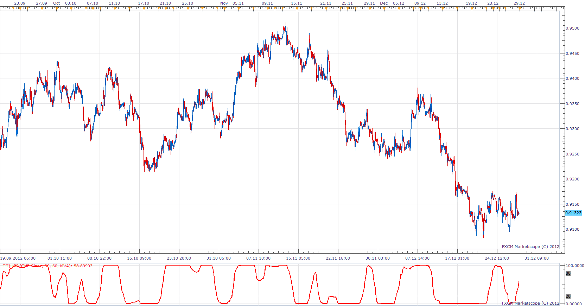

# Trend Intensity Index

> Source: https://fxcodebase.com/code/viewtopic.php?f=17&t=28055  
> Forum: 17 · Topic 28055 · 6 post(s)

---

## Trend Intensity Index

**Apprentice** · Sun Dec 30, 2012 9:56 am

Trend Intensity Index (TII) is based on an article by M. H. Pee that is available in the June 2002 issue of Stocks and Commodities Magazine.

II is used to indicate the strength of the current trend in the market. The stronger the current trend, the more likely the market will continue moving in the current direction.

POS = Close - MA
NEG = MA - Close
TII = 100 * (POS) / (POS +NEG)

 [TII.lua](files/49260/TII.lua)

The indicator was revised and updated

---

## Re: Trend Intensity Index

**Alexander.Gettinger** · Mon Sep 22, 2014 10:43 am

MQL4 version of Trend Intensity Index: [viewtopic.php?f=38&t=61215](https://fxcodebase.com/code/viewtopic.php?f=38&t=61215).

---

## Re: Trend Intensity Index

**Apprentice** · Sat Jun 24, 2017 5:17 am

The indicator was revised and updated.

---

## Re: Trend Intensity Index

**ASTERIA** · Tue Jun 04, 2019 5:32 am

Hi apprentice,

Can you make a strategy with this indicator?
At the levels 0, 20, 80 and 100 to be the following options: No action/ sell/ buy/ close / alert
Entry and exit: Live/ end of turn
Use break even
Trailing after break even
I request the possibility of opening multi positions at the same time with different lot sizes, stops and limits for the Strategy.

Thank you

---

## Re: Trend Intensity Index

**Apprentice** · Tue Jun 04, 2019 6:07 am

Your request is added to the development list under Id Number 4694

---

## Re: Trend Intensity Index

**Apprentice** · Tue Jun 04, 2019 10:39 am

Try this version.
[viewtopic.php?f=31&t=68534](https://fxcodebase.com/code/viewtopic.php?f=31&t=68534)
