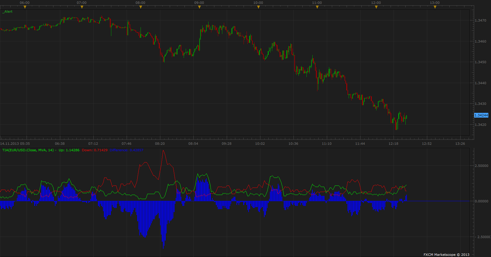

# Trend Interruption Average

> Source: https://fxcodebase.com/code/viewtopic.php?f=17&t=59851  
> Forum: 17 · Topic 59851 · 16 post(s)

---

## Trend Interruption Average

**Apprentice** · Thu Nov 14, 2013 6:31 am

Written according to request.
[viewtopic.php?f=27&t=59844](https://fxcodebase.com/code/viewtopic.php?f=27&t=59844)

 [TIA.lua](files/90808/TIA.lua)

 [TIA with Normalization.lua](files/90808/TIA%20with%20Normalization.lua)

Mq4/MT4 version
[viewtopic.php?f=38&t=63942&p=108462#p108462](https://fxcodebase.com/code/viewtopic.php?f=38&t=63942&p=108462#p108462)

The indicator was revised and updated

---

## Re: Trend Interruption Average

**speakinmymind** · Thu Nov 14, 2013 7:56 am

Great! Please add option to display difference as a line instead of histogram. Also, please add the ability to turn each component on and off. Thanks!!

---

## Re: Trend Interruption Average

**Apprentice** · Thu Nov 14, 2013 9:38 am

Requested options added.

---

## Re: Trend Interruption Average

**speakinmymind** · Fri Nov 15, 2013 8:41 am

Could please create a strategy that buys at a specified number, (say -7) and sells at a specified number say (+7) thanks!

This would be based off the difference line.

---

## Re: Trend Interruption Average

**Apprentice** · Sat Nov 16, 2013 3:18 am

Your request is added to the development list

---

## Re: Trend Interruption Average

**speakinmymind** · Mon Nov 18, 2013 12:29 pm

Could you please make the difference bars color coded so that:

When the bars are falling they are grey and when the are rising they are blue or another color.

The theory is that this indicator is rising, the market participating in a trend (moving price).
When this indicator is falling, the market is searching for a trend (price can be volatile).

Thanks!

---

## Re: Trend Interruption Average

**Apprentice** · Tue Nov 19, 2013 2:28 pm

At this time, I'm not sure how this zones are determined.
Can you explain in more detail.

---

## Re: Trend Interruption Average

**speakinmymind** · Tue Nov 19, 2013 6:49 pm

Basically all bars that have a higher value than the previous bar should be blue.

All bars that have a lower value than the previous bar should be grey.

---

## Re: Trend Interruption Average

**speakinmymind** · Thu Feb 13, 2014 1:56 pm

Could you please add normalization to this the same way you did the "Prevailing Trend" indicator?

[viewtopic.php?f=17&t=59402&start=20](https://fxcodebase.com/code/viewtopic.php?f=17&t=59402&start=20)

---

## Re: Trend Interruption Average

**Apprentice** · Fri Feb 14, 2014 4:14 am

Your request is added to the development list

---

## Re: Trend Interruption Average

**speakinmymind** · Wed Mar 19, 2014 3:52 pm

Any update on this?

---

## Re: Trend Interruption Average

**speakinmymind** · Sun Feb 28, 2016 3:50 pm

Hey Apprentice, I was hoping you could take another look at creating this indicator with normalization. Tha

---

## Re: Trend Interruption Average

**Apprentice** · Mon Feb 29, 2016 6:45 am

TIA with Normalization added.

---

## Re: Trend Interruption Average

**Apprentice** · Mon Feb 29, 2016 7:11 am

Simple TIA strategy can be found here.
[viewtopic.php?f=31&t=63194](https://fxcodebase.com/code/viewtopic.php?f=31&t=63194)

---

## Re: Trend Interruption Average

**speakinmymind** · Sun Jul 16, 2017 10:29 am

Apprentice,

I am wondering how this indicator works when volume is selected as the data source.

Considering there is no negative volume candles, how could the uptrend ever be interrupted?

Is it using a candle with less volume than the previous as a red candle for calculations? If not, what is being used?

Thanks!

---

## Re: Trend Interruption Average

**Apprentice** · Mon Jul 17, 2017 4:24 am

Yes, candles with less volume than the previous one will be a red candle, and vice versa.
