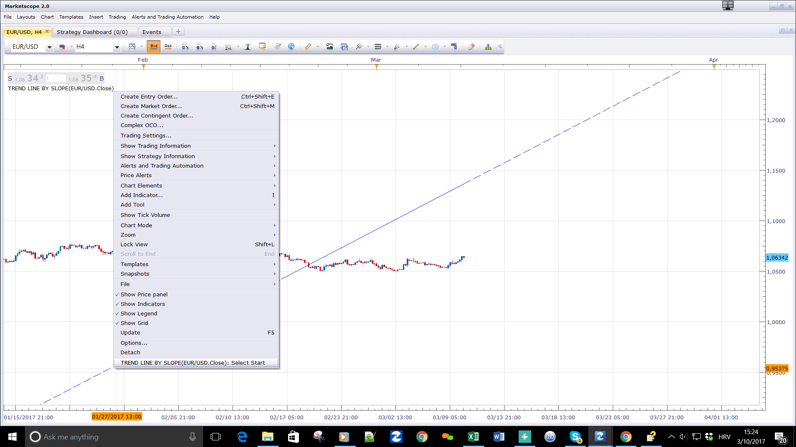

# Trend line by slope

> Source: https://fxcodebase.com/code/viewtopic.php?f=17&t=64517  
> Forum: 17 · Topic 64517 · 3 post(s)

---

## Trend line by slope

**Apprentice** · Fri Mar 10, 2017 11:18 am

Will create a trend line with specified slope, in pips, starting at the start point.

 [Trend line by slope.lua](files/111394/Trend%20line%20by%20slope.lua)

The indicator was revised and updated

---

## Re: Trend line by slope

**mcarr005** · Mon Mar 13, 2017 12:09 pm

Please can you fix this problem: When you insert several "trend line slope" and change the starting point of one of them, then all starting points change.

Thanks in advance Aprentice, great work.

---

## Re: Trend line by slope

**Apprentice** · Tue Mar 14, 2017 7:29 am

Try it now.
ID Number was introduced.
