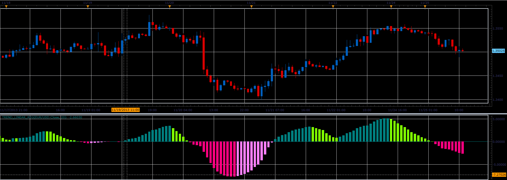

# Trend Linear Reg oscillator

> Source: https://fxcodebase.com/code/viewtopic.php?f=17&t=59990  
> Forum: 17 · Topic 59990 · 4 post(s)

---

## Trend Linear Reg oscillator

**Alexander.Gettinger** · Tue Nov 26, 2013 4:39 pm

This indicator is a ported MQL5 indicator from [http://www.mql5.com/en/code/1884](http://www.mql5.com/en/code/1884).

 

Download:

 [Trend_Linear_Reg.lua](files/91146/Trend_Linear_Reg.lua)

---

## Re: Trend Linear Reg oscillator

**Alexander.Gettinger** · Tue Nov 26, 2013 4:42 pm

MQL4 version of Trend Linear Reg oscillator: [viewtopic.php?f=38&t=59991](https://fxcodebase.com/code/viewtopic.php?f=38&t=59991).

---

## Re: Trend Linear Reg oscillator

**tmdabc** · Fri Oct 23, 2015 2:07 pm

looks good，thanks

---

## Re: Trend Linear Reg oscillator

**Apprentice** · Wed Sep 05, 2018 6:24 am

The indicator was revised and updated.
