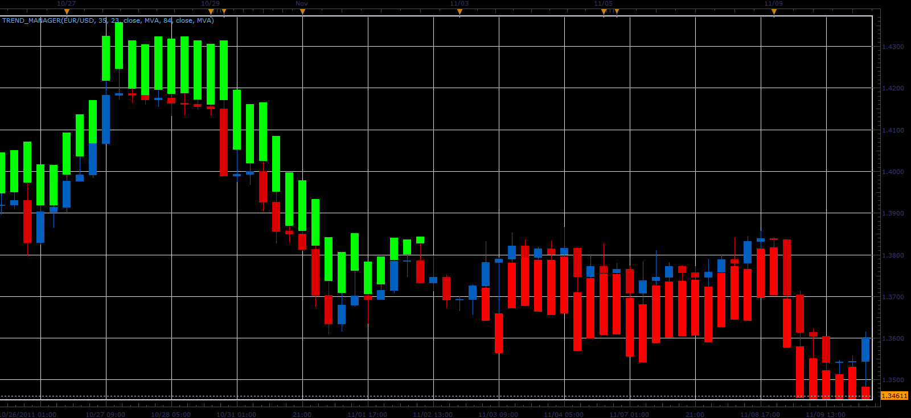

# Trend manager

> Source: https://fxcodebase.com/code/viewtopic.php?f=17&t=9709  
> Forum: 17 · Topic 9709 · 2 post(s)

---

## Trend manager

**Alexander.Gettinger** · Thu Dec 15, 2011 5:26 am

This indicator is a ported MQL5 indicator from [http://www.mql5.com/ru/code/754](http://www.mql5.com/ru/code/754) (in Russian).

Indicator use a 2 MA. If difference between MAs more than DVLimit indicator draw shadow. Size of shadow equal (Abs(MA1-MA2)-DVLimit).

 

Download:

 [Trend_Manager.lua](files/20703/Trend_Manager.lua)

For this indicator must be installed Averages indicator from [viewtopic.php?f=17&t=2430](https://fxcodebase.com/code/viewtopic.php?f=17&t=2430)

The indicator was revised and updated

---

## Re: Trend manager

**Apprentice** · Mon Mar 20, 2017 7:56 am

Indicator was revised and updated.
