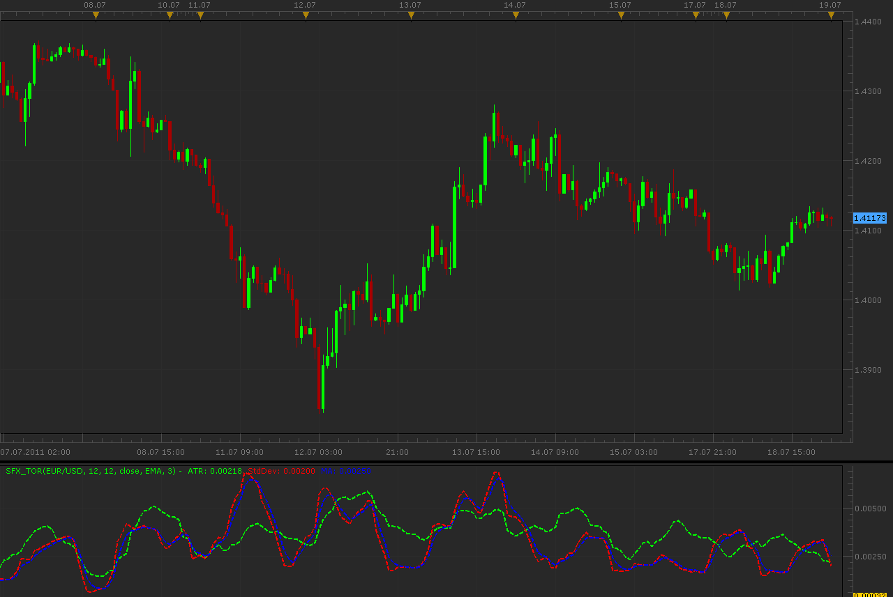

# Trend Or Range Indicator

> Source: https://fxcodebase.com/code/viewtopic.php?f=17&t=5270  
> Forum: 17 · Topic 5270 · 8 post(s)

---

## Trend Or Range Indicator

**Alexander.Gettinger** · Mon Jul 18, 2011 11:56 pm

Trend or Range indicator.

There lines:

Yellow = StDev (Standard Deviation)
Aqua = ATR
Red = SMMA(StdDev)

* Stdev cross over SMMA(StDev) while under ATR - begin of trend
* Stdev cross over SMMA(StDev) while Over ATR - trend
* Stdev cross under SMMA(StDev) when over ATR - end of trend
* StdDev below SMMA(StDev) and below ATR - stagnation (no trend)

 

Download:

 [SFX_TOR.lua](files/12828/SFX_TOR.lua)

 

 [Trend Or Range Indicator Heat Map.lua](files/12828/Trend%20Or%20Range%20Indicator%20Heat%20Map.lua)

For this indicator must be installed AVERAGES indicator ([http://www.fxcodebase.com/code/viewtopi ... =17&t=2430](http://www.fxcodebase.com/code/viewtopic.php?f=17&t=2430))
and StdDev
([viewtopic.php?f=17&t=870&start=0](https://fxcodebase.com/code/viewtopic.php?f=17&t=870&start=0)).

---

## Re: SFX Trend Or Range Indicator

**Apprentice** · Sun Feb 10, 2013 5:46 am

This indicator will provide Audio / Email Alerts for individual components cross over/under.

 [SFX_TOR with Alert.lua](files/54399/SFX_TOR%20with%20Alert.lua)

For this indicator following indicator must be installed
 AVERAGES indicator
[http://www.fxcodebase.com/code/viewtopi ... =17&t=2430](http://www.fxcodebase.com/code/viewtopic.php?f=17&t=2430)
 StdDev Indicator
[viewtopic.php?f=17&t=870&start=0](https://fxcodebase.com/code/viewtopic.php?f=17&t=870&start=0)

Compatibility issue fixed.
_Alert Helper is not longer needed.

---

## Re: SFX Trend Or Range Indicator

**Apprentice** · Sun Feb 10, 2013 7:54 am

Updated.

---

## Re: SFX Trend Or Range Indicator

**Blackcat2** · Mon Feb 11, 2013 6:38 am

Interesting, can this be represented like a heat map?

Cheers..
BC

---

## Re: SFX Trend Or Range Indicator

**Apprentice** · Mon Feb 11, 2013 6:06 pm

Your request is added to the development list.

---

## Re: Trend Or Range Indicator

**Apprentice** · Wed Feb 24, 2016 11:15 am

Compatibility issue fixed.
_Alert Helper is not longer needed.

---

## Re: Trend Or Range Indicator

**Apprentice** · Wed Mar 02, 2016 6:22 am

Trend Or Range Indicator Heat Map.lua Added.

---

## Re: Trend Or Range Indicator

**Apprentice** · Fri Oct 19, 2018 4:34 am

The indicator was revised and updated.
