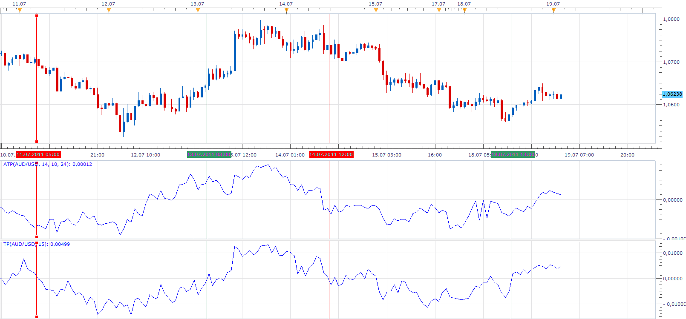

# Trend Pressure

> Source: https://fxcodebase.com/code/viewtopic.php?f=17&t=5275  
> Forum: 17 · Topic 5275 · 3 post(s)

---

## Trend Pressure

**Apprentice** · Tue Jul 19, 2011 2:01 am

This indicator is currently being developed.

There are two versions.

Advance Pressure Trend
Compares the Up and Down Pressure of the last N bars.
The calculation takes into account the entire candle.
Body and Wick.

Advance Trend Pressure

 [TP.lua](files/12836/TP.lua)

Asymmetric Pressure Trend

It basically compares the Up and Down pressure
 for the last, N candles in the direction of the trend,
 and last N candle in the opposite direction from current trends.

Allows you to define a separate trend, and Reversal Period.
If you are using Smaller Reversal Period this will Result with in earlier signals.

Asymmetric Trend Pressure

 [ATP.lua](files/12836/ATP.lua)

Obtained data has a lot of noise.
Therefore, further smoothing is recommended.

The indicator was revised and updated

---

## Re: Trend Pressure

**Alexander.Gettinger** · Fri Jun 29, 2012 1:34 pm

MQL4 version of Trend pressure: [viewtopic.php?f=38&t=20675](https://fxcodebase.com/code/viewtopic.php?f=38&t=20675)

---

## Re: Trend Pressure

**Apprentice** · Tue Apr 11, 2017 5:26 am

Indicator was revised and updated.
