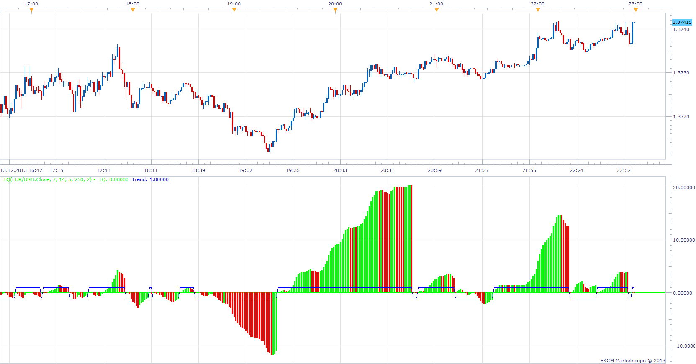

# Trend Quality

> Source: https://fxcodebase.com/code/viewtopic.php?f=17&t=60117  
> Forum: 17 · Topic 60117 · 6 post(s)

---

## Trend Quality

**Apprentice** · Sun Dec 15, 2013 2:11 pm

As described in the article "Detecting And Determining Trends - Trend-Quality Indicator" by David Sepiashvili

 [TQ.lua](files/91535/TQ.lua)

The indicator was revised and updated

---

## Re: Trend Quality

**cersoz** · Sat Jan 11, 2014 3:37 pm

anyone can add +2,-2 and +5,-5 lvl s

---

## Re: Trend Quality

**evgeniyn** · Sun Jan 12, 2014 10:06 am

> **cersoz wrote:**
> anyone can add +2,-2 and +5,-5 lvl s

.Pls find in attached

---

## Re: Trend Quality

**cersoz** · Sun Jan 12, 2014 2:11 pm

thanks man!:)

---

## Re: Trend Quality

**Alexander.Gettinger** · Wed Mar 05, 2014 5:10 pm

MQL4 version of Trend Quality oscillator: [viewtopic.php?f=38&t=60406](https://fxcodebase.com/code/viewtopic.php?f=38&t=60406).

---

## Re: Trend Quality

**Apprentice** · Sun Jun 18, 2017 12:55 pm

The indicator was revised and updated.
