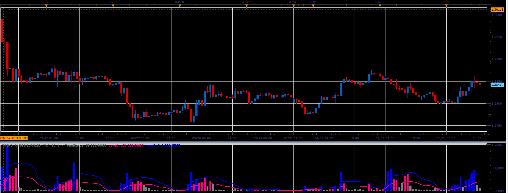

# Trend Range oscillator

> Source: https://fxcodebase.com/code/viewtopic.php?f=17&t=34061  
> Forum: 17 · Topic 34061 · 3 post(s)

---

## Trend Range oscillator

**Alexander.Gettinger** · Wed Apr 03, 2013 2:40 pm

This indicator is a ported MQL5 indicators from [http://www.mql5.com/en/code/1573](http://www.mql5.com/en/code/1573)

Formulas:
TrendRange[i] = res*Volume[i], where
res = High[i] - Low[i].
Level1 = Max/2,
Level2 = Max, where
Max = MA(TrendRange) + StdDev(TrendRange)*Deviation.

 

Download:

 [Trend_Range.lua](files/57900/Trend_Range.lua)

Averages indicator is available here [viewtopic.php?f=17&t=2430](https://fxcodebase.com/code/viewtopic.php?f=17&t=2430)
 StdDev indicator is available here [viewtopic.php?f=17&t=870&hilit=STDDEV](https://fxcodebase.com/code/viewtopic.php?f=17&t=870&hilit=STDDEV)

The indicator was revised and updated

---

## Re: Trend Range oscillator

**Alexander.Gettinger** · Wed Apr 10, 2013 4:13 pm

MQL4 version of this indicator: [viewtopic.php?f=38&t=34362](https://fxcodebase.com/code/viewtopic.php?f=38&t=34362)

---

## Re: Trend Range oscillator

**Apprentice** · Tue May 09, 2017 6:19 am

Indicator was revised and updated.
