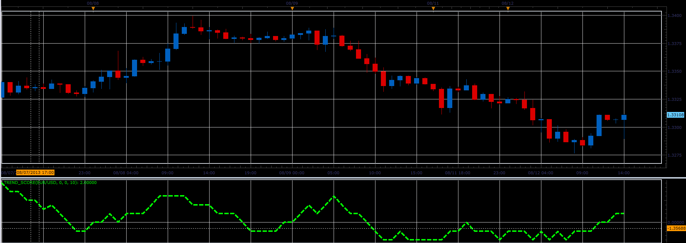

# Trend score oscillator

> Source: https://fxcodebase.com/code/viewtopic.php?f=17&t=59046  
> Forum: 17 · Topic 59046 · 4 post(s)

---

## Trend score oscillator

**Alexander.Gettinger** · Tue Aug 13, 2013 8:20 am

This indicator is a ported MQL5 indicator from [http://www.mql5.com/en/code/1782](http://www.mql5.com/en/code/1782).

 

Download:

 [Trend_Score.lua](files/88459/Trend_Score.lua)

The indicator was revised and updated

---

## Re: Trend score oscillator

**Alexander.Gettinger** · Tue Aug 13, 2013 8:22 am

MQL4 version of this oscillator: [viewtopic.php?f=38&t=59047](http://www.fxcodebase.com/code/viewtopic.php?f=38&t=59047)

---

## Re: Trend score oscillator

**Apprentice** · Sun Jun 04, 2017 5:58 am

The indicator was revised and updated.

---

## Re: Trend score oscillator

**ahmedalhosenyy** · Mon Mar 17, 2025 8:25 am

Nice indicator
