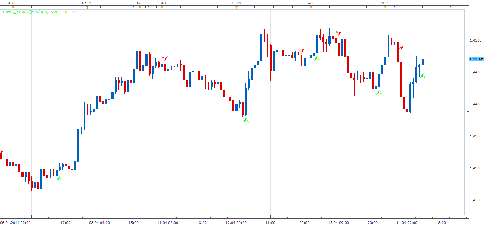
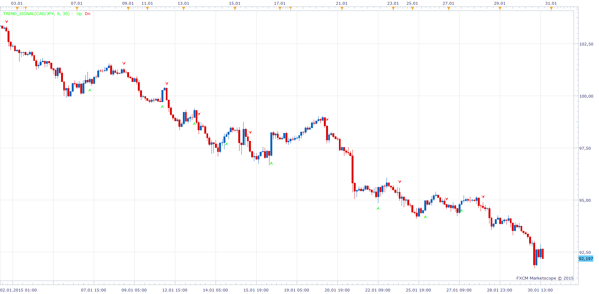
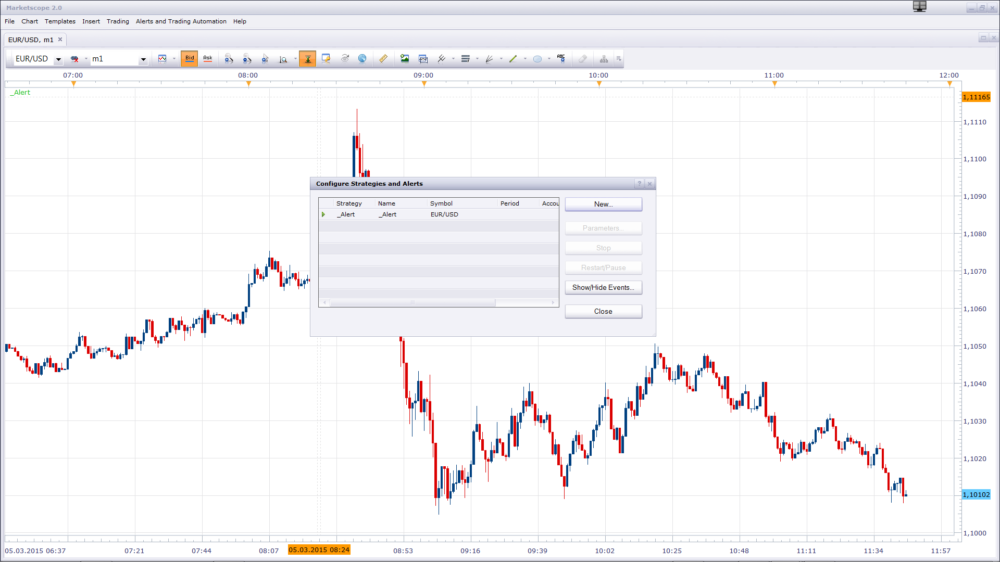

# Trend Signal Indicator

> Source: https://fxcodebase.com/code/viewtopic.php?f=17&t=3918  
> Forum: 17 · Topic 3918 · 40 post(s)

---

## Trend Signal Indicator

**Apprentice** · Thu Apr 14, 2011 11:12 am

This indicator gives an indication of trend reversal,
when the closing price rises / falls above / below the maximum / minimum for a defined period.

With Risk parameter we can determine the distance from the extreme price for that period.
We define it as a percentage of the range for that period.

 [Trend_Signal.lua](files/9673/Trend_Signal.lua)

---

## Re: Trend Signal Indicator

**bluemoon** · Tue Apr 19, 2011 9:52 am

Your indicator generating false indicators in 30 mins and 1 hour charts. Sometimes indicator become visible and then after few mins disappear from chart and appeared again after 20 to 30 mins on same candle or sometime on the different candle.

Can you please fix this problem.

thanks

---

## Re: Trend Signal Indicator

**Apprentice** · Tue Apr 19, 2011 11:16 am

I'll continue testing.
But for now, I have not discovered the problem.

---

## Re: Trend Signal Indicator

**bluemoon** · Wed Apr 20, 2011 9:17 am

Thanks..

Your indicator again generated a falls Down signal 9:00 EST on gold at 1500.6 and disappeared after few mins but in 30 mins chart yindicator generated a Down signal at 7:30 EST on gold at 1503 and it still there.

---

## Re: Trend Signal Indicator

**Apprentice** · Wed Apr 20, 2011 11:44 am

Thanks for the information.

Today I post updated version.
Which uses slightly different algorithm.
I hope this will help.

I have not managed to catch this problem yet.

---

## Re: Trend Signal Indicator

**bluemoon** · Wed Apr 20, 2011 3:22 pm

Thanks.

let me test it again.

---

## Re: Trend Signal Indicator

**bluemoon** · Sun May 01, 2011 2:12 pm

Hello Apprentice

This indicator is ok but not much helpful. I lost $40 in 2 hours in my demo account because of that indicator.

regards

---

## Re: Trend Signal Indicator

**Apprentice** · Mon May 02, 2011 3:00 am

First. This indicator has been written on request.
According to the template, I am not the author of it.

Second. None of indicators does guarantees you one hundred percent success.

Third. Technical analysis is just one of the tools at your disposal.
When entering a trade Technical Analysis is usually only in fourth or fifth, last place in decision-making process.

I personally do not use indicators in my trading.
Those who have followed my trading know that I'm pretty successful.

---

## Re: Trend Signal Indicator

**luigipg** · Mon May 02, 2011 3:12 am

Which are the first, second and third place in decision to entering a trade? What you use for your trading? I'd like follow your trading know, how can i do? Thanks in advance and also for your infinite work. Luigi!!!

---

## Re: Trend Signal Indicator

**bluemoon** · Mon May 02, 2011 3:17 am

I know indicators not give you 100% result. I'm just telling you my experience.

Can you please guide us how do you trade without indicators? any tip?

thanks

---

## Re: Trend Signal Indicator

**Apprentice** · Mon May 02, 2011 9:47 am

For both.
I use Trend Lines and Channels.

If you want to know more send me a private mail.

---

## Re: Trend Signal Indicator

**iburak** · Tue May 10, 2011 3:46 am

Apprentice,

This is a very good performing signal, could you please give a code for sound alert?

---

## Re: Trend Signal Indicator

**Apprentice** · Tue May 10, 2011 3:18 pm

Your request has been added to developmental cue.

---

## Re: Trend Signal Indicator

**RJH501** · Fri Jul 29, 2011 12:02 pm

Hi Apprentice!

Nice indicator but I can't get the strategy to load. See chart for problem message.

Would sure appreciate your help.

Best regards,

Richard

---

## Re: Trend Signal Indicator

**Alexander.Gettinger** · Fri Nov 21, 2014 4:53 pm

MQL4 version of Trend Signal indicator: [viewtopic.php?f=38&t=61514](https://fxcodebase.com/code/viewtopic.php?f=38&t=61514).

---

## Re: Trend Signal Indicator

**JOKER83** · Mon Dec 08, 2014 5:32 pm

> **Apprentice wrote:**
> First. This indicator has been written on request.
> According to the template, I am not the author of it.
>
> Second. None of indicators does guarantees you one hundred percent success.
>
> Third. Technical analysis is just one of the tools at your disposal.
> When entering a trade Technical Analysis is usually only in fourth or fifth, last place in decision-making process.
>
> I personally do not use indicators in my trading.
> Those who have followed my trading know that I'm pretty successful.

can you tell my your tradingstrategy??

---

## Re: Trend Signal Indicator

**Apprentice** · Mon Dec 08, 2014 6:29 pm

Basically, sell high/expensive, buy low/cheap .
You can use price parity indicator like a Big Mac Index for this purpose.
I listen to the market sentiment, You can are using COT indicator.
I use various risk management / Position sizing strategies,
You can use the Risk Reward Indicator.
I only draw trend & channels lines.

---

## Re: Trend Signal Indicator

**copperwasher7** · Thu Jan 29, 2015 4:26 pm

> **Apprentice wrote:**
>
>
> The attachment **Trend_Signal.png** is no longer available
>
>
>
> This indicator gives an indication of trend reversal,
> when the closing price rises / falls above / below the maximum / minimum for a defined period.
>
> With Risk parameter we can determine the distance from the extreme price for that period.
> We define it as a percentage of the range for that period.
>
>
> The attachment **Trend_Signal.png** is no longer available

Hi there Apprentice

This is an excellent indicator, but there is one small issue...
the size of the arrow, when displayed the arrow is buried in the candle - see attached image

i have adjusted the font settings, but the arrow is still buried in the candle. its the same issue on any chart...

i do hope you can help.

With kindest regards,
Copperwasher7

---

## Re: Trend Signal Indicator

**Apprentice** · Fri Jan 30, 2015 8:26 am

Please Try Updated Version.

---

## Re: Trend Signal Indicator

**copperwasher7** · Fri Jan 30, 2015 9:12 am

> **Apprentice wrote:**
> Please Try Updated Version.

hi Apprentice

I have looked for an updated version,

would you kindly paste the link

with much appreciation
Copperwasher7

---

## Re: Trend Signal Indicator

**Apprentice** · Fri Jan 30, 2015 9:23 am

Use indicator from first (top most) post of this topic.

---

## Re: Trend Signal Indicator

**copperwasher7** · Fri Jan 30, 2015 12:09 pm

> **Apprentice wrote:**
> Use indicator from first (top most) post of this topic.

Done...

Didnt work, even though i had to remove the previous version and then reinstate the version suggested.

great indicator (along with others) it would be so usable if visible.
any other ideas Apprentice ???

---

## Re: Trend Signal Indicator

**copperwasher7** · Fri Jan 30, 2015 12:26 pm

> **Apprentice wrote:**
> Use this file.
>
>
> Trend_Signal.lua
>
>
>
> For future reference.
> Try to clean your browser buffer.

Done...
Chrome swapped for Mozilla, and back again - still the same visibility issue with the indicator on the screen - please advise

---

## Re: Trend Signal Indicator

**Apprentice** · Sat Jan 31, 2015 8:41 am

Obviously it's something on your side.
As you can see, the updated version have a revised presentation.

---

## Re: Trend Signal Indicator

**copperwasher7** · Sun Mar 01, 2015 4:54 pm

> **Apprentice wrote:**
>
>
> dsf.png
>
>
> Obviously it's something on your side.
> As you can see, the updated version have a revised presentation.

Hi Apprentice

Can you please set an alert for this indicator - as a pop up to display on the laptop when the signal is triggered.

Example:
_______________________
Trend Signal Indicator Alert

USD/CAD
Signal Short
Date
Time*
________________________

*time is most important

I hope this is possible

many thanks in anticipation.
Copperwasher7

---

## Re: Trend Signal Indicator

**Apprentice** · Mon Mar 02, 2015 6:08 pm

Your request is added to the development list.

---

## Re: Trend Signal Indicator

**copperwasher7** · Tue Mar 03, 2015 3:31 am

> **Apprentice wrote:**
> Your request is added to the development list.

Thank you kindly Apprentice

I look forward to the alert development

kind regards
CopperWasher7

---

## Re: Trend Signal Indicator

**copperwasher7** · Thu Mar 05, 2015 8:29 am

> **copperwasher7 wrote:**
>
>
> > **Apprentice wrote:**
> > Your request is added to the development list.
>
>
>
> Thank you kindly Apprentice
>
> I look forward to the alert development
>
> kind regards
> CopperWasher7

..............................

Mr Apprentice
Thank you so much for the alert to the 'Trend Signal Indicator'

Your work is always much appreciated.

I'll be in touch by pm regarding the other development previously discussed - for sure.

With my thanks
CopperWasher7

---

## Re: Trend Signal Indicator

**copperwasher7** · Thu Mar 05, 2015 9:06 am

Hi Apprentice
I have downloaded and installed, but I already have an alert called '_alert.lua' (for another signal)

Ive changed the file name to TSI_alert.lua to avoid any conflict
and imported the file, I cannot find it on the install list?

Please help
copperwasher7

---

## Re: Trend Signal Indicator

**Apprentice** · Thu Mar 05, 2015 9:10 am

One instance of _Alert Helper is sufficient per trading station.
Name change will make it inoperable.
Just make sure to have one active instance per currency pair.

---

## Re: Trend Signal Indicator

**copperwasher7** · Thu Mar 05, 2015 9:15 am

> **Apprentice wrote:**
> One instance of _Alert Helper is sufficient per trading station.
> Name change will make it inoperable.
> Just make sure to have one active instance per currency pair.

I require both alerts to work for both signals ! its part of the strategy...

Can the alert be part of an amendment to the code for the TSI Trend Signal Indicator rather than an add-on...?

I would much appreciate the amendment

with thanks for your help
Copperwasher7

---

## Re: Trend Signal Indicator

**Apprentice** · Thu Mar 05, 2015 9:29 am

One _Alert helper can service multiple indicator per Instrument.
At this time, This is only way to have this alert.
I have promises that alert will get native support in future updates of TS.

---

## Re: Trend Signal Indicator

**copperwasher7** · Thu Mar 05, 2015 9:37 am

> **Apprentice wrote:**
> One _Alert helper can service multiple indicator per Instrument.
> At this time, This is only way to have this alert.
> I have promises that alert will get native support in future updates of TS.

......

So the program _alert.lua will work with signals: e.g Trend Signal Indicator, etc ?

Apprentice, I dont see the _alert.lua file in the import list 'Add Indicator' even though I have downloaded and imported the file..

oh my what am i doing wrong here

Please help me...
copperwasher7

---

## Re: Trend Signal Indicator

**Apprentice** · Thu Mar 05, 2015 11:39 am

Alert is not indicator.
You can add it as any other signal or strategy.

---

## Re: Trend Signal Indicator

**tmdabc** · Fri Oct 23, 2015 2:12 pm

looks good，thanks

---

## Re: Trend Signal Indicator

**Apprentice** · Mon Dec 14, 2015 7:20 am

Dec 14, 2015: Compatibility issue Fixed. _Alert helper is not longer needed.

If you want to use updated version of this indicator,
please make sure to use TS Version 01.14.101415. or higher.

---

## Re: Trend Signal Indicator

**Apprentice** · Wed Aug 02, 2017 7:02 am

The indicator was revised and updated.

---

## Re: Trend Signal Indicator

**projection** · Mon Oct 30, 2017 7:09 am

Hello Apprenctice,

Does the 'Trend Signal Indicator' repaints on 'end of the turn' mode?

Regards,

---

## Re: Trend Signal Indicator

**Apprentice** · Mon Oct 30, 2017 10:24 am

No.

---

## Re: Trend Signal Indicator

**Apprentice** · Tue Aug 07, 2018 4:45 am

The indicator was revised and updated.
