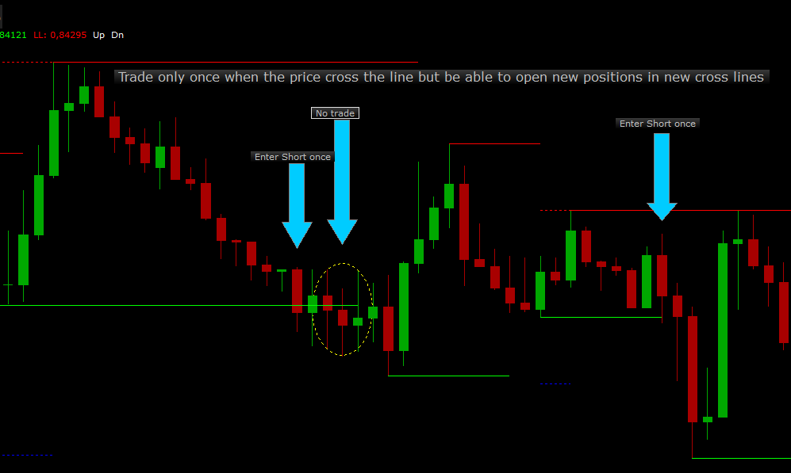
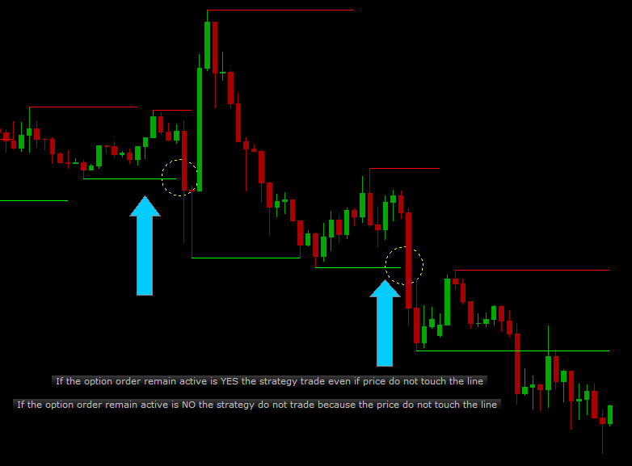

# Trend SR

> Source: https://fxcodebase.com/code/viewtopic.php?f=17&t=64245  
> Forum: 17 · Topic 64245 · 8 post(s)

---

## Trend SR

**Mukonazwothe** · Sat Dec 24, 2016 1:34 pm

Indicator that draws trend line and support resistance for breakout trading. With arrows also to sport reversals. The indicator comes EMKHEI HT engine to ensure that the user can choose any multiple of the current time frame. Here is how it work.

if chart TF is m1 and HT is 1 then the indicator will display results for m1
if chart TF is m1 and HT is 2 then the indicator will display results for m2(not available in marketscope)

if chart TF is m1 and HT is 5 then the indicator will display results for m5

this is done without changing the time frame of the indicator.

Enjoy your 123, Triangles, trendline, SR, reversals in one package with EMKHEI HT engine.

Double tops and all other good market patterns to be added latter.

 [TREND SR.bin](files/110244/TREND%20SR.bin)

---

## Re: Trend SR

**Apprentice** · Sun Dec 25, 2016 6:00 am

TREND SR.bin:161: Specified index is out of range.

---

## Re: Trend SR

**Mukonazwothe** · Sun Dec 25, 2016 9:47 am

I can't find the error specified, please share settings that caused such an error

---

## Re: Trend SR

**Apprentice** · Sun Dec 25, 2016 10:09 am

Default
Try scroll your chart back.
"m1" time frame

---

## Re: Trend SR

**Mukonazwothe** · Sun Dec 25, 2016 11:28 am

Thank you sir. The indicator has a "period" recording function, as you scroll "period" is rewritten and the recorded one is higher than the one being rewritten in the beginning of the process. Hence the a recorded index becomes out of range.

Indicator is fixed, now it resets recorded values the moment you scroll back.

---

## Re: Trend SR

**mangonel** · Mon Feb 14, 2022 4:27 pm

Apprentice can you create a strategy based on the Trend SR and particular at the Support and Resistance section ?
It's a breakaway strategy
Please name it 123
The strategy goes like this :

Enter Long :
When the indicator create a new High line the strategy buy when the price touch that new high line
and the corresponding Low line should be the first where it will be create at the bottom and at the right side of the high line

Enter Long Stop :
The strategy exit the trade when the price reach the level of the corresponding Low line
The stop will remain active until the trade close by Limit or the price reach the stop

Enter Long Limit :
The 1,618 of the Fibonacci retracement from High line to corresponding Low line

 

Enter Short :
When the indicator create a new Low line the strategy short when the price touch that new low line
and the corresponding High line should be the first where it will be create at the top and at the right side of the low line

Enter Short Stop :
The strategy exit the trade when the price reach the level of the corresponding High line
The stop will remain active until the trade close by Limit or the price reach the stop

Enter Short Limit :
The 1,618 of the Fibonacci retracement from Low line to corresponding High line

 

Definition of corresponding Low Line for Long trades
As the price goes up and the indicator create a high line at the top the corresponding low line should be the first where it will be create at the bottom and at the right side of the high line

 

Definition of corresponding High Line for Short trades
As the price goes down and the indicator create a low line at the bottom the corresponding high line should be the first where it will be create at the top and at the right side of the low line

 

So in both cases the corresponding lines must be at the right side of the line where will be touch and trade

Definition of Allow multiple : Yes/No
Keep in mind the strategy to trade only once when the price touch the High or Low line.
If the price touch the same line again, the strategy should not trade again but to be able to trade in future positions even if previous trades didn't closed yet. The same for the order remain active.
Only one trade if the order remain active but multiple positions if the trade didn't close

 

Definition of Order remain active : Yes/No
In some cases the price don't touch the High or Low line but the trade goes as the strategy predicts. If the option order remain active is NO the strategy do not trade
if the price do not touch the line. If the option order remain active is YES the strategy trade although the price don't touch the line and the order CANCEL if did not execute
when a new line is created.

 

Price type : Bid, Ask
Allow strategy to trade : Yes/No
Allowed side : Buy, Sell, Both
Period :3,4,5,6,....
Time frame :1m,5m,15m,....
Trade amount in lots : 1,2,3,4,.....
Type of signal : Direct/Reverse
Allow multiple : Yes/No
Position limit :0,1,2,3...(Zero for unlimited)
Close on opposite : Yes/No
Order remain active : Yes/No

Thank you for your effort.

---

## Re: Trend SR

**Apprentice** · Tue Feb 15, 2022 8:13 am

Your request is added to the development list.
Development reference 99.

---

## Re: Trend SR

**mangonel** · Tue Mar 01, 2022 12:04 pm

Apprentice is there any issues with the strategy ? Everything ok ? It's something that i need to explain more to proceed ?

Thank you in advance, as always.
