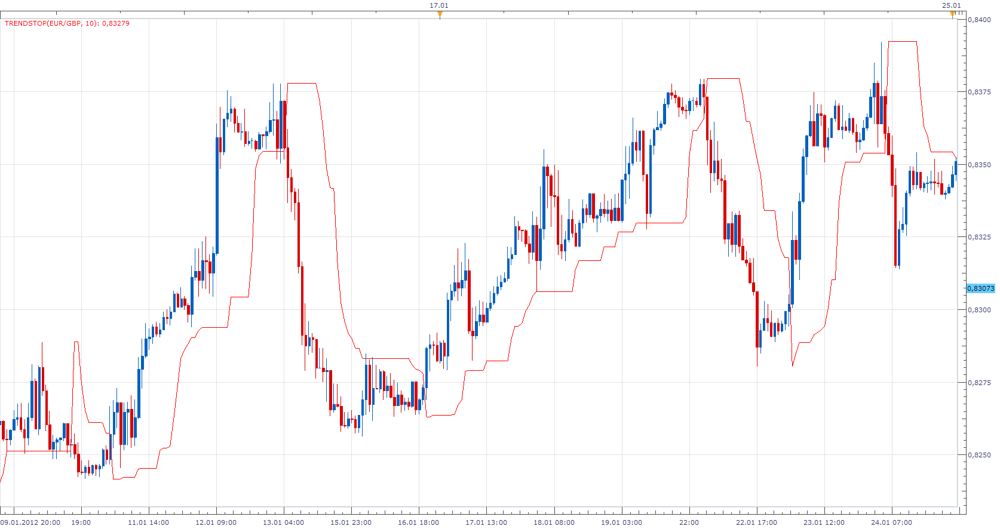
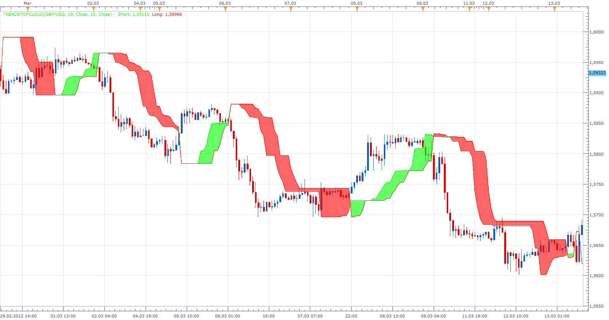
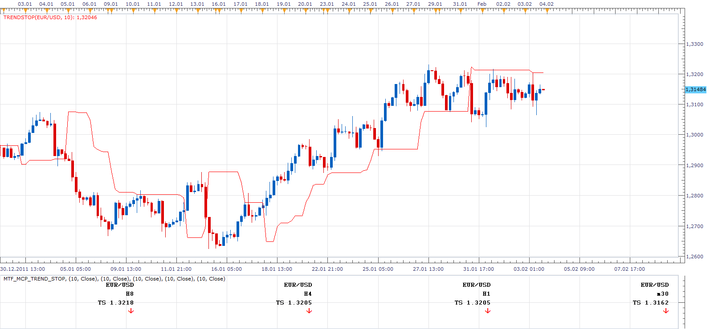
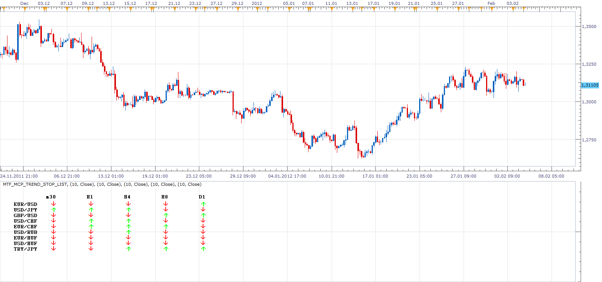
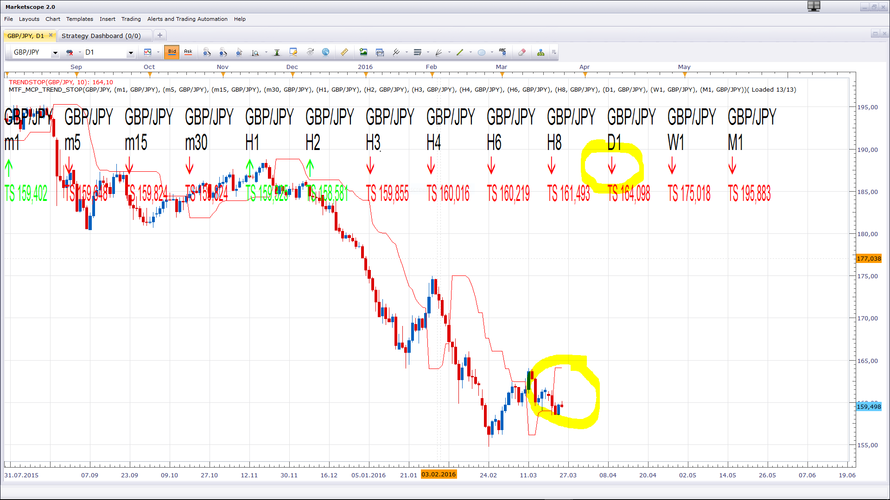
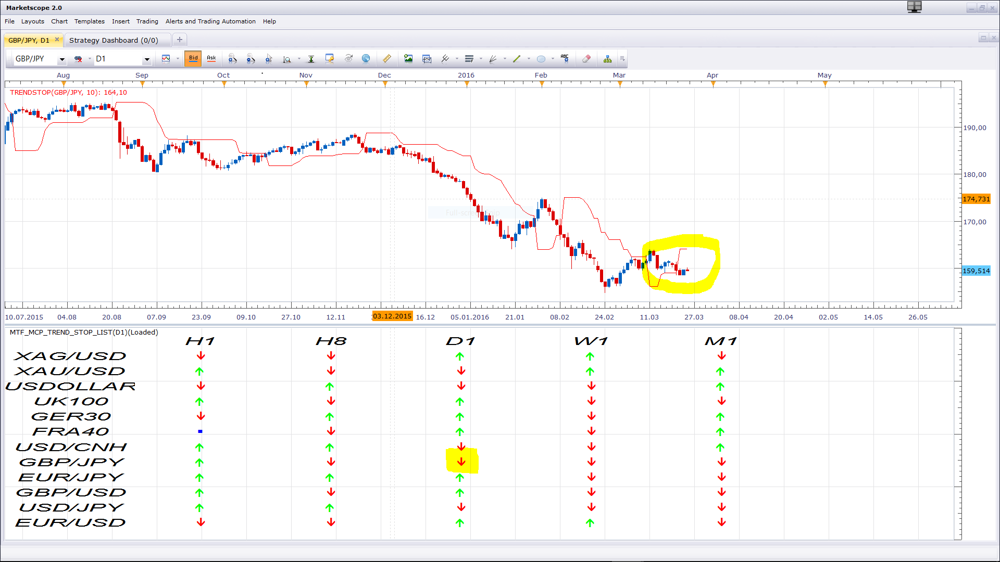

# Trend Stop

> Source: https://fxcodebase.com/code/viewtopic.php?f=17&t=12728  
> Forum: 17 · Topic 12728 · 77 post(s)

---

## Trend Stop

**Apprentice** · Thu Feb 02, 2012 10:45 am

This indicator was created as a byproduct of more complex project on which I work.
Trailing Stop is the High / Low value of the last N periods.
Supports the choice of crossover algorithm.
Close or High / Low.
Have exceptionally good results during strong trends periods, as seen from the attached.

 [TrendStop.bin](files/24997/TrendStop.bin)

. bin are same as .lua in every respect

 

 [TrendStopCloud.lua](files/24997/TrendStopCloud.lua)

Please install the TrendStop Indicator, in order to use the TrendStopCloud indicator.

 

 [Trend Stop Overlay.lua](files/24997/Trend%20Stop%20Overlay.lua)

Please install the TrendStop Indicator, in order to use the Trend Stop Overlay indicator.

 [TrendStop with Alert.bin](files/24997/TrendStop%20with%20Alert.bin)

This indicator provides Audio / Email Alerts od TrendStop/Price Cross.

Dec 14, 2015: Compatibility issue Fixed. _Alert helper is not longer needed.

If you want to use updated version of this indicator,
please make sure to use TS Version 01.14.101415. or higher.

The indicator was revised and updated

---

## Re: Trend Stop

**Fosking** · Sat Feb 04, 2012 3:11 am

Hi Apprentice, how are you?

I was trying this indicator yesterday on M5 and turned a nice little profit.
Would it be possible to have a MTF option with all the pairs in one table?
I wonder if it would be more profitable to use the H1 as a bias and say M15/M5 for your entries and exits, only in the way of the H1 bias. This way it may reduce some of the weaker signals.

Many thanks and thank you for this interesting indicator.
fosking

---

## Re: Trend Stop

**Hailkayy** · Sat Feb 04, 2012 10:09 pm

Many thanks

---

## Re: Trend Stop

**Apprentice** · Sun Feb 05, 2012 9:03 am

I know, this is not a table, and have this completed before your request.
Shows the value of Trend Stop for selected currency pairs, time frames.

 [MTF_MCP_Trend_Stop.lua](files/25223/MTF_MCP_Trend_Stop.lua)

please install Trend Indicator, in order to use this indicator.

---

## Re: Trend Stop

**Fosking** · Sun Feb 05, 2012 9:45 am

That looks great Apprentice.
I will give it a go this week and see how it works.

Thank you

---

## Re: Trend Stop

**Apprentice** · Sun Feb 05, 2012 7:22 pm

MTF MCP List Added.

 [MTF_MCP_Trend_Stop_List.lua](files/25242/MTF_MCP_Trend_Stop_List.lua)

Please install Trend Stop Indicator, in order to use this indicator.

---

## Re: Trend Stop

**Fosking** · Mon Feb 06, 2012 2:58 am

Brilliant! Thank you

---

## Re: Trend Stop

**Alexander.Gettinger** · Mon Feb 06, 2012 3:55 pm

Trend stop with color and style options:

 [TrendStop_Color.bin](files/25329/TrendStop_Color.bin)

---

## Re: Trend Stop

**Fosking** · Wed Apr 11, 2012 11:42 am

Hi Apprentice,

I keep coming back to this great indicator!
This isn't something too important for me, it's just a bit more of a visual update to see the trend at a glance (like an Ichimoku cloud).
I have just the Trend Stop, 15 and Trend Stop, 5 on the chart and have coloured the cloud in using Photoshop.
Is it at all possible to make an indicator where you can choose two Trend Stop lines and have the "cloud" filled in with colour like my attachment?
Don't worry about it if it's too much work, as I say, it's just something to make it a bit more visual and simple on the eye.

Thank you.

---

## Re: Trend Stop

**Fosking** · Thu Apr 12, 2012 4:15 am

Wow, that was quick!

Thank you so much for the update.

---

## Re: Trend Stop

**amazon1a** · Sun May 20, 2012 11:42 am

Hi Apprentice, I am not sure which "Trend Indicator" needs to be applied for the trend stop indicator to work. I have searched but find dozens of possibilities. Can you point me in the right direction?

---

## Re: Trend Stop

**Apprentice** · Mon May 21, 2012 12:52 am

I'm not sure whether I understand your question.
During development, I planned to use, trend stop, as a trailing stop indicator.
However you can use it to open new positions. It is an indicator in its own right.
You can use it independently, or as an extension to the existing indicators.

---

## Re: Trend Stop

**sunshine** · Mon May 21, 2012 12:54 am

> Hi Apprentice, I am not sure which "Trend Indicator" needs to be applied for the trend stop indicator to work. I have searched but find dozens of possibilities. Can you point me in the right direction?

As I see, the "Trend Stop" indicator can work without any additional custom indicators. But the "Trend Stop Cloud" indicator requires the "Trend Stop" indicator installed.

---

## Re: Trend Stop

**TheEdge** · Tue May 22, 2012 3:39 am

Is it possible to get this for MT4/5?

---

## Re: Trend Stop

**Apprentice** · Tue May 22, 2012 4:22 am

Can you define specific indicator.
Or all of them

---

## Re: Trend Stop

**TheEdge** · Tue May 22, 2012 5:07 am

TrendStop_Color would be fine for me.

---

## Re: Trend Stop

**Alexander.Gettinger** · Fri Jun 01, 2012 1:58 pm

> **TheEdge wrote:**
> Is it possible to get this for MT4/5?

MQL4 version of Trend stop: [viewtopic.php?f=38&t=19649](https://fxcodebase.com/code/viewtopic.php?f=38&t=19649)

---

## Re: Trend Stop

**Fosking** · Sat Jun 02, 2012 3:46 pm

If it's easy to do, can you make the candles under the trend stop red and all the bullish candles above the trend stop line green? If it's too much trouble it's not a problem. Thank you!

---

## Re: Trend Stop

**Apprentice** · Sun Jun 03, 2012 5:55 am

Trend Stop Overlay Indicator Added.

---

## Re: Trend Stop

**Fosking** · Sun Jun 03, 2012 7:30 am

Brilliant as always Apprentice. Thank you.

---

## Re: Trend Stop

**nazareth** · Fri Jun 22, 2012 5:19 pm

HI EXCUSME I DONT INDERSTAND FOR PUT TREND STOP IN FXCM
TREND BIN WHERE I PUT THANKS I M NEW HERE

---

## Re: Trend Stop

**nazareth** · Fri Jun 22, 2012 5:27 pm

HI I understand FOR PUT TREND STOP IN FXCM
DE HARMONICS IS PERFECT THANKS
BUT TREND STOP IS EREURRE I DONT NO WHERE I PUT FILES TREND.BIN
THANKS FOR HELP

---

## Re: Trend Stop

**Apprentice** · Mon Jun 25, 2012 1:39 am

Bin and Lua extensions, their use is identical.
Bin is encrypted lua file.

---

## Re: Trend Stop

**imprimus** · Mon Aug 27, 2012 1:11 am

Do we have strategy based on this indicator ?

---

## Re: Trend Stop

**Apprentice** · Mon Aug 27, 2012 6:50 am

U can find one here.
[viewtopic.php?f=31&t=16865&p=34192&hilit=trend+stop#p34192](https://fxcodebase.com/code/viewtopic.php?f=31&t=16865&p=34192&hilit=trend+stop#p34192)

---

## Re: Trend Stop

**trader-muc** · Sat Sep 08, 2012 8:25 am

dear programmers and fellow traders !

i really like the trend stop indicator. i mainly use it with the mtf panel.
does anyone in this forum have a signal like the following (example for trading in H1 timeframe):

D1 Trendstop long
H4 Trendstop long
H1 Trendstop **short**
m15 Trendstop **goes from short to long** (this is my buy signal)

D1 Trendstop short
H4 Trendstop short
H1 Trendstop **long**
m15 Trendstop **goes from long to short**(this is my sell signal)

thanx in advance ! you are really doing a great job here !!
Axel

---

## Re: Trend Stop

**Apprentice** · Sat Sep 08, 2012 1:00 pm

Your request is added to the development list.

---

## Re: Trend Stop

**Apprentice** · Sat Sep 08, 2012 1:42 pm

Requested can be found here.
[viewtopic.php?f=31&t=23181](https://fxcodebase.com/code/viewtopic.php?f=31&t=23181)

---

## Re: Trend Stop

**trader-muc** · Sun Sep 09, 2012 2:56 pm

wow. this was quick. thank you so much ! much appreciated

---

## Re: Trend Stop

**Hailkayy** · Tue Dec 11, 2012 6:59 am

Hi apprentice !

Please upload basic trendstop indicator with "Color down/Color up"
The trendstop line will change color when it goes under price. And will remain same color until it goes above price.
Practical visual.

Thanks in adv

R

---

## Re: Trend Stop

**Apprentice** · Tue Dec 11, 2012 8:37 am

Color and Style Options Added.

---

## Re: Trend Stop

**Apprentice** · Sun Oct 06, 2013 3:54 am

MTF_MCP_Trend_Stop & MTF_MCP_Trend_Stop_List Update

---

## Re: Trend Stop

**Apprentice** · Tue Dec 31, 2013 4:13 am

Trend Stop with Alert Added.

---

## Re: Trend Stop

**ldemarchi** · Tue Dec 31, 2013 4:46 pm

Hi Apprentice,

Where do I download indicator? I do not see it attached.

Thanks.

---

## Re: Trend Stop

**Apprentice** · Wed Jan 01, 2014 3:07 am

I have added it to topmost (first) post in this topic.

---

## Re: Trend Stop

**ldemarchi** · Thu Jan 02, 2014 9:07 am

Hello,

Im very unfamiliar in setting up the audio and email alerts. If anyone can post something step by step to get the email and audio alerts going that would be very helpful.

Thank you.

Lino.

---

## Re: Trend Stop

**Apprentice** · Fri Jan 03, 2014 1:07 pm

1. Install, Alert Helper.

 

2.After U install Alert Signal/Alert it will appeared in my Strategy/Alert list.

 

3. Activate Alert Helper (One per Pair)
Use Strategies and Alert ->New

Alert is not Indicator, it is Helper from Signal / Strategy class.
U have to add it as Signal / Strategy.
Make sure to have one active Alert Helper per pair.

---

## Re: Trend Stop

**ldemarchi** · Mon Jan 06, 2014 8:13 pm

Hi Apprentice

It does not seem to be working, im pretty sure I have installed it the way you explained. Anyway for you to take a look? remote desktop?

---

## Re: Trend Stop

**Apprentice** · Wed Jan 08, 2014 5:22 am

Contact me on my private email.
mario.jemic(@)gmail.com
I can look at your set up over Skype.

---

## Re: Trend Stop

**rplust** · Wed Jan 15, 2014 4:46 am

HI, could you pls. add a candle outline color to the Trendstop Overlay. As I use the Trendstop Cloud (thx for this fabulous Indicator...don't know how I ever could trade without it... ) I'd like to be able to make the candles easier to see when passing through the cloud.

---

## Re: Trend Stop

**Apprentice** · Fri Jan 17, 2014 12:55 pm

Then simply use Regular TrendStop.

---

## Re: Trend Stop

**4x4partners** · Thu May 07, 2015 12:00 pm

Hi Apprentice,

Do you know how to get this indicator to show up in the FX Strategy Wizard?

I've had it installed for weeks and getting good results using it. Would love to try out something a bit more sophisticated.

Appreciate all your help.

Best
4x4

---

## Re: Trend Stop

**Apprentice** · Fri May 08, 2015 4:47 am

As far as I know,
You can not use additional indicator within FX Strategy Wizard.
You'll need to hardcode such indicator.

---

## Re: Trend Stop

**tmdabc** · Fri Oct 23, 2015 2:13 pm

looks good，thanks

---

## Re: Trend Stop

**Apprentice** · Mon Dec 14, 2015 8:19 am

Dec 14, 2015: Compatibility issue Fixed. _Alert helper is not longer needed.

If you want to use updated version of this indicator,
please make sure to use TS Version 01.14.101415. or higher.

---

## Re: Trend Stop

**copperwasher7** · Sun Feb 21, 2016 6:43 pm

Hi there,

Great indicators guys - dam fine work...

Is there any chance of another alert with this useful indicator (TSC TrendStopCloud).

The alert currently in place works well when the arrow appears, but it would be useful if an alert was present when the candle passed through the cloud (Typically a diagonal cloud line).

Often the arrow alert appears but it can take a few hours or more (1 hour chart) for the candle to pass through the cloud. An alert / notification would be so helpful when this happens.

I have a screenshot edited in paintshop to explain - if that helps.

I would be very grateful if you could help.

Many thanks
Copperwasher7

---

## Re: Trend Stop

**Apprentice** · Wed Feb 24, 2016 2:49 pm

Your request is added to the development list.

---

## Re: Trend Stop

**copperwasher7** · Thu Mar 03, 2016 6:54 am

Thank you Apprentice

Your help is much appreciated

G

---

## Re: Trend Stop

**copperwasher7** · Fri Mar 04, 2016 11:03 am

Hi Apprentice

I hope you are well - and trading well

Quick question...

How will I know when the latest development request has been fulfilled, so I can download the latest version.

Many thanks,
Copperwasher

---

## Re: Trend Stop

**Apprentice** · Sun Mar 06, 2016 6:25 am

If a new version is published,
old file will be updated.
(Applies to this topic.)

---

## Re: Trend Stop

**copperwasher7** · Mon Mar 07, 2016 9:25 am

Thank you Apprentice...

I look forward to the requested development work

I'll keep an eye open for the update.

Copperwasher

---

## Re: Trend Stop

**copperwasher7** · Tue Mar 15, 2016 5:08 am

> **Apprentice wrote:**
>
>
> MTF_MCP_Trend_Stop.png
>
>
> I know, this is not a table, and have this completed before your request.
> Shows the value of Trend Stop for selected currency pairs, time frames.
>
>
> MTF_MCP_Trend_Stop.lua
>
>
> please install Trend Indicator, in order to use this indicator.

Hey Apprentice.

I do like this indicator, esp the MTP MCP add on

Can I ask, is it possible for the MTF MCP indicator to auto detect the symbol it is being loaded upon.
I have up to 15 to 20 charts, and thats a lot of changes I need to make for each chart open.

Much appreciation,

Copperwasher

---

## Re: Trend Stop

**Apprentice** · Wed Mar 16, 2016 5:37 am

Use Lock Type "Instrument".

---

## Re: Trend Stop

**copperwasher7** · Wed Mar 16, 2016 5:45 am

Brilliant

That worked perfectly.

Thank you Apprentice

---

## Re: Trend Stop

**copperwasher7** · Wed Mar 16, 2016 6:27 am

Excellent Apprentice

Its looking good, I wonder Is it possible to:
1. turn off the TS value for each time frame (It clutters the chart)?
2. The Data is kept closer together rather than spread across the whole screen?

Once I have selected 'Parameters':
Lock [yes]
Lock Type [instrument]

And I select the following for 1. Trend Stop Calculation
Period [14]
Trigger [Close]
Instrument [GBPUSD]
Time Frame [H4]

Do i have to change the other Trend Stop Calcs (2, 3, 4 and 5) to match no. 1, ???

I do appreciate your help,

My kind regards
copperwasher

---

## Re: Trend Stop MTF MCP

**copperwasher7** · Wed Mar 16, 2016 2:20 pm

Dear Apprentice

Is it possible for this indicator once installed to automatically detect the symbol it is being applied to??? (Currently it loads with the previous symbol applied)

Could you also change the layout for this indicator, and allow it to be shown of the chart directly rather than under in a separate box under the chart?

MTF MCP example layout (single symbol)

Top right corner of chart
................
GBPUSD
1D arrow
8H arrow
4H arrow
2H arrow
1H arrow
................

So its nice and easy to read.

I hope that makes sense

my regards,

copperwasher

---

## Re: Trend Stop

**Apprentice** · Mon Mar 21, 2016 3:57 am

Try updated MTF_MCP_Trend_Stop.lua

---

## Re: Trend Stop

**Apprentice** · Mon Mar 21, 2016 7:44 am

MTF_MCP_Trend_Stop_List.lua Update.

---

## Re: Trend Stop

**copperwasher7** · Tue Mar 22, 2016 7:34 am

Hey there Apprentice

Any update on the PM's i sent regarding the errors I am getting with TSC MTF-MCP arrows and the TSC Alert arrows.

Please advise

my kindest regards

Copperwasher

---

## Re: Trend Stop

**Apprentice** · Tue Mar 22, 2016 9:31 am

Can you post above mentioned indicator,
I'm not sure about which indicators you are talking about.

---

## Re: Trend Stop

**copperwasher7** · Tue Mar 22, 2016 10:43 am

Hi there Apprentice,

TrendStopCloud MTF-MCP and TrendStopCloud Alert arrow signal error!

GBPJPY 1 DAY chart
TSC Arrow alert shows a SELL signal
and
MTF MCP shows GBPJPY 1D as a buy signal arrow.!!!

I have both the TSC alert and the MTF-MCP set to the same value 14 day period

please see link to image below...

[http://i1108.photobucket.com/albums/h405/copperwasher/ScreenHunter_39%20Mar.%2021%2018.05%20worksV1_zpsexorfeds.jpg](http://i1108.photobucket.com/albums/h405/copperwasher/ScreenHunter_39%20Mar.%2021%2018.05%20worksV1_zpsexorfeds.jpg)

Please do advise.

my thanks and kind regards

copperwasher

---

## Re: Trend Stop MTF-MCP

**copperwasher7** · Tue Mar 22, 2016 10:53 am

Hi Apprentice

Here is the other PM i sent.

The TrendStopCloud MTF-MCP new display is a bit messy, as the data line stems from the left to the right and clashes with the template legend in the top left corner.

Is it possible to present the MTF-MCP data in a block in the top right corner of the chart like this:
GBPUSD
30min data 'Arrow'
1HR data 'Arrow'
2HR data 'Arrow'
4HR data 'Arrow'
etc...

I hope that makes sense.

many thanks for your help

copperwasher

---

## Re: Trend Stop

**Apprentice** · Thu Mar 24, 2016 4:48 am

Your request is added to the development list.

---

## Re: Trend Stop

**copperwasher7** · Thu Mar 24, 2016 8:18 am

> **copperwasher7 wrote:**
> Hi there Apprentice,
>
> TrendStopCloud MTF-MCP and TrendStopCloud Alert arrow signal error!
>
> GBPJPY 1 DAY chart
> TSC Arrow alert shows a SELL signal
> and
> MTF MCP shows GBPJPY 1D as a buy signal arrow.!!!
>
> I have both the TSC alert and the MTF-MCP set to the same value 14 day period
>
> please see link to image below...
>
> [http://i1108.photobucket.com/albums/h405/copperwasher/ScreenHunter_39%20Mar.%2021%2018.05%20worksV1_zpsexorfeds.jpg](http://i1108.photobucket.com/albums/h405/copperwasher/ScreenHunter_39%20Mar.%2021%2018.05%20worksV1_zpsexorfeds.jpg)
>
> Please do advise.
>
> my thanks and kind regards
>
> copperwasher

.............................................................

Hi Apprentice.

Can you take a look at these errors I am getting with the MTF_MCP_Trend_Stop.lua and the TrendStopCloud.

The attached file shows the signals in disagreement with each other for the same time zone.

Please advise.

Many thanks

Copperwasher

---

## Re: Trend Stop

**Apprentice** · Fri Mar 25, 2016 3:22 am

 

Immediately after loading everything looks ok.
This problem occurs after some time?

---

## Re: Trend Stop

**copperwasher7** · Fri Mar 25, 2016 3:32 am

Dear Apprentice

Thank you for the screen prints,

You didnt use the TrendStopCloud (TSC) Alert so there is no arrow!!!

This TSC Alert indicator is not matching with TRENDSTOPCLOUD MCF MCP (MTF_MCP_Trend_Stop.lua).
This is seen on my attached image sent previously. There are other symbols on my screen that are also in conflict.

I am not sure what the two images you attached are looking to confirm or verify. There is no text either to explain.

Please check my attached image and check the TSC Alert arrows and the MTF_MCP_Trend_Stop.lua arrows also - this is where the conflict/mis direction error is.

Many thanks

copperwasher

---

## Re: Trend Stop

**Apprentice** · Mon Mar 28, 2016 8:35 am

Major Update of various indicators.

---

## Re: Trend Stop

**copperwasher7** · Tue Mar 29, 2016 7:07 am

> **Apprentice wrote:**
> Major Update of various indicators.

Hi there Apprentice

Thanks for making the amendments...

This request re-pasted below:
...................................................................
The TrendStopCloud MTF-MCP Trend Stop new display is a bit messy, as the data line stems from the left to the right and clashes with the template legend in the top left corner.

Is it possible to present the MTF-MCP data in a block in the top right corner of the chart like this:
GBPUSD
30min data 'Arrow'
1HR data 'Arrow'
2HR data 'Arrow'
4HR data 'Arrow'
etc...
...................................................................

I have download the latest version of TrendStopCloud MTF-MCP Trend Stop, but the update is the same as before - a linear line from left to right :l

Is it possible to place the text as requested ??

With kind regards
copperwasher

---

## Re: Trend Stop

**copperwasher7** · Tue Mar 29, 2016 8:43 am

Hi Apprentice...

The error stated before still exists.

See attached image.
GBPUSD 1DAY

Indicators
TrendStopCloud
TrendStop alert
TrendStop MCP MTF
All the settings are the same periods. Cross checked

The indicator TrendStop alert shows a SELL arrow, the TrendStop MCP MTF list shows the 1 Day as a BUY arrow.

Please help.

with regards
copperwasher

[http://i1108.photobucket.com/albums/h405/copperwasher/ScreenHunter_42%20Mar.%2029%2013.58%20work%20v1_zpslr5uvmko.jpg](http://i1108.photobucket.com/albums/h405/copperwasher/ScreenHunter_42%20Mar.%2029%2013.58%20work%20v1_zpslr5uvmko.jpg)

---

## Re: Trend Stop

**Apprentice** · Sat Mar 25, 2017 6:49 am

Indicator was revised and updated.

---

## Re: Trend Stop

**easytrading** · Mon Mar 27, 2017 6:30 am

hello Apprentice ,
is it possible to develop Trendstop.bin with shift ,please ? with many thanks in advance.

---

## Re: Trend Stop

**Apprentice** · Mon Mar 27, 2017 11:48 am

Try TrendStop.bin from first post in this topic.

---

## Re: Trend Stop

**amazon1a** · Thu Aug 23, 2018 11:49 am

Hi Apprentice,

Would it be possible to add Line Style options to TrendStop with Alert?

Many thanks, AG

---

## Re: Trend Stop

**Peteradshel** · Thu Aug 23, 2018 8:19 pm

Hi
I am just new to this site. I am quite interesting in this indicators. But all these files extension are :Bin or Lua", I do not understand what this extension for? I am using MT4, usually extension will be .ex4 or MQL4. Is there anyone can help? how can I get Trend Stop and other indicators with it for MT4 version? Thanks a lot.

---

## Re: Trend Stop

**Apprentice** · Sat Aug 25, 2018 6:29 am

.lua / .bin is used for FXCM TS2
[https://www.fxcm.com/au/platforms/trading-station/](https://www.fxcm.com/au/platforms/trading-station/)
You can download MT4/MQ4 version here.
[viewtopic.php?f=38&t=19649](https://fxcodebase.com/code/viewtopic.php?f=38&t=19649)

---

## Re: Trend Stop

**AlexSz** · Mon May 11, 2020 3:45 pm

Hi this indicator looks great i would love to try it. The only problem is that it is a bin file and i have no idea how to useit or what to do with it to make it work on my charts. Could you please help me with that?

---

## Re: Trend Stop

**Apprentice** · Tue May 12, 2020 11:12 am

How to Download and Install Custom Indicator for the FXCM TS2
[viewtopic.php?f=17&t=17](https://fxcodebase.com/code/viewtopic.php?f=17&t=17)
