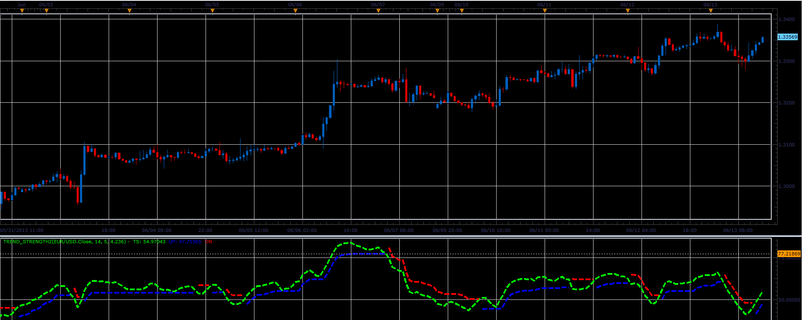

# Trend strength 2

> Source: https://fxcodebase.com/code/viewtopic.php?f=17&t=41303  
> Forum: 17 · Topic 41303 · 6 post(s)

---

## Trend strength 2

**Alexander.Gettinger** · Tue Jun 18, 2013 2:17 pm

This indicator is a ported MQL5 indicator from [http://www.mql5.com/en/code/1699](http://www.mql5.com/en/code/1699)

Formulas:
TS[i]=TS[i-1]+2/(Smooth+1)*(RSI[i]-TS[i-1]),
upband[i] = TS[i]+K*delta2[i],
loband[i] = TS[i]-K*delta2[i],
delta2[i] = delta2[i-1]+alpha*(delta1[i]-delta2[i-1]),
delta1[i] = delta1[i-1]+alpha*(rangeRSI-delta1[i-1]),
alpha = 1/Period,
rangeRSI = hiRSI - loRSI,
hiRSI = max(TS[i], TS[i-1]),
loRSI = min(TS[i], TS[i-1]).

 

Download:

 [Trend_Strength2.lua](files/67530/Trend_Strength2.lua)

MT4/MQ4 version.
[viewtopic.php?f=38&t=66621](https://fxcodebase.com/code/viewtopic.php?f=38&t=66621)

---

## Re: Trend strength 2

**tmdabc** · Fri Oct 23, 2015 2:03 pm

looks good，thanks

---

## Re: Trend strength 2

**Apprentice** · Mon Aug 21, 2017 7:54 am

The indicator was revised and updated.

---

## Re: Trend strength 2

**DanPhi74** · Sat Sep 01, 2018 10:26 am

Great indi.
could you code it for mq4 please .

best regards

---

## Re: Trend strength 2

**Apprentice** · Sat Sep 01, 2018 10:56 am

Your request is added to the development list under Id Number 4247

---

## Re: Trend strength 2

**Apprentice** · Tue Sep 04, 2018 3:39 am

MT4/MQ4 version.
[viewtopic.php?f=38&t=66621](https://fxcodebase.com/code/viewtopic.php?f=38&t=66621)
