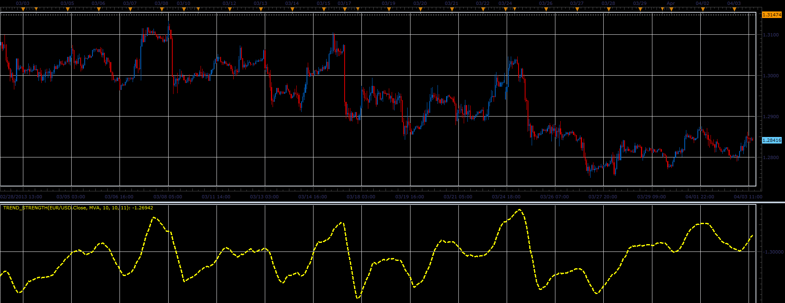

# Trend Strength oscillator

> Source: https://fxcodebase.com/code/viewtopic.php?f=17&t=34062  
> Forum: 17 · Topic 34062 · 2 post(s)

---

## Trend Strength oscillator

**Alexander.Gettinger** · Wed Apr 03, 2013 2:46 pm

This indicator is a ported MQL5 indicators from [http://www.mql5.com/en/code/1585](http://www.mql5.com/en/code/1585)

Formulas:
TrendStrength = MaxSteps*MA0 - res, where
MA0 - moving average with Period,
res = sum of MA(Period), MA(Period+Step), MA(Period+2*Step), ..., MA(Period+MaxSteps*Step).

 

Download:

 [Trend_Strength.lua](files/57901/Trend_Strength.lua)

For this indicator must be installed Averages indicator ([viewtopic.php?f=17&t=2430](https://fxcodebase.com/code/viewtopic.php?f=17&t=2430)).

The indicator was revised and updated

---

## Re: Trend Strength oscillator

**Apprentice** · Tue May 09, 2017 5:57 am

Indicator was revised and updated.
