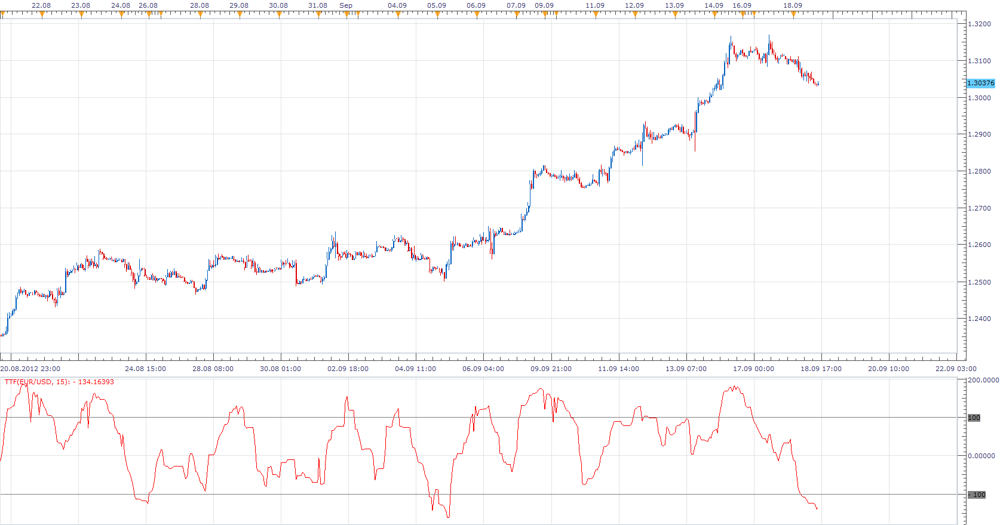

# Trend Trigger Factor

> Source: https://fxcodebase.com/code/viewtopic.php?f=17&t=23558  
> Forum: 17 · Topic 23558 · 3 post(s)

---

## Trend Trigger Factor

**Apprentice** · Tue Sep 18, 2012 2:29 pm

M. H. Pee introduces this indicator in his article "Trend Trigger Factor" in the December 2004 issue of Technical Analysis of Stocks and Commodities magazine. The TTF is a method of detecting trends using buy/sell power.

 [TTF.lua](files/40535/TTF.lua)

The indicator was revised and updated

---

## Re: Trend Trigger Factor

**Alexander.Gettinger** · Mon Nov 17, 2014 4:39 pm

MQL4 version of Trend Trigger Factor oscillator: [viewtopic.php?f=38&t=61446](https://fxcodebase.com/code/viewtopic.php?f=38&t=61446).

---

## Re: Trend Trigger Factor

**Apprentice** · Tue Jun 27, 2017 4:22 am

The indicator was revised and updated.
