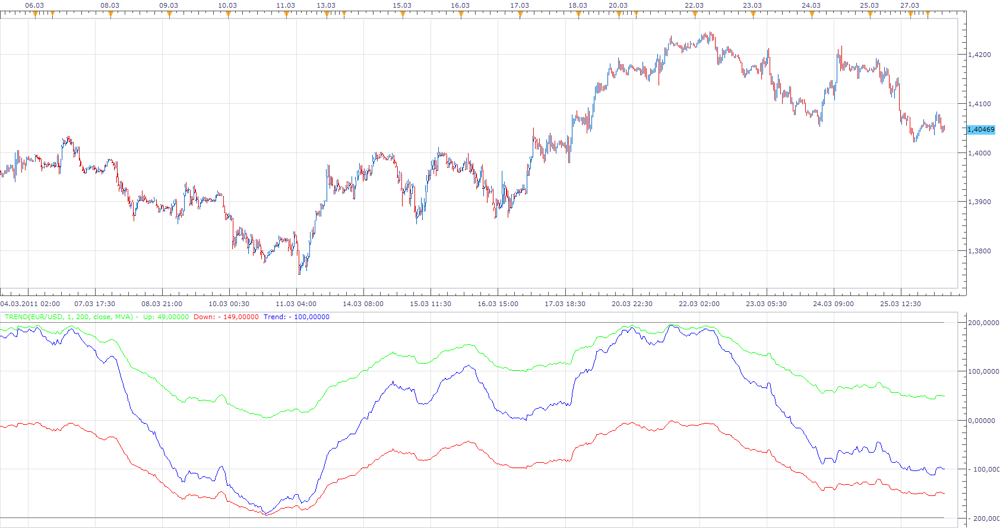
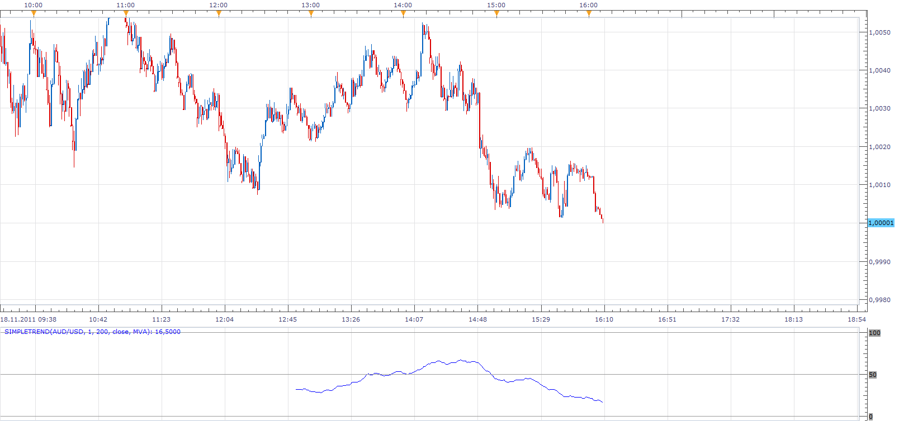

# Trend

> Source: https://fxcodebase.com/code/viewtopic.php?f=17&t=3753  
> Forum: 17 · Topic 3753 · 17 post(s)

---

## Trend

**Apprentice** · Mon Mar 28, 2011 6:08 am

This is my last project.
Unfortunately when choosing the name I was not too creative.
Suggestions are welcome.

Basically, this indicator is checked whether the indicator is above or below the next higher in the series.

The series starts from 2, go to the max, the distance between the two averages is the Step.

For example.
For Step 2, Max 10, series is 2, 4, 6, 8, 10
In total there are five steps, which is Overbought Oversold Level for that setup.

If the trend is equal to 5 is suggested that all indicators are in the up trend phase.
If the trends are -5 suggests that all the indicators are in down trend phase.
What an extreme situation.

To me it seems an interesting idea.
Please give your feedback.

This indicator is quite difficult to calculate.
To speed up the calculation, especially if you have an older computer, reduce the resolution, increase the step that you are using.

 [Trend.lua](files/9114/Trend.lua)

For this indicator to work installed Averages indicator from
[viewtopic.php?f=17&t=2430&p=5268&hilit=averages#p5268](https://fxcodebase.com/code/viewtopic.php?f=17&t=2430&p=5268&hilit=averages#p5268)

 

These are basically the same indicators.
A simplified version has a range from 0 to 100
A smaller choice of moving averages.
Option of defining the period of calculation, in order to obtain better performance.

 [SimpleTrend.lua](files/9114/SimpleTrend.lua)

---

## Re: Trend

**davetherave110179** · Mon Mar 28, 2011 6:53 am

If this is your last Indicator then let me be the first to to say 'Thank you' for all your help and Indicators and Stratagies!

Thank you (again) and good luck.

davetherave110179

---

## Re: Trend

**Apprentice** · Mon Mar 28, 2011 8:17 am

Latest not Last.

---

## Re: Trend

**luigipg** · Mon Mar 28, 2011 12:00 pm

I try to download it but "The selected attachment does not exist anymore".

---

## Re: Trend

**Apprentice** · Tue Mar 29, 2011 3:36 am

I tried to do the same.
Everything was as expected.
Probably it was a temporary problem,
or i did just update the post.

---

## Re: Trend

**sabrumea** · Mon Apr 04, 2011 7:10 am

Apprentice, to me it seems an interesting idea too.. i've put it on the chart and try to change the settings.. what do you think yourself what are the most appropriate settings? to me it seems that we can use this indicator to see how long we can stay in trade which is as long as trend remeins in the overbought or the oversold area.. but my perception migh be wrong.. you are the author of the idea.. can we use this indicator to enter the trade???

---

## Re: Trend

**Apprentice** · Mon Apr 04, 2011 9:52 am

You can use it for you trading.
I do have some specific settings to recommend.
I noticed that you can trade the divergence between the closing price and the indicator.
Or indicator extreme values​​.

---

## Re: Trend

**sabrumea** · Mon Apr 04, 2011 10:06 am

oki, recommend the settings then pleeeeease yes, i think we can use it to enter the trade when the trend line reaches the extream value—when it is converging with either up or down line and then diverge again... did i understand right?

---

## Re: Trend

**sabrumea** · Mon Apr 04, 2011 10:13 am

Apprentice, you are right!!! it can be used to spot divergence indeed.. look at this example with gbp/nzd... i will keep an eye on your new indicator now

---

## Re: Trend

**Apprentice** · Mon Apr 04, 2011 11:18 am

Also you can tr< to use, for example 20 period MA of the trend as the signal line.

---

## Re: Trend

**sabrumea** · Mon Apr 04, 2011 7:51 pm

excellent, Apprentice, thank you very much for this master piece, really! the more i observe it, the more i like it ! do you have any signal for example when trend line is approaching extreme levels??

---

## Re: Trend

**Apprentice** · Tue Apr 05, 2011 2:39 am

I do not have at the moment.
But you can always ask for them.
Just write a specification.

---

## Re: Trend

**duzhaoping** · Tue May 10, 2011 11:22 am

Great works!Can i ask for a formula of this indicator? I want to use it in stock market.Thanks a lot.

---

## Re: Trend

**davidf515** · Wed Oct 05, 2011 5:46 pm

Apprentice,

This looks very interesting, but I like to make sure that I understand an indicator before I use it.

As I see it, if the setting is: **Step = 1, Max = 100, using MVA**, then what's happening is that it's taking the 1 period MVA (Current price) and comparing it to the 2 period MVA. If the more recent (1period) is higher than the 2 period, then a +1 is generated. If the more recent is lower, then a -1 is generated. The 2 period SMA is then compared to the 3 period SMA, the same analysis is done, and either a -1 or a +1 is generated. This continues until all of the individual comparisons are made ("x" period MVA vs "x+1" period MVA) up to the max (99 period vs. 100 period SMA). If a step of 2 is used, then the comparisons would be between the 2 period vs. 4 period, 4 period vs. 6 period, etc up to 98 period vs. 100 period. Once all of this is done, the Pluses are counted (Up Number) and the Minuses are counted (Down Number) and each is charted. The Trend line is simply the positive Up number plus the negative Down number. I hope that covers it.

If the above is true, then I have one observation and 2 requests:

Observation: It seems that all three lines are saying the same thing. The Up and Down each oscillate between 0 and the max or min indentically (they're always same same distance from each other), and the Trend oscillates between each extreme. Realistically, you could eliminate any 2 of the lines and still get the same information. Although, the current configuration of 3 lines DOES make it easier to see when the extremes are being reached, so maybe that IS the way to go.

Requests:
1: Is it possible to indicate the current level of the Trend line on the right of the chart, like a standard price chart does with the current price?

2: Would it be possible to create an ALERT that signals when one of the lines (user defined) reaches a certain level near each of the extremes (again, user defined)?

If either or both are possible, I'd be happy to re-request them in the appropriate forum.

I have been playing around with this indicator and it seems you may have a winner here! Excellent job!

Thanks again for everything you do!

---

## Re: Trend

**Apprentice** · Sat Nov 19, 2011 2:38 pm

SimpleTrend Added.

---

## Re: Trend

**tmdabc** · Fri Oct 23, 2015 2:19 pm

looks good，thanks

---

## Re: Trend

**Apprentice** · Mon Aug 06, 2018 1:43 pm

The indicator was revised and updated.
